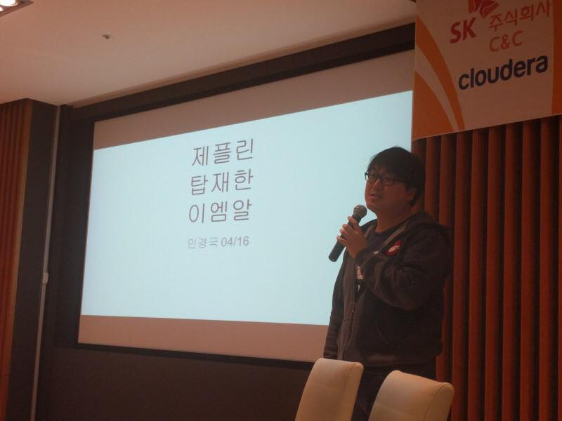
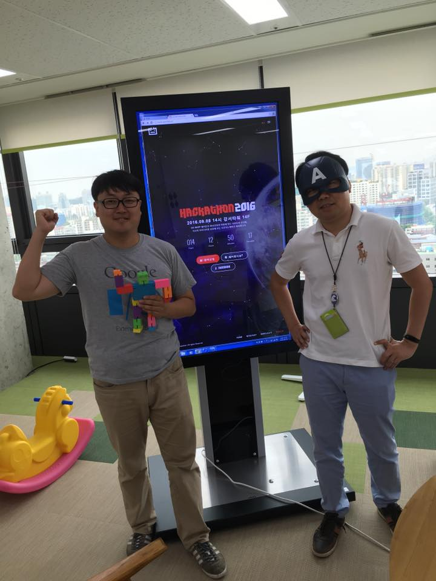

# ME
::: tip special provisions for military service
- Taking pictures with world-renowned singer PSY during the four-week military training
- Young men in Korea go to the military or work for companies in special cases. I served 42 months as a programmer.

::: details I am gangnam style

:::

# Coffee chat
- [Apply for Coffee Chat](https://cal.com/diginori/coffeechat)
- I believe that sometimes lightness can be heavier than heavy.
- Wherever you are.

### Who am I?
``` digiNORI
I loved physics
yearning for folklore
Data as a profession
He is a developer who wants to play
```
- [Pycon 2016 Developer T-shirt Nerd - One Sunday morning](https://www.slideshare.net/diginorimin/2016-64973868)
::: details NERD LIFE

:::

### What am I proud of?
- Development of NAVER Enterprise Data Collection Pipeline and Automatic Placement Generation Module Using Reservoir Meta
- [Founding member of NAVER's labor union](https://www.hankookilbo.com/News/Read/201804110457391978)
- LINE game log collection analysis and user navigation system deployment
- [Data, let's play Super Fun launch](https://byline.network/2017/10/11-5/)
- Establishment of a family targeting system through SKTV viewing log analysis / AWS+EMR (apache spark + zeppelin)
- Cashslide advertising retargeting system performance 100x cost 1/10 AWS deployment
- [apache zeppelin evangelist](https://www.slideshare.net/diginorimin/ss-60780570)
- [Ruby-on-rails performance testing and profiling](https://www.slideshare.net/diginorimin/ss-42434557)
- Lessons learned from the failure of the first agile megaproject and who left it behind
- Samsung Electronics' Galaxy Chat-on Performance Test Bed Construction and Troubleshooting
- [The Dream of Media Art digiNORI](https://www.hani.co.kr/arti/economy/working/459626.html) - [diginori.com](https://diginori.com)
- [Artificial vocal cords protection for laryngeal surgery patients, media art part of Gwangju Asian Cultural Center](https://www.chosun.com/site/data/html_dir/2010/09/28/2010092801552.html)
- Development of "LOW-TEMPERATURE COMBUSTION ROCKET" and successful pilot launch, September 2000, Gu Professor of Defense Science Research Institute guided

### Education
- a physics major
- a minor in education / a second-degree orthodoxy certificate
- I dropped out of my master's degree in folklore


### Skills
::: details Source Software Development Skills
- python
- linux & bash
- hadoop echo system - zeppelin, spark, hive, airflow
- taste of c - naver search for a month
- javascript - vue.js + quasar
- aws & cloud native + docker
- ruby
- java
- ios
- c#
- jsp ok?
:::

### Culture

::: details No one is good at everything.
No one is good at everything.

So we need a team.
The team keeps you from missing out
If there's anything you're good at, the team should give you wings.


:::

::: details I like MVP and code like this.
- Minimum Viable Product


:::

::: details I still support Agile Software Development Declaration.
- But I don't like the case and some coaches who use Agile badly.

[Agile Software Development Declaration](https://agilemanifesto.org/iso/ko/manifesto.html)
:::

::: details Free Software + Open Source = Community
- FOC! my own philosophy
- free vs open is different from each other, but I think it's one with the word community.
- so launched [20th Open Source in DMZ](https://datayanolja.github.io/opensource-dmz-bus) 

[Why “Free Software” is better than “Open Source”](https://www.gnu.org/philosophy/free-software-for-freedom.html.en)
['Open source' is not 'free software'](https://opensource.com/business/16/11/open-source-not-free-software)
:::

### Bonus+

::: details bonus shorts
⸝⸝◜࿀◝ ⸝⸝ Oh, Hadub's father, [Doug cutting](https://en.wikipedia.org/wiki/Doug_Cutting)





( ◜࿀◝ ) [data play](https://photos.app.goo.gl/bjzHgdkjWCYATQCY2)


:::
