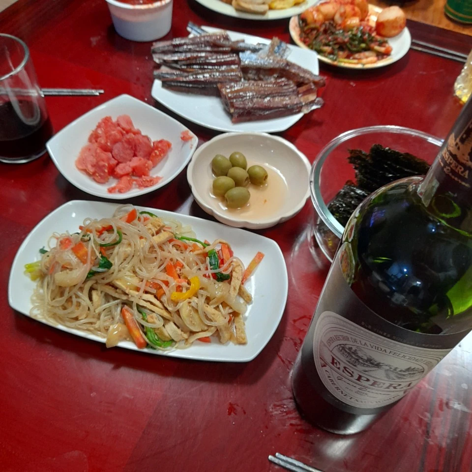
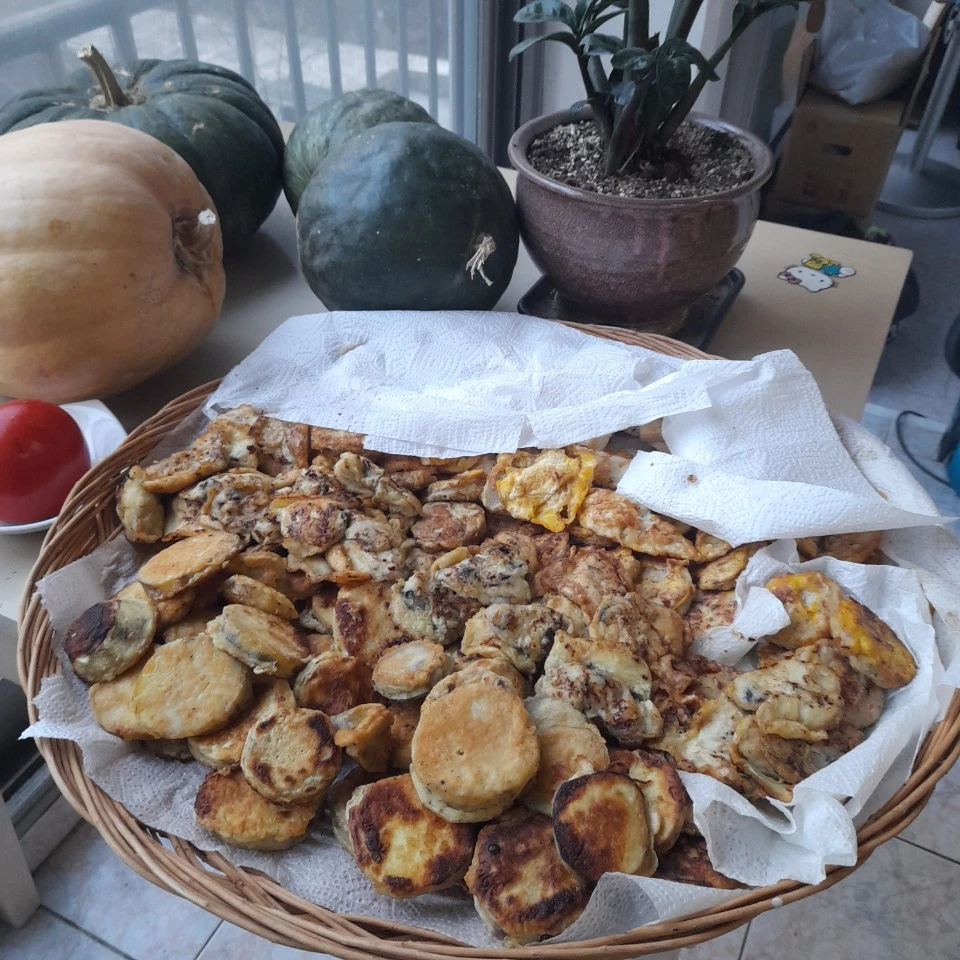
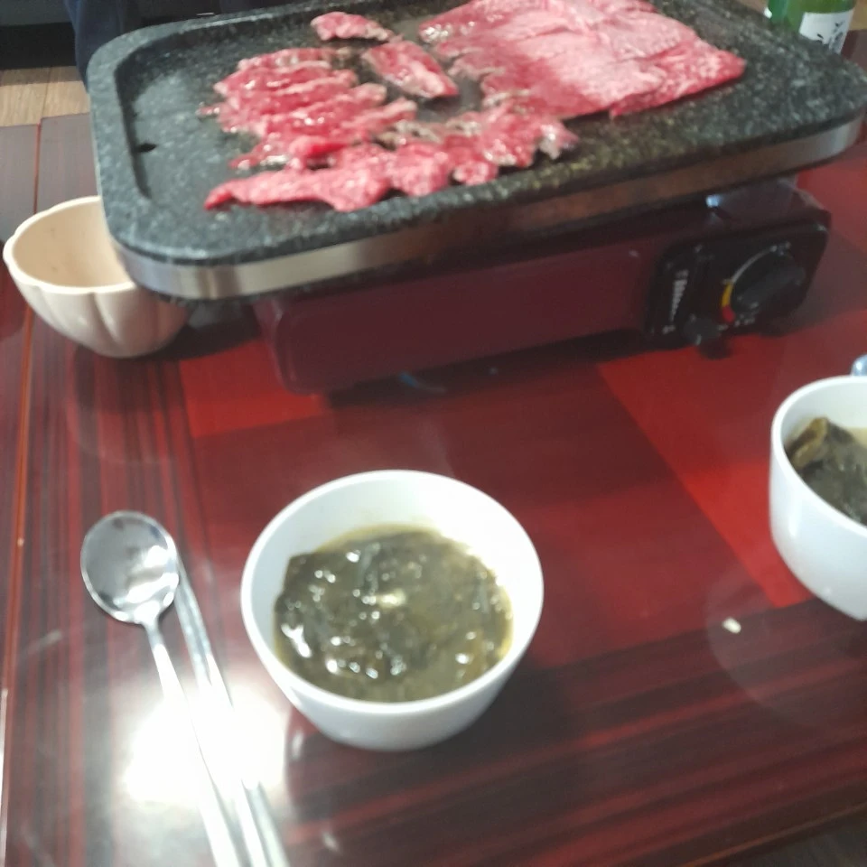
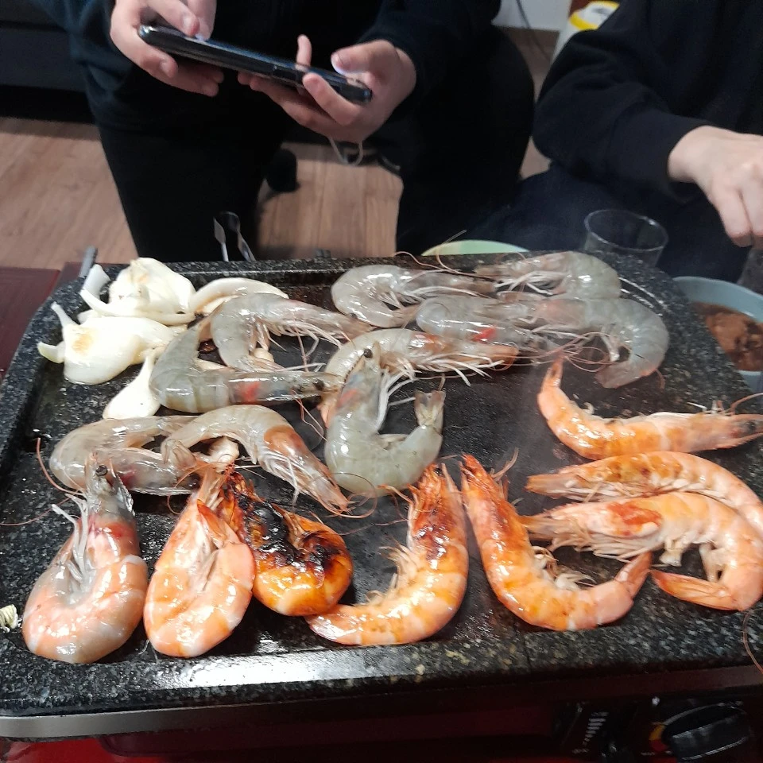
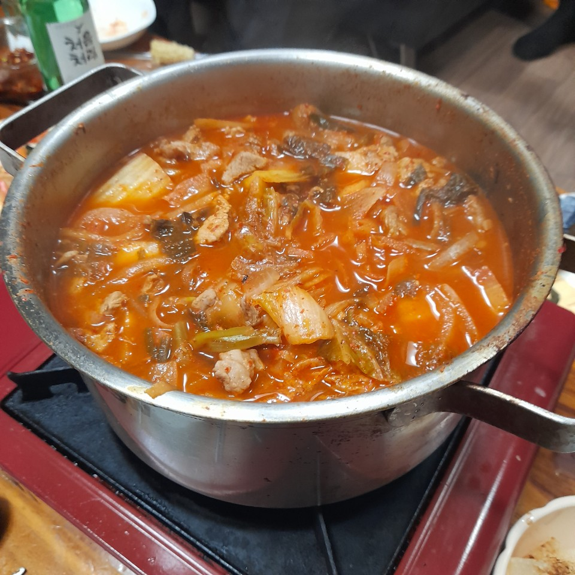
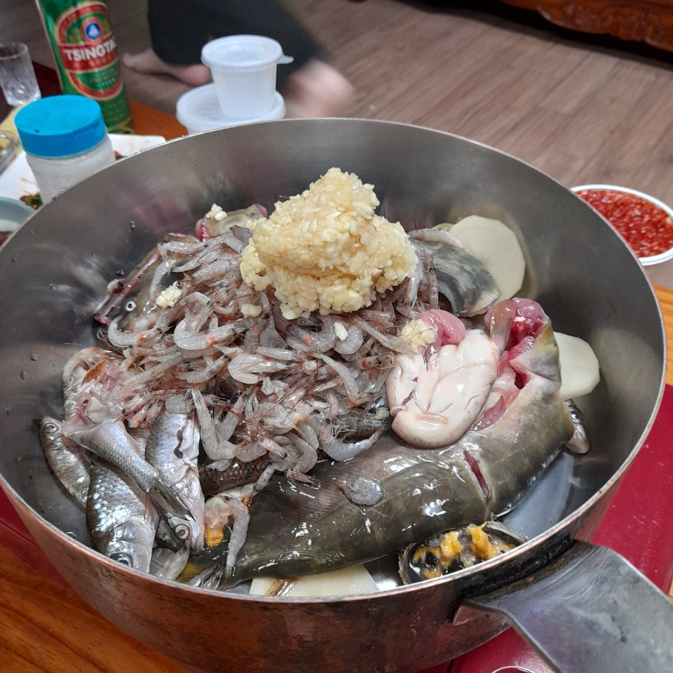

# KOREAN CULTURE

### mother's birthday
::: tip happy birthday
The birthday of the adult generation in Korea is still based on the lunar calendar. At the same time, Western cakes and candles are not necessarily missing.
:::

- Korea's representative feast food! Chapchae. My second daughter made it at home.

- Also, the representative feast food "Jeon"! Oysters, pork, cabbage, etc. are coated in egg water and baked.

- Now, dogs are an important member in Korea. After building it all day, I sat on the lap of my family who visited because it was close to midnight. Now I think they've accepted us as a family. Please take care of me next time too :D

- In Korea, we eat seaweed soup on birthdays and after giving birth to children. There is also a story that foreign daughters-in-law who marry into Korea are struggling because of their mother-in-law who wants to feed them seaweed soup. Koreans think seaweed soup is very delicious, so they also like the slippery texture.

- Families gathered at lunchtime sit on the floor, chat, drink, laugh, and sing in a Korean way until after midnight.
- Koreans love kimchi.Every food is finished and eat 12 hours, but we's kimchi stew!

- But why did someone hit it? I want to eat spicy freshwater fish stew! It is a soupy dish that boiled fish that live in the river. It contains Maggie, freshwater shrimp, and freshwater crab. The seasoning is mainly garlic and liquor powder.
