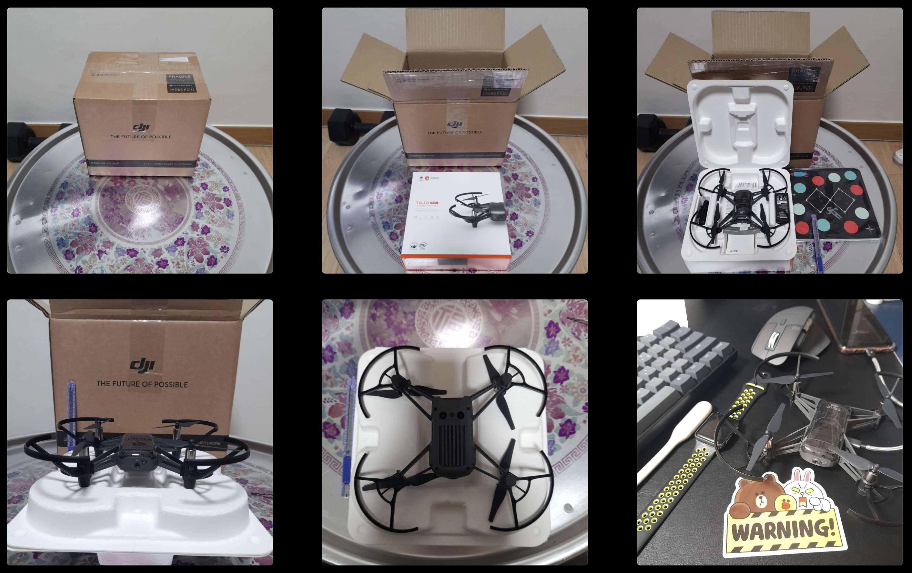

# DRONE PROGRAMMING
::: warning 드론(DJI EDU TELLO) 파이썬 코딩으로 조종하기
- The age of artificial intelligence and robots is coming.
- The future of our children
- And our future
- Learn about programmable drones -> Conclusion and Recommendation -> [DJI EDU TELLO](https://brand.naver.com/dji/products/5747594906)
:::
``` python
print ('Hit with coding!')
print ('Moving World!')
print ('Moving Drone!')

＼De-Ron/＼Coding/
ʕ•̫͡•ʕ•̫͡•ʔ•̫͡•ʔ•̫͡•ʕ•̫͡•ʔ•̫͡•ʔ
```

### a programmable drone?
I thought about searching for a drone that can be coded.
- [10 Best Programmable Drones 2022](https://www.propelrc.com/best-programmable-drones/)

- [Bitcraze Crazyflie 2.1](https://www.bitcraze.io/products/crazyflie-2-1/) - 파이썬+C, 오픈소스, 교육용+연구용, [330,0000](https://bitcraze.kr/product/%ED%81%AC%EB%A0%88%EC%9D%B4%EC%A7%80%ED%94%8C%EB%9D%BC%EC%9D%B4-21-crazyflie-21/36/category/1/display/2/)
- [Parrot Mambo Fly Educational Drone](https://www.parrot.com/en/drones/anafi-ai/technical-documentation/sdk) - C++ or Python programming language, [150$](https://shopping.interpark.com/product/productInfo.do?prdNo=6141901042&dispNo=016001&bizCd=P01397&NaPm=ct%3Dlb8rfbw0%7Cci%3D203baf1800b8bfd9a833ebb584bec7184265dda9%7Ctr%3Dslsl%7Csn%3D3%7Chk%3Dcf1974783272753d3c071fdbad4ab4000c52aad6&utm_medium=affiliate&utm_source=naver&utm_campaign=shop_20211015_navershopping_p01397_cps&utm_content=conversion_47)
- [Makeblock Airblock Hovercraft](https://hicomputing.org:45939/index.php?document_srl=46902) - [READ MORE: Drone to meet in blocks, air blocks](https://brunch.co.kr/@dronestarting/730), [Official](https://www.makeblock.com/steam-kits/airblock)

- Makeblock Airblock Hovercraft was intrigued, but the data is poor and now it looks like it has stopped selling.


### what should I buy?
The result is...
::: tip
- Python programming is possible
- an affordable price
- Delivery is fast
- There's an official store in Korea
- It is the latest model, and the related posting is relatively easy to find compared to other drones
- Too bad javascript / node is not supported.
:::
- [DJI EDU TELLO DRONE](https://things-voyager.tistory.com/68) / [150$](https://brand.naver.com/dji/products/5747594906), Supports Python, Scratch, and Swift)

- youtube -> [Choose to buy coding drones Tello and Tello Edu](https://www.youtube.com/watch?v=ixUJTXL_ktg)
- youtube -> [Drone Programming With Python Course | 3 Hours | Including x4 Projects | Computer Vision](https://www.youtube.com/watch?v=LmEcyQnfpDA)

### Start! Let's do it together!
- (We'll start when the drone arrives.) - December 4, 2022 / Order from Naver Store in Korea

```
Δ~~~Δ
ξ ･ェ･ ξ
ξ　~　ξ
ξ　　 ξ
ξ　　 “~～~～O
ξ　　　　　　 ξ
ξ ξ ξ~～~ξ ξ　
ξ_ξ_ξ　ξ_ξ_ξ
Please register as a browser favorite.
```

### Delivery Arrival and Box Open & Size Comparison
``` bash
# Delivery takes 2 business days
# Position the mouse clock keyboard to measure the size of the drone
```


### Start the program with Python
- [GITHUB](https://docs.github.com/ko/get-started)에 [SDK released by DJI](https://github.com/dji-sdk/Tello-Python)
- The above code is forks -> [drone-lions/tello-sdk-python](https://github.com/drone-lions/tello-sdk-python3) -> Proceed by switching from to Python 3.

### Drone Outdoor Ambitious Flight Training in the Park
- Follow the attached paper guide to familiarize yourself with drone coordination before programming. / So we tried flying drones in the park, cutting through the night air.

