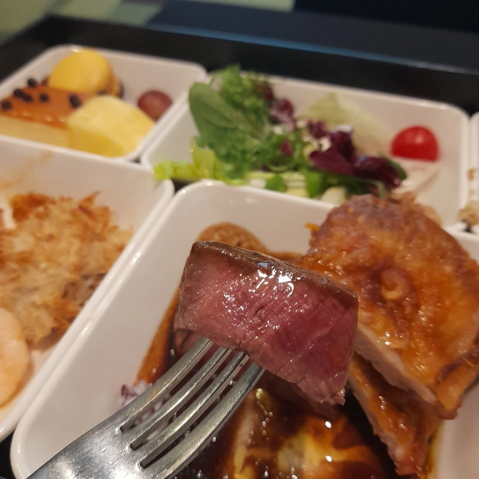
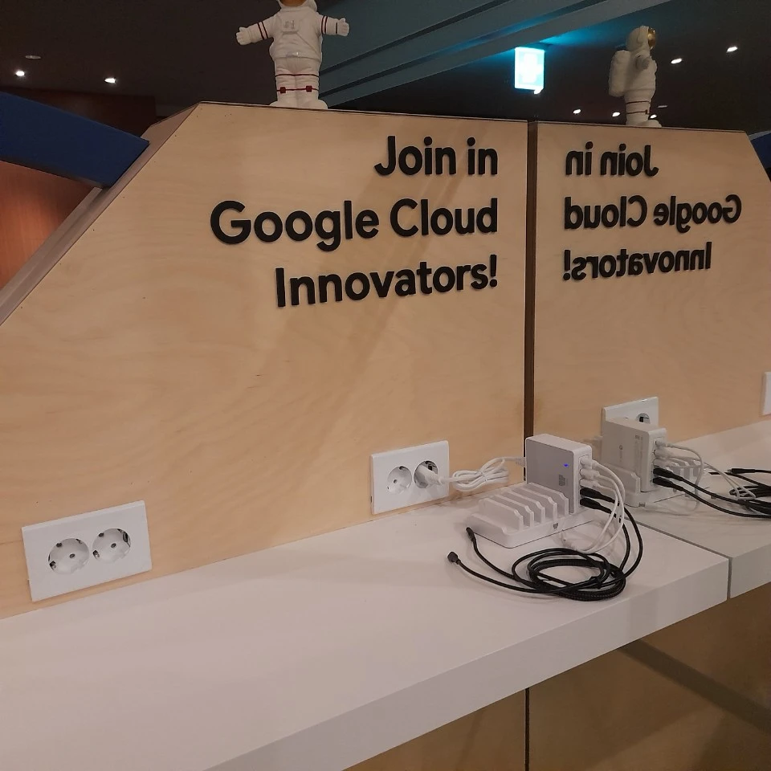
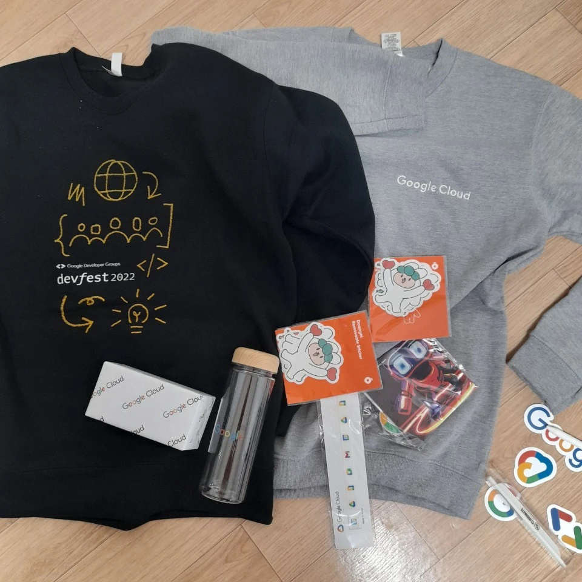
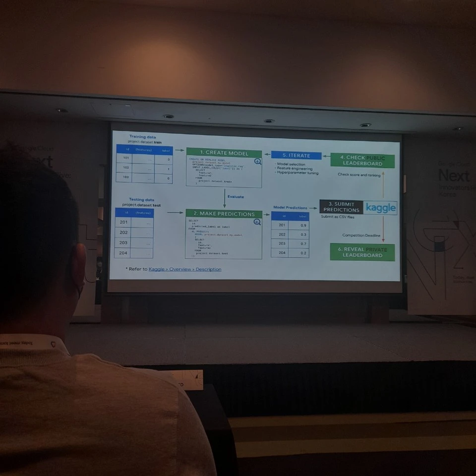
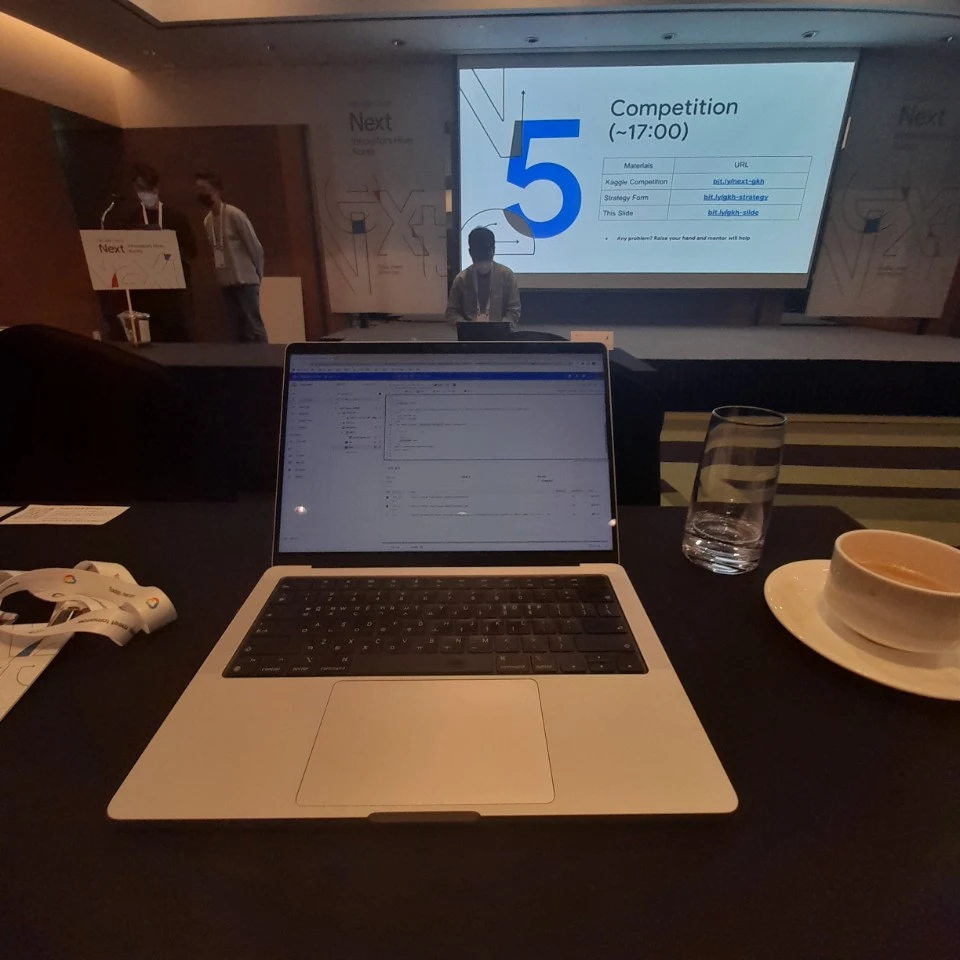
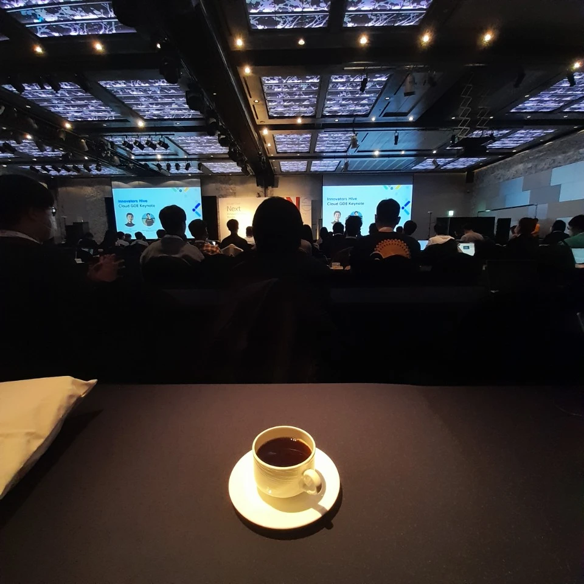
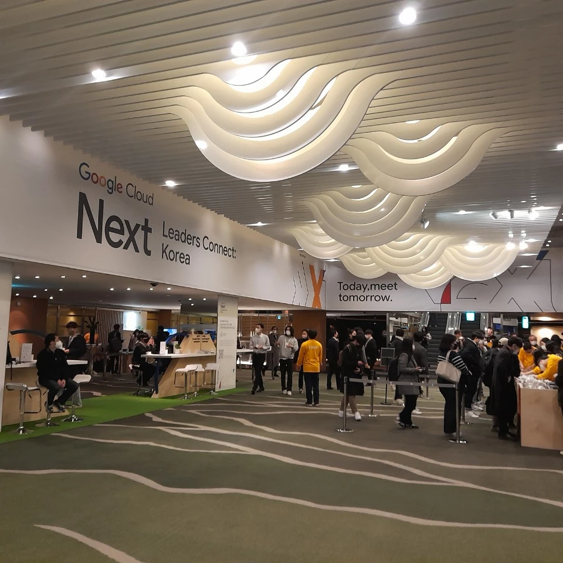

# GOOGLE INNOVATORS HIVE

::: tip introduction
- 2022년 11월 22일 (화) 9:00 오전–6:00 오후 KST
- 인터컨티넨탈 서울 코엑스 (Intercontinental Seoul Coex), 하모니 볼룸

:::


### 점심 맛집 구글
- 밥 먹으로 간건 아니지만 호텔식 점심은 뭐 그냥 그냥 그래서 기대를 안했으나 구글은 달랐다. INNOVATOR!
- 미각의 즐거움을 느낀 구글클라우드 행사 / 잘먹었습니다.
- 유부프 프리미엄 구독료 패이백 받아갑니다.


### 전기 충전
- NAVER JAPAN 시절 파견간 동료분께 들은 이야기로 "일본 사람들은 회사와서 핸드폰 충전 못한다. 하면 전기 도둑이 된다" 그런데 한국 개발자들이 가서 문화가 바뀌엇다.
- 구글의 충전 서비스는 JOIN IN 하게 만드는 첫 단추로 다가왔다. 충전 서비스가 없으면 뭔가 전기도둑이 된마량 두리번 두리번 거려야 한다. 사소하지만 않은 좋은 생각이다.


### 선물 굿즈
- 개발자는 티셔츠 굿즈면 끝이지! (성급한 일반화) 따땃하다. 코딩력 상승중!
- 개발자 굿즈의 또다른 유니버스 '바지'편이 궁금하면 -> [NHN Cloud Goods](http://localhost:8080/logs/tech/nhn-forward/#goods)



### 도전 Kaggle
- 월드컵 기간에 맞춰 랭킹 12번째 등록
- 친절한 구글분들 



### GRACEFUL COFFEE & SIGTERM VS SIGKILL
- [SIGTERM vs SIGKILL: What's the Difference?](https://linuxhandbook.com/sigterm-vs-sigkill/)
```
우아하게
호텔커피
마시면서
코딩하면
버그없는
코드될까
버그라도
좋아질까
```



### COMMUNITY DRIVEN EVENT
- 구글의 행사는 세련되엇지만 또 어설프다.
- 정확한 표현인지 모르겠으나 [GDG Seoul](https://gdg.community.dev/gdg-seoul/) & [GDG Bussan](https://gdg.community.dev/gdg-busan/) 이 주도하는 행사로 보인다.
- 주도 / 주관 / 주최 ... 아무튼 커뮤니티의 발랄함과 공룡 구글의 묵직함 신뢰가 잘 섞인 행사


### kill -9
```
Don't do it, don't do it! Let's go gracefully
＼　　ヽ　　　　i　　|　　　　 /　　　/　
　　　＼　
!
　　　　　　　　　　　　　　;' ':;,,　　　　 ,;'':;,
　　　　　　　　　　　　　;'　　 ':;,.,.,.,.,.,,,;'　　';,
　　ー　　　　　　　　 ,:'　　　　　　　　 　::::::::､
　_＿　　　　　　　　,:' ／ 　 　　　　＼ 　　::::::::',
　　　　　二　　　　:'　 ●　　　　　 ●　 　　 ::::::::i.
　　￣　　　　　　　i　 '''　(__人_)　　'''' 　　 ::::::::::i
　　　　-‐　　　　　 :　 　　　　　　　　　 　::::::::i
　　　　　　　　　　　`:,､ 　　　　　 　 　 :::::::::: /
　　　　／　　　　　　 ,:'　　　　　　　 : ::::::::::::｀:､
　　　　　　　　　　　 ,:'　　　　　　　　 : : ::::::::::｀:､

```

### BONUS
- ["클라우드 시대에 맞는 사이트 신뢰성 엔지니어" 발표 자료](https://blog.outsider.ne.kr/1635)
- 잠깐 아웃사이더님과 만나 이야기 나누는 영광의 시간이 있었다. 
- 나에겐 아직 SRE 거리감이 있는 단어다.
- SRE 안에서 많은 길을 보게 될 것 같다.
- 아웃사이더님 발표가 그 시작이 되었다. 
- 내가 좀 늦은 감이 있는 건가 싶기도 하지만 뭐!
- 발표 내용? [https://blog.outsider.ne.kr/1635](https://blog.outsider.ne.kr/1635) outsider 님 블로그로!
- 가나전 3:2 !!! 쫌 !!!
