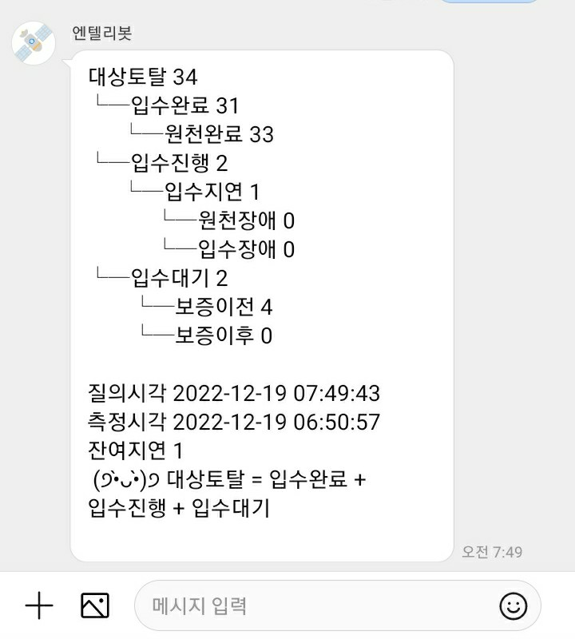

# Devops & mental If you leave it unattended, it'll rust!

### Super Developer's Coming Out
::: tip Depression Coming Out
If left alone, rusty devops and worsening depression
- As a person who can't work
- as a bad student
- as a retired soldier

It's hard to work, school, and military. I used to be that kind of person.
I was depressed because I thought he was that kind of person.
I was diagnosed with depression, took medicine, and received psychotherapy.

I'll hide it from the team leader. I'll hide it from the team members
Coming back from sick leave, I came out.

What encouraged this coming-out was his coming-out, which I consider to be a super-super developer, which was a big boost.
I use this article to express my appreciation and respect for him. And I want you to know that there are a lot of people who are respacking you because they're over a long tunnel.

And I got much better thanks to my colleague who came after coming out.
:::

I had a hard time alone at home during the COVID-19 situation. The hardest thing at that time was when a pipeline failure occurred on Sunday morning, it was a mixture of anxiety and initial depression and lethargy. I was afraid of everything in the world.


### phobia of telephones
Sports Webtoon Smart Store Real Estate... I had to call developers of other departments through message mail. It came as a killing pain that I had to wake up someone's sweet Sunday morning for that one screen that no one was looking at on the C-level description board on Sunday morning. I was shaking all day, but all I did was call and spread the situation through chat. My Saturday/Sunday/Holiday is gone, but I feel guilty again, barely raising an hour to work.

I once had a two-hour private meeting with the highest senior (?) in the company. Anyway, since then, the HR team asked us to come down to where we were, and the team dropped it alone to learn search techniques that they had not worked for nearly two years or had never done before. The search technology here doesn't come out by searching anywhere.


### The Savior and the Butt
Then, now he came to the department that endured only when the buttocks of collecting Naver company data and creating a data mart were heavy, led by a savior-like touch from a representative of Naver's subsidiary. The pipeline there was in [LUigi] (https://github.com/spotify/luigi) XML hell).
More than 300 data pipelines were changed to airflow and standardized into three types through the analysis process to create meta reservoirs and automate them all. The amount of code has been reduced by one-third. The start of airflow is [Naver blog of a teammate next to you] (https://blog).naver.com/gyrbsdl18/221561318823) 였다. After some progress, the next team inquired about our composition, and I was happy to spread the part I learned in the meantime. It's a pleasure to be of service to anyone.

With another achievement (I'm bragging now). I learned to do well in depression) The existing data acquisition processing work, which was done through XML code modification and distribution directly in Real, was also constructed by dividing devstreal, testing it, and conducting code review. He explained and explained and set various tactics and strategies to induce him to raise the test coverage naturally. From experience, you have to exercise care in this area. You can't learn this by writing. Since I was using github (Enterprise), I tried to establish a branch strategy, release strategy, guide, and rollback strategy for disability, repeat guide documents and training for team members, and do fair programming and kindly inform anyone who asks.

But there was no feedback from the leader. The leader's instructions were just to monitor and guarantee the data coming into the moon on weekends or at dawn.
```
.　　　 ヘ　 ヘ
　　　/　＼/　＼
　　／　　　　　ヽ
　 /　　ㅇ　　 ㅇ　|
　｜　∪　/￣￣T　|
　｜∪　 ｜　　|　|
　 ＼　　｜＿　| ノ
　 ／　ヽ｜　ヽ|、
　(　　 |｜　 ||｜
　|　　 ヽ二二ノ｜
　|　 L　　　　｣｜
　ヽ＿ﾉ　　　 (_/
　　｜　　/　 /
　　｜　 /　 /
　　(＿＿)＿_)

```

I worked hard on the work by giving it its own way. We can't put off this growth-free job for new recruiters! Let's make the system stronger while I do it. So, I silently tried to access the chatbot or the sitem at 6 a.m. every morning 365 days, or at 2 a.m. 3 a.m., when the data pipeline that I woke up was spinning for a long time. I'm glad it's spinning well. Let's sleep now. And I wake up again between 6 and 7 o' Is there any chat from the data request department? An automated hook was hung to check and check if there were any failed messages coming as chatbots. Fortunately, if there is no disability, the working hours are not recorded. I just checked! I didn't connect to the company system (I made it possible to check without accessing the company system - and bragging about it) and I didn't code like a developer, but I was just nervous.



However, the start of the data pipeline I can guarantee is the developers of Naver's company-wide development department. If either code error or system failure occurred, there was nothing I could handle. According to the chapter, an email was sent automatically to find the person in charge, but by 9 a.m., C-levels had to call them at 7 a.m. to view the data summary report dashboard.

### You need to rest to cure it
I got sick and informed my team members and took sick leave before I got out of the nightmare. Nightmare is the point where I have to wake up someone's peaceful morning.

And when I came back to my sick leave, the rust accumulated in my mind was peeling and trying to sparkle again, but devstg, who was working well, was rusted and the job data pipeline code was being distributed to Real again. On the other hand, it's a relief. What I did didn't go back without me, so I thought I had to ride my hand to recover. Of course, we shouldn't do this if we make a code for a rocket that rides people into space, but we are living in an era of artificial intelligence, but we are living in an era that requires more human intelligence.  SRC: I added another potion item called Insights on my success, limitations and growth of devOps.


Let's get back to work! I purposely went to work at Starbucks on the early morning Tehairan-ro with a body that was struggling to feel the old days. Starbucks, who is always waiting for me! Wi-Fi~~~~~ (Let's use secure Wi-Fi - Secure - You can approach it with wifi/wifi.)


### After Coming Out
- My colleagues understood me. Thank you for not staying away from me.
- I sent you a respac for what I did. During the code review session, he made it clear that he did the work easily using the part he made. Thank you.
- May's labor secretary, who was dispatched from the labor union and the Korean Confederation of Trade Unions, relieved me.

### conclusion
- If people and systems continue to load, they will be destroyed.
- The system does stress tests
- Don't do that to people
- The system has also been tested a lot for performance. Samsung Electronics has also solved its Chat-on failure and its Cash Slide 150 DAU. What I felt at this time was [Naver's open source nGrinder] (https://naver.github).The greatness of the io/ngrinder/) and the machine system is that it dies if it is subjected to peak stress for a certain period of time.
- Let's turn off the system and rest once in a while! That's how it turns on again.
- There is a good colleague around you. But I can't see it when I'm tired. Invisible does not mean absent. There is definitely one.