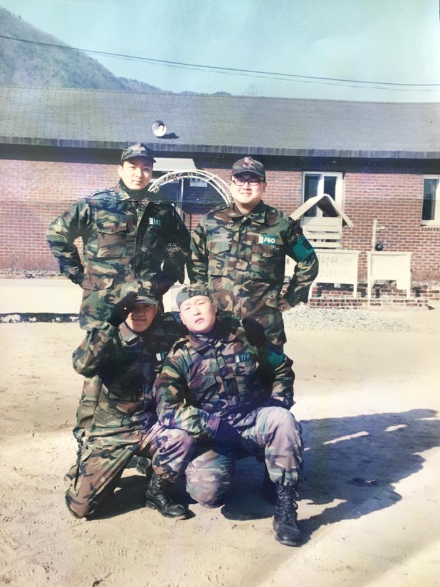
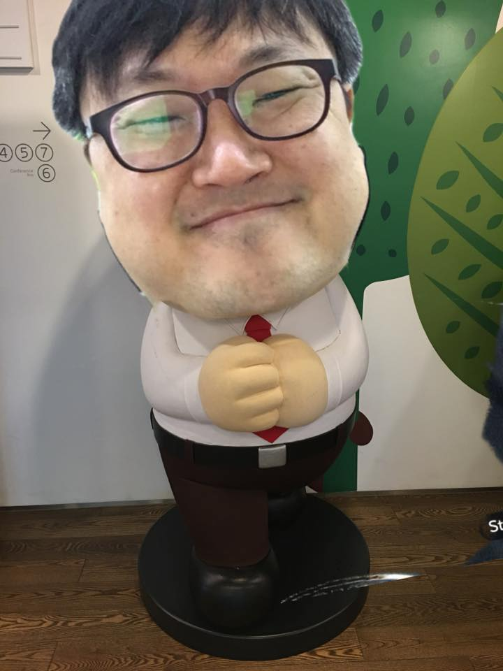
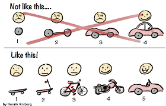
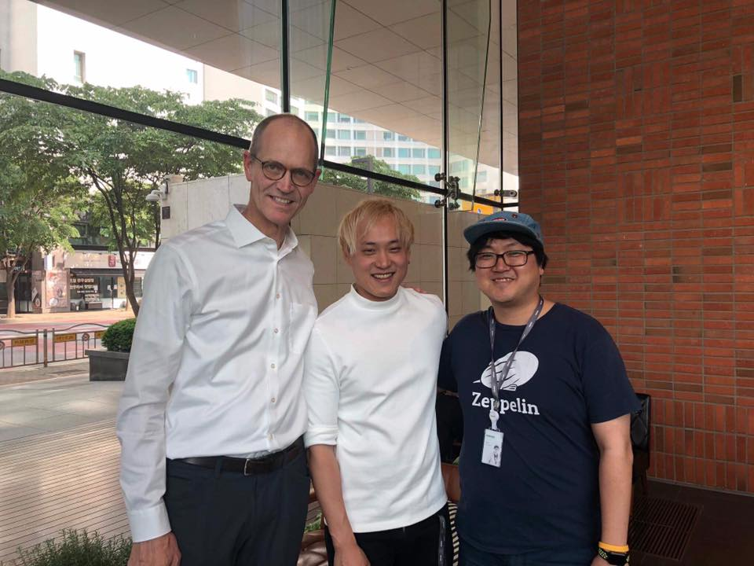
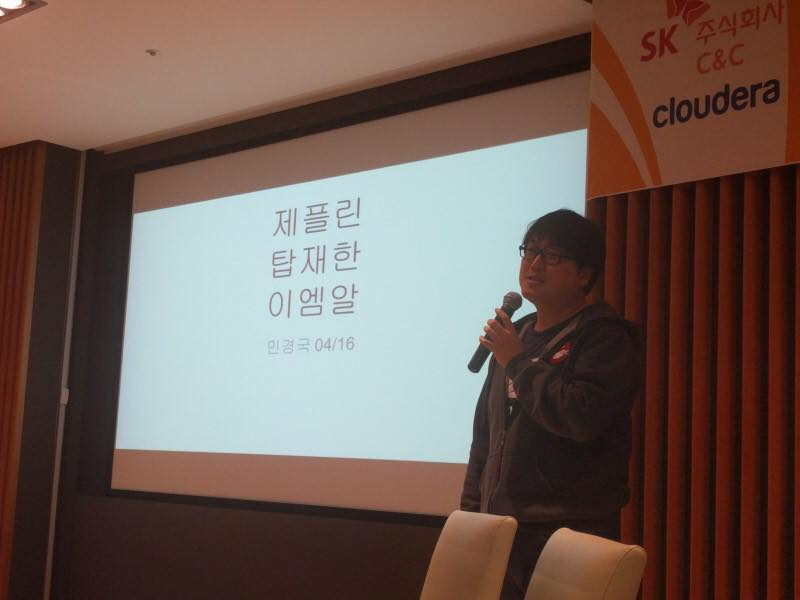
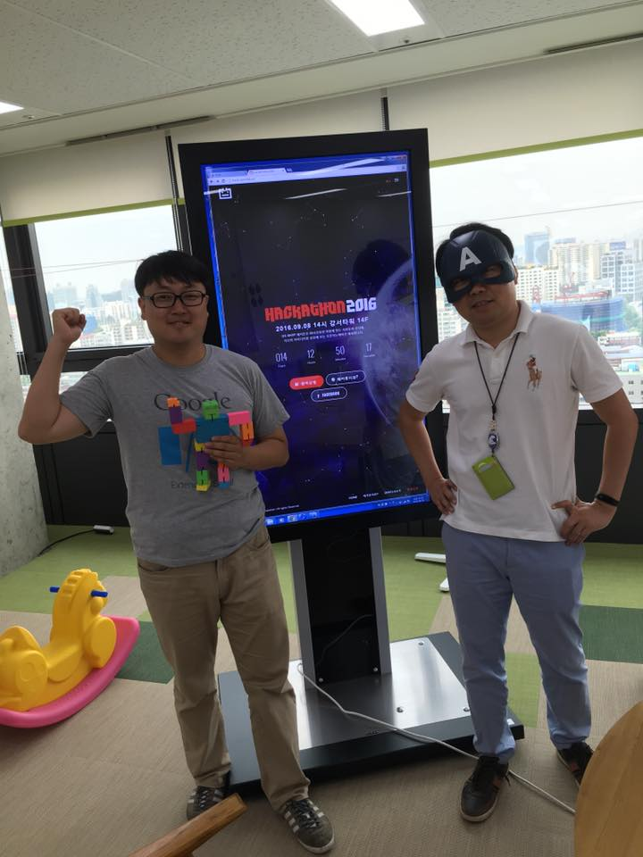

# ME
::: tip 병특 140번 올빼미
- 부소대장 훈련병 시절 철원 6사단 소대장 훈련병 싸이와 함께 기념사진을 남겼다.
- 철원 1월 추위 4주차 야상 빨아 입고 연병장에 사열했다. 덜 말라 김이 모락모락 나는 나를 발견한 대대장님이 모범 사병이라며 퇴소식서 표창장을 ...

::: details I am gangnam style

:::

# Coffee chat
- [Apply for Coffee Chat](https://cal.com/diginori/coffeechat)
- I believe that sometimes lightness can be heavier than heavy.
- Wherever you are.

### Who am I?
```
물리학을 사랑했고
민속학을 동경하는
데이터를 직업으로
놀자하는 개발자다
```
- [파이콘2016 개발자티셔츠덕후의-어느일요일아침](https://www.slideshare.net/diginorimin/2016-64973868)

<!-- 

 -->

### What am I proud of?
- 네이버 전사 데이터 수집 파이프라인 생성 및 저수지 메타 활용 자동 배치 생성 모듈 개발
- [Founding member of NAVER's labor union](https://www.hankookilbo.com/News/Read/201804110457391978)
- 라인 게임 로그 수집 분석 및 어뷰징 사용자 탐색 시스템 구축
- [데이터야놀자 슈퍼 펀 런칭](https://byline.network/2017/10/11-5/)
- sk btv 시청로그 분석을 통한 가족타겟팅 시스템 구축 / AWS+EMR(apache spark + zeppelin)
- 캐시슬라이드 광고 리타겟팅 시스템 성능 100배 비용 1/10 AWS spot instans 기반 구축
- [apache zeppelin evangelist](https://www.slideshare.net/diginorimin/ss-60780570), 커뮤니티, 삼성 카카오 sk ... 강연
- [루비 온 레일즈 성능테스트 및 프로파일링](https://www.slideshare.net/diginorimin/ss-42434557)
- 첫 애자일 대형 프로젝트의 실패에서 배운 교훈과 남긴 사람들
- 삼성전자 갤럭시 챗온 성능테스트 베드 구축 및 트러블슈팅
- [디지노리의 꿈](https://www.hani.co.kr/arti/economy/working/459626.html) - [diginori.com](https://diginori.com)

### Education
- 물리학전공
- 교육학 부전공 / 2급 정교사 자격증
- 민속학 석사과정 중퇴


### Skills
::: details
- 파이썬
- linux & bash
- 하둡에코시스템 - zeppelin, spark, hive, airflow
- c 의 맛 - 네이버 검색 한달
- 자바스크립트 - vue.js + quasar
- aws & cloud native + docker
- 루비
- 자바
- ios
- c#
- jsp ok?
:::

### Culture
::: details 모든것을 잘하는 사람은 없습니다. / team play

- 그래서 우리에겐 팀이 필요합니다.
- 팀은 당신에게 부족한 부분을 막아주고 
- 당신이 잘하는 부분이 있다면 팀은 당신에게 날개를 달아 주어야 합니다.


:::

::: details MVP 좋아하고 이렇게 코딩합니다.
- Minimum Viable Product


:::

::: details 저는 여전히 애자일 소프트웨어 개발 선언 지지 합니다.
- 우리는 소프트웨어를 개발하고, 또 다른 사람의 개발을
도와주면서 소프트웨어 개발의 더 나은 방법들을 찾아가고
있다

[애자일 소프트웨어 개발 선언](https://agilemanifesto.org/iso/ko/manifesto.html)
:::

::: details 자유소프트웨어 + 오픈소스 = 커뮤니티

- 자유 vs 오픈 서로는 다르다고 하지만 저는 커뮤니티라는 단어로 하나라고 생각해요.
- 그래서 [20th Open Source in DMZ](https://datayanolja.github.io/opensource-dmz-bus) 를 런칭 했습니다.

[왜 자유 소프트웨어가 오픈 소스보다 좋은가?](https://www.gnu.org/philosophy/free-software-for-freedom.ko.html)
['Open source' is not 'free software'](https://opensource.com/business/16/11/open-source-not-free-software)
:::

### Bonus+

::: details bonus shorts





( ◜࿀◝ ) [데놀앨범](https://photos.app.goo.gl/bjzHgdkjWCYATQCY2)


:::