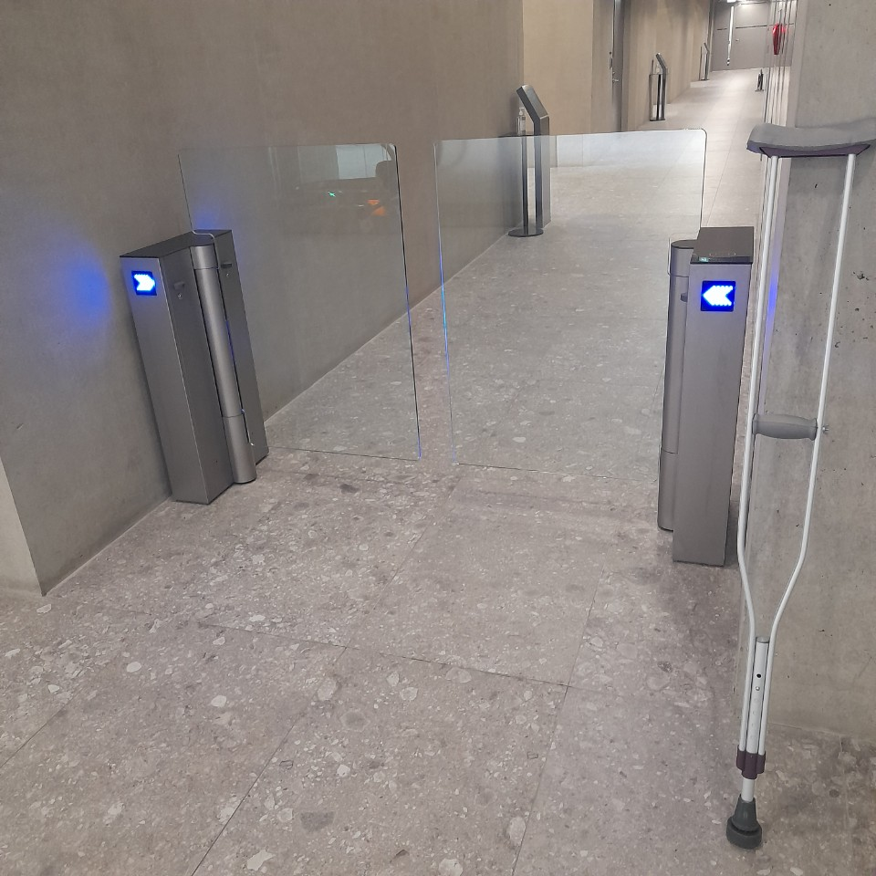
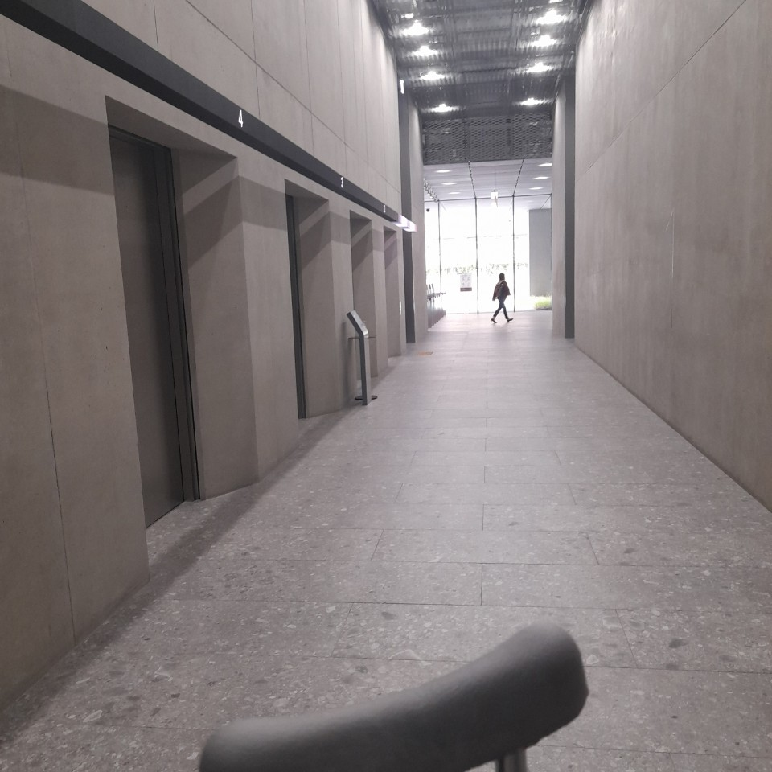
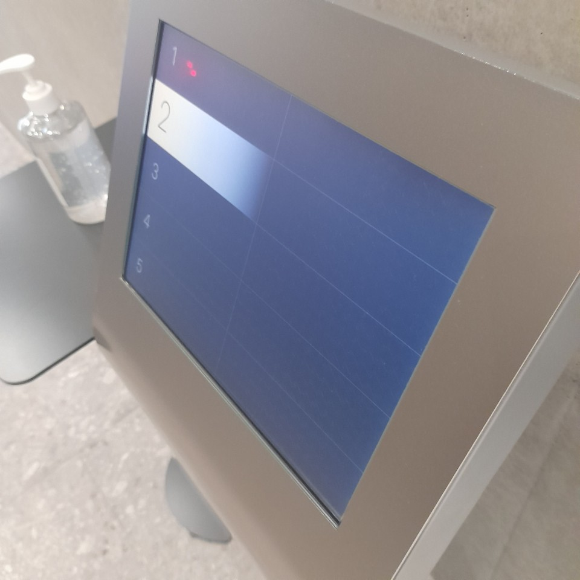

# 1784 AND MY STORY
``` haskell
main = putStrLn "You can see as much as you know."
```

### a road that people can't walk on
``` haskell
main = putStrLn "There's a path you can't take"
```


``` haskell
main = The elevator that automatically allocates looks future-oriented and cool. But I am slow"
```


``` haskell
main = putStrLn "There were five loops to meet the nearest elevator."
```


### runhaskell
```
$ runhaskell see.sh
$ runhaskell take.sh
# runhaskell cool.hs
$ runhaskell meet.hs
```