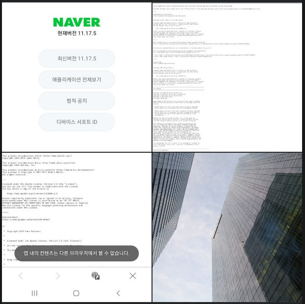
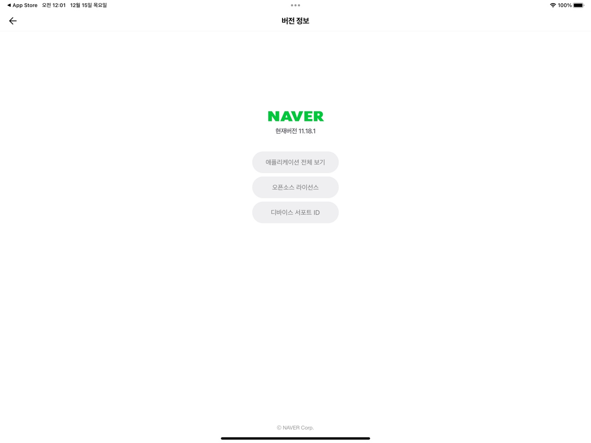

# Opensource used by NAVER
::: warning
네이버앱의 오픈소스 고지는 어떨까 궁금해졌다. 지키지 않으면 안되니까 지킨다가 아닌 오픈소스 생태계에 대한 리스팩이 담겨 있으면 좋겠다는 기대를 갖고 찾아 보았다.

#### 결론 부터 말하면 "아쉽다"

지금은 오픈소스 없는 소프트웨어 개발이 불가능한 시대다. 

하지만 불과 내기준 15년 전에는 "유지보수가 되지 않는 오픈소스는 회사에서는 쓰기 힘들다" 라는 생각을 하거나 20년 전에는 오픈소스가 뭔지도 몰랐다. 

또 소프트웨어나 음원등은 당연하게도 쉽게 복사가 되고 복사만 되면 돈 주고 사지 않아도 된다고 생각했다. 아직도 그때 구운 불법 음원 CD 가 누군가의 서랍안에는 한두장씩 있을 것이다.

#### 시대가 변했다.

LINE 은 [많은 오픈소스 재단이 최소한의 자금으로 극소수의 사람들의 사명감에 의해서만 유지되고 있다는 것에 대한 문제의식을 느끼고 기업 차원에서 생태계 개선에 동참하고자 이번 후원을 결정](https://n.news.naver.com/mnews/article/092/0002252058?sid=105) 하고 아파치 소프트웨어 재단(ASF)과 공식 후원 계약으로 연간 25,000$(32,403,482원) 후원을 결정했다.

수백게 오픈소스를 키워왔고 관리하며 또 회사에 속한 개발자들이 매일 업무를 위해 사용하고 있는 점을 감안하면 유료로 소프트웨어를 사서 쓴다고 가정 했을 때 큰돈의 후원은 아니다. 다만 돈으로만 따질 수 없는 오픈소스 생태계에 대한 리스팩과 동참의 의미로 다양한 [오픈소스 활동](https://engineering.linecorp.com/en/opensource)을 동시에 하고 있는 LINE 의 후원은 의미가 있다. 라인은 또 오픈소스가 아닌 사용소프트웨어의 구매력도 높다는 것은 이미 알려진 사실이다. 네이버도 국내 기업중 단연 가장 멋진 활동을 하고 있다.


#### 오픈소스 고지 사례
[오픈소스 라이선스 고지 방법](https://millo-l.github.io/%EC%98%A4%ED%94%88%EC%86%8C%EC%8A%A4-%EB%9D%BC%EC%9D%B4%EC%84%A0%EC%8A%A4-%EA%B3%A0%EC%A7%80-%EB%B0%A9%EB%B2%95/) 블로그 글을 보면 카카오톡과 크롭브라우저의 사례가 있다.


[현대차 프랑스 판매 아반테2 펌웨어에 사용된 오픈소스 고지](http://webmanual.hyundai.com/STD_GEN5W/AVNT2/EU/French/opensourcesoftwarenotice.html) 사례를 보면 보기 좋게 정리가 되어 있다. 상단에 간단한 표 형식의 목록과 하단에 라이센스 정책에 따라 전문이 붙여 있다.

:::

### 네이버앱 오픈소스 법적공지
::: tip 확인 방법 삼선메뉴 -> 톱니바퀴 -> 버전정보
- 안드로이드는 "법적공지" iOS 는 "오픈소스 라이선스" 라는 메뉴에서 확인 가능하다. 통일 되면 좋겠다.
#### 안드로이드 v11.17.5
 -> 법정공지"


#### ios v11.18.1
-> 오픈소스라이선스

:::

### 오픈소스 사용 내역 공개 전문
- 네이버앱의 "오픈소스 사용 고지" 는 위 현대차 유럽 아반때 경우 대비 좀덜 정리된 느낌에 가독성이 떨어진다.
- 그래서 고지 내용을 복사하기 위해 안드로이드에서 시도하다가 ... 복사 용량 초과로 짤리고 우물쭈물 하다가 ipad 에 키보드 연결하고 복사해서 네이버 메일로 보내고 그걸 다시 아래에 옮겨 두었다.(어렵다! 요즘 많이 쓰는 )
::: details ipad pro + keyboard 에서 cmd + a 통해 전체 복사

```
THE FOLLOWING SETS FORTH ATTRIBUTION NOTICES FOR THIRD PARTY SOFTWARE THAT MAY BE CONTAINED IN THIS APPLICATION.

We thank the open source community for all of their efforts. If you have any questions about these notices please email us at opensource@navercorp.com.

=====

gekitz/UIDevice-with-UniqueIdentifier-for-iOS-5
https://github.com/gekitz/UIDevice-with-UniqueIdentifier-for-iOS-5


Copyright (C) 2012, Georg Kitz, @gekitz

Permission is hereby granted, free of charge, to any person obtaining a copy of
this software and associated documentation files (the "Software"), to deal in
the Software without restriction, including without limitation the rights to
use, copy, modify, merge, publish, distribute, sublicense, and/or sell copies
of the Software, and to permit persons to whom the Software is furnished to do
so, subject to the following conditions:

The above copyright notice and this permission notice shall be included in all
copies or substantial portions of the Software.

THE SOFTWARE IS PROVIDED "AS IS", WITHOUT WARRANTY OF ANY KIND, EXPRESS OR
IMPLIED, INCLUDING BUT NOT LIMITED TO THE WARRANTIES OF MERCHANTABILITY,
FITNESS FOR A PARTICULAR PURPOSE AND NONINFRINGEMENT. IN NO EVENT SHALL THE
AUTHORS OR COPYRIGHT HOLDERS BE LIABLE FOR ANY CLAIM, DAMAGES OR OTHER
LIABILITY, WHETHER IN AN ACTION OF CONTRACT, TORT OR OTHERWISE, ARISING FROM,
OUT OF OR IN CONNECTION WITH THE SOFTWARE OR THE USE OR OTHER DEALINGS IN THE
SOFTWARE.

=====

ios-uiimagepickercontroller-result-image-orientation-after-upload
https://stackoverflow.com/questions/5427656/ios-uiimagepickercontroller-result-image-orientation-after-upload/5427890#5427890


According to stackoverflow.com, user contributions is licensed under cc by-sa 3.0.

User contribution at stackoverflow.com may be included in this application,
it is used under https://creativecommons.org/licenses/by-sa/3.0/.

* Code: https://stackoverflow.com/questions/5427656/ios-uiimagepickercontroller-result-image-orientation-after-upload/5427890#5427890
* Author name: Anomie, https://stackoverflow.com/users/634419/anomie

=====

CocoaLumberjack/CocoaLumberjack
https://github.com/CocoaLumberjack/CocoaLumberjack


Software License Agreement (BSD License)

Copyright (c) 2010-2016, Deusty, LLC
All rights reserved.

Redistribution and use of this software in source and binary forms,
with or without modification, are permitted provided that the following conditions are met:

* Redistributions of source code must retain the above
  copyright notice, this list of conditions and the
  following disclaimer.

* Neither the name of Deusty nor the names of its
  contributors may be used to endorse or promote products
  derived from this software without specific prior
  written permission of Deusty, LLC.

THIS SOFTWARE IS PROVIDED BY THE COPYRIGHT HOLDERS AND CONTRIBUTORS "AS IS" AND ANY EXPRESS OR IMPLIED WARRANTIES, INCLUDING, BUT NOT LIMITED TO, THE IMPLIED WARRANTIES OF MERCHANTABILITY AND FITNESS FOR A PARTICULAR PURPOSE ARE DISCLAIMED. IN NO EVENT SHALL THE COPYRIGHT OWNER OR CONTRIBUTORS BE LIABLE FOR ANY DIRECT, INDIRECT, INCIDENTAL, SPECIAL, EXEMPLARY, OR CONSEQUENTIAL DAMAGES (INCLUDING, BUT NOT LIMITED TO, PROCUREMENT OF SUBSTITUTE GOODS OR SERVICES; LOSS OF USE, DATA, OR PROFITS; OR BUSINESS INTERRUPTION) HOWEVER CAUSED AND ON ANY THEORY OF LIABILITY, WHETHER IN CONTRACT, STRICT LIABILITY, OR TORT (INCLUDING NEGLIGENCE OR OTHERWISE) ARISING IN ANY WAY OUT OF THE USE OF THIS SOFTWARE, EVEN IF ADVISED OF THE POSSIBILITY OF SUCH DAMAGE.

=====

chiahsien/CHTCollectionViewWaterfallLayout
https://github.com/chiahsien/CHTCollectionViewWaterfallLayout


Copyright (c) 2012 Nelson Tai <chiahsien@gmail.com>

Permission is hereby granted, free of charge, to any person obtaining a copy
of this software and associated documentation files (the "Software"), to deal
in the Software without restriction, including without limitation the rights
to use, copy, modify, merge, publish, distribute, sublicense, and/or sell
copies of the Software, and to permit persons to whom the Software is furnished
to do so, subject to the following conditions:

The above copyright notice and this permission notice shall be included in all
copies or substantial portions of the Software.

THE SOFTWARE IS PROVIDED "AS IS", WITHOUT WARRANTY OF ANY KIND, EXPRESS OR
IMPLIED, INCLUDING BUT NOT LIMITED TO THE WARRANTIES OF MERCHANTABILITY,
FITNESS FOR A PARTICULAR PURPOSE AND NONINFRINGEMENT. IN NO EVENT SHALL THE
AUTHORS OR COPYRIGHT HOLDERS BE LIABLE FOR ANY CLAIM, DAMAGES OR OTHER
LIABILITY, WHETHER IN AN ACTION OF CONTRACT, TORT OR OTHERWISE, ARISING FROM,
OUT OF OR IN CONNECTION WITH THE SOFTWARE OR THE USE OR OTHER DEALINGS IN
THE SOFTWARE.

=====

pixelogik/ColorCube
https://github.com/pixelogik/ColorCube


The MIT License (MIT)

Copyright (c) 2015 Ole Krause-Sparmann

Permission is hereby granted, free of charge, to any person obtaining a copy
of this software and associated documentation files (the "Software"), to deal
in the Software without restriction, including without limitation the rights
to use, copy, modify, merge, publish, distribute, sublicense, and/or sell
copies of the Software, and to permit persons to whom the Software is
furnished to do so, subject to the following conditions:

The above copyright notice and this permission notice shall be included in all
copies or substantial portions of the Software.

THE SOFTWARE IS PROVIDED "AS IS", WITHOUT WARRANTY OF ANY KIND, EXPRESS OR
IMPLIED, INCLUDING BUT NOT LIMITED TO THE WARRANTIES OF MERCHANTABILITY,
FITNESS FOR A PARTICULAR PURPOSE AND NONINFRINGEMENT. IN NO EVENT SHALL THE
AUTHORS OR COPYRIGHT HOLDERS BE LIABLE FOR ANY CLAIM, DAMAGES OR OTHER
LIABILITY, WHETHER IN AN ACTION OF CONTRACT, TORT OR OTHERWISE, ARISING FROM,
OUT OF OR IN CONNECTION WITH THE SOFTWARE OR THE USE OR OTHER DEALINGS IN THE
SOFTWARE.

=====

devxoul/Then
https://github.com/devxoul/Then


The MIT License (MIT)

Copyright (c) 2015 Suyeol Jeon (xoul.kr)

Permission is hereby granted, free of charge, to any person obtaining a copy
of this software and associated documentation files (the "Software"), to deal
in the Software without restriction, including without limitation the rights
to use, copy, modify, merge, publish, distribute, sublicense, and/or sell
copies of the Software, and to permit persons to whom the Software is
furnished to do so, subject to the following conditions:

The above copyright notice and this permission notice shall be included in all
copies or substantial portions of the Software.

THE SOFTWARE IS PROVIDED "AS IS", WITHOUT WARRANTY OF ANY KIND, EXPRESS OR
IMPLIED, INCLUDING BUT NOT LIMITED TO THE WARRANTIES OF MERCHANTABILITY,
FITNESS FOR A PARTICULAR PURPOSE AND NONINFRINGEMENT. IN NO EVENT SHALL THE
AUTHORS OR COPYRIGHT HOLDERS BE LIABLE FOR ANY CLAIM, DAMAGES OR OTHER
LIABILITY, WHETHER IN AN ACTION OF CONTRACT, TORT OR OTHERWISE, ARISING FROM,
OUT OF OR IN CONNECTION WITH THE SOFTWARE OR THE USE OR OTHER DEALINGS IN THE
SOFTWARE.

=====

google/google-toolbox-for-mac
https://github.com/google/google-toolbox-for-mac


Copyright 2007 Google Inc.

Licensed under the Apache License, Version 2.0 (the "License");
you may not use this file except in compliance with the License.
You may obtain a copy of the License at

    http://www.apache.org/licenses/LICENSE-2.0

Unless required by applicable law or agreed to in writing, software
distributed under the License is distributed on an "AS IS" BASIS,
WITHOUT WARRANTIES OR CONDITIONS OF ANY KIND, either express or implied.
See the License for the specific language governing permissions and
limitations under the License.

=====

nanumfont
https://hangeul.naver.com/2017/nanum


Copyright (c) 2010, NAVER Corporation (https://www.navercorp.com/),
 
with Reserved Font Name Nanum, Naver Nanum, NanumGothic, Naver NanumGothic, NanumMyeongjo, Naver NanumMyeongjo, NanumBrush, Naver NanumBrush, NanumPen, Naver NanumPen, Naver NanumGothicEco, NanumGothicEco, Naver NanumMyeongjoEco, NanumMyeongjoEco, Naver NanumGothicLight, NanumGothicLight, NanumBarunGothic, Naver NanumBarunGothic,

This Font Software is licensed under the SIL Open Font License, Version 1.1.

This license is copied below, and is also available with a FAQ at: http://scripts.sil.org/OFL

SIL OPEN FONT LICENSE
Version 1.1 - 26 February 2007

PREAMBLE
The goals of the Open Font License (OFL) are to stimulate worldwide
development of collaborative font projects, to support the font creation
efforts of academic and linguistic communities, and to provide a free and
open framework in which fonts may be shared and improved in partnership
with others.

The OFL allows the licensed fonts to be used, studied, modified and
redistributed freely as long as they are not sold by themselves. The
fonts, including any derivative works, can be bundled, embedded,
redistributed and/or sold with any software provided that any reserved
names are not used by derivative works. The fonts and derivatives,
however, cannot be released under any other type of license. The
requirement for fonts to remain under this license does not apply
to any document created using the fonts or their derivatives.

DEFINITIONS
"Font Software" refers to the set of files released by the Copyright
Holder(s) under this license and clearly marked as such. This may
include source files, build scripts and documentation.

"Reserved Font Name" refers to any names specified as such after the
copyright statement(s).

"Original Version" refers to the collection of Font Software components as
distributed by the Copyright Holder(s).

"Modified Version" refers to any derivative made by adding to, deleting,
or substituting - in part or in whole - any of the components of the
Original Version, by changing formats or by porting the Font Software to a
new environment.

"Author" refers to any designer, engineer, programmer, technical
writer or other person who contributed to the Font Software.

PERMISSION & CONDITIONS
Permission is hereby granted, free of charge, to any person obtaining
a copy of the Font Software, to use, study, copy, merge, embed, modify,
redistribute, and sell modified and unmodified copies of the Font
Software, subject to the following conditions:

1) Neither the Font Software nor any of its individual components,
in Original or Modified Versions, may be sold by itself.

2) Original or Modified Versions of the Font Software may be bundled,
redistributed and/or sold with any software, provided that each copy
contains the above copyright notice and this license. These can be
included either as stand-alone text files, human-readable headers or
in the appropriate machine-readable metadata fields within text or
binary files as long as those fields can be easily viewed by the user.

3) No Modified Version of the Font Software may use the Reserved Font
Name(s) unless explicit written permission is granted by the corresponding
Copyright Holder. This restriction only applies to the primary font name as
presented to the users.

4) The name(s) of the Copyright Holder(s) or the Author(s) of the Font
Software shall not be used to promote, endorse or advertise any
Modified Version, except to acknowledge the contribution(s) of the
Copyright Holder(s) and the Author(s) or with their explicit written
permission.

5) The Font Software, modified or unmodified, in part or in whole,
must be distributed entirely under this license, and must not be
distributed under any other license. The requirement for fonts to
remain under this license does not apply to any document created
using the Font Software.

TERMINATION
This license becomes null and void if any of the above conditions are
not met.

DISCLAIMER
THE FONT SOFTWARE IS PROVIDED "AS IS", WITHOUT WARRANTY OF ANY KIND,
EXPRESS OR IMPLIED, INCLUDING BUT NOT LIMITED TO ANY WARRANTIES OF
MERCHANTABILITY, FITNESS FOR A PARTICULAR PURPOSE AND NONINFRINGEMENT
OF COPYRIGHT, PATENT, TRADEMARK, OR OTHER RIGHT. IN NO EVENT SHALL THE
COPYRIGHT HOLDER BE LIABLE FOR ANY CLAIM, DAMAGES OR OTHER LIABILITY,
INCLUDING ANY GENERAL, SPECIAL, INDIRECT, INCIDENTAL, OR CONSEQUENTIAL
DAMAGES, WHETHER IN AN ACTION OF CONTRACT, TORT OR OTHERWISE, ARISING
FROM, OUT OF THE USE OR INABILITY TO USE THE FONT SOFTWARE OR FROM
OTHER DEALINGS IN THE FONT SOFTWARE.

=====

Chromium Source
https://chromium.googlesource.com/chromium/src.git


// Copyright 2015 The Chromium Authors. All rights reserved.
//
// Redistribution and use in source and binary forms, with or without
// modification, are permitted provided that the following conditions are
// met:
//
//    * Redistributions of source code must retain the above copyright
// notice, this list of conditions and the following disclaimer.
//    * Redistributions in binary form must reproduce the above
// copyright notice, this list of conditions and the following disclaimer
// in the documentation and/or other materials provided with the
// distribution.
//    * Neither the name of Google Inc. nor the names of its
// contributors may be used to endorse or promote products derived from
// this software without specific prior written permission.
//
// THIS SOFTWARE IS PROVIDED BY THE COPYRIGHT HOLDERS AND CONTRIBUTORS
// "AS IS" AND ANY EXPRESS OR IMPLIED WARRANTIES, INCLUDING, BUT NOT
// LIMITED TO, THE IMPLIED WARRANTIES OF MERCHANTABILITY AND FITNESS FOR
// A PARTICULAR PURPOSE ARE DISCLAIMED. IN NO EVENT SHALL THE COPYRIGHT
// OWNER OR CONTRIBUTORS BE LIABLE FOR ANY DIRECT, INDIRECT, INCIDENTAL,
// SPECIAL, EXEMPLARY, OR CONSEQUENTIAL DAMAGES (INCLUDING, BUT NOT
// LIMITED TO, PROCUREMENT OF SUBSTITUTE GOODS OR SERVICES; LOSS OF USE,
// DATA, OR PROFITS; OR BUSINESS INTERRUPTION) HOWEVER CAUSED AND ON ANY
// THEORY OF LIABILITY, WHETHER IN CONTRACT, STRICT LIABILITY, OR TORT
// (INCLUDING NEGLIGENCE OR OTHERWISE) ARISING IN ANY WAY OUT OF THE USE
// OF THIS SOFTWARE, EVEN IF ADVISED OF THE POSSIBILITY OF SUCH DAMAGE.


=====

josh/swift-har
https://github.com/josh/swift-har


MIT License

Copyright (c) 2020 Joshua Peek

Permission is hereby granted, free of charge, to any person obtaining a copy
of this software and associated documentation files (the "Software"), to deal
in the Software without restriction, including without limitation the rights
to use, copy, modify, merge, publish, distribute, sublicense, and/or sell
copies of the Software, and to permit persons to whom the Software is
furnished to do so, subject to the following conditions:

The above copyright notice and this permission notice shall be included in all
copies or substantial portions of the Software.

THE SOFTWARE IS PROVIDED "AS IS", WITHOUT WARRANTY OF ANY KIND, EXPRESS OR
IMPLIED, INCLUDING BUT NOT LIMITED TO THE WARRANTIES OF MERCHANTABILITY,
FITNESS FOR A PARTICULAR PURPOSE AND NONINFRINGEMENT. IN NO EVENT SHALL THE
AUTHORS OR COPYRIGHT HOLDERS BE LIABLE FOR ANY CLAIM, DAMAGES OR OTHER
LIABILITY, WHETHER IN AN ACTION OF CONTRACT, TORT OR OTHERWISE, ARISING FROM,
OUT OF OR IN CONNECTION WITH THE SOFTWARE OR THE USE OR OTHER DEALINGS IN THE
SOFTWARE.

=====

SDWebImage/SDWebImage
https://github.com/SDWebImage/SDWebImage


Copyright (c) 2009-2020 Olivier Poitrey rs@dailymotion.com
 
Permission is hereby granted, free of charge, to any person obtaining a copy
of this software and associated documentation files (the "Software"), to deal
in the Software without restriction, including without limitation the rights
to use, copy, modify, merge, publish, distribute, sublicense, and/or sell
copies of the Software, and to permit persons to whom the Software is furnished
to do so, subject to the following conditions:
 
The above copyright notice and this permission notice shall be included in all
copies or substantial portions of the Software.
 
THE SOFTWARE IS PROVIDED "AS IS", WITHOUT WARRANTY OF ANY KIND, EXPRESS OR
IMPLIED, INCLUDING BUT NOT LIMITED TO THE WARRANTIES OF MERCHANTABILITY,
FITNESS FOR A PARTICULAR PURPOSE AND NONINFRINGEMENT. IN NO EVENT SHALL THE
AUTHORS OR COPYRIGHT HOLDERS BE LIABLE FOR ANY CLAIM, DAMAGES OR OTHER
LIABILITY, WHETHER IN AN ACTION OF CONTRACT, TORT OR OTHERWISE, ARISING FROM,
OUT OF OR IN CONNECTION WITH THE SOFTWARE OR THE USE OR OTHER DEALINGS IN
THE SOFTWARE.

=====

Alamofire/Alamofire
https://github.com/Alamofire/Alamofire


Copyright (c) 2014-2021 Alamofire Software Foundation (http://alamofire.org/)

Permission is hereby granted, free of charge, to any person obtaining a copy
of this software and associated documentation files (the "Software"), to deal
in the Software without restriction, including without limitation the rights
to use, copy, modify, merge, publish, distribute, sublicense, and/or sell
copies of the Software, and to permit persons to whom the Software is
furnished to do so, subject to the following conditions:

The above copyright notice and this permission notice shall be included in
all copies or substantial portions of the Software.

THE SOFTWARE IS PROVIDED "AS IS", WITHOUT WARRANTY OF ANY KIND, EXPRESS OR
IMPLIED, INCLUDING BUT NOT LIMITED TO THE WARRANTIES OF MERCHANTABILITY,
FITNESS FOR A PARTICULAR PURPOSE AND NONINFRINGEMENT. IN NO EVENT SHALL THE
AUTHORS OR COPYRIGHT HOLDERS BE LIABLE FOR ANY CLAIM, DAMAGES OR OTHER
LIABILITY, WHETHER IN AN ACTION OF CONTRACT, TORT OR OTHERWISE, ARISING FROM,
OUT OF OR IN CONNECTION WITH THE SOFTWARE OR THE USE OR OTHER DEALINGS IN
THE SOFTWARE.

=====

Alamofire/AlamofireImage
https://github.com/Alamofire/AlamofireImage


Copyright (c) 2015-2021 Alamofire Software Foundation (http://alamofire.org/)

Permission is hereby granted, free of charge, to any person obtaining a copy
of this software and associated documentation files (the "Software"), to deal
in the Software without restriction, including without limitation the rights
to use, copy, modify, merge, publish, distribute, sublicense, and/or sell
copies of the Software, and to permit persons to whom the Software is
furnished to do so, subject to the following conditions:

The above copyright notice and this permission notice shall be included in
all copies or substantial portions of the Software.

THE SOFTWARE IS PROVIDED "AS IS", WITHOUT WARRANTY OF ANY KIND, EXPRESS OR
IMPLIED, INCLUDING BUT NOT LIMITED TO THE WARRANTIES OF MERCHANTABILITY,
FITNESS FOR A PARTICULAR PURPOSE AND NONINFRINGEMENT. IN NO EVENT SHALL THE
AUTHORS OR COPYRIGHT HOLDERS BE LIABLE FOR ANY CLAIM, DAMAGES OR OTHER
LIABILITY, WHETHER IN AN ACTION OF CONTRACT, TORT OR OTHERWISE, ARISING FROM,
OUT OF OR IN CONNECTION WITH THE SOFTWARE OR THE USE OR OTHER DEALINGS IN
THE SOFTWARE.

=====

AFNetworking/AFNetworking
https://github.com/AFNetworking/AFNetworking


Copyright (c) 2011-2020 Alamofire Software Foundation (http://alamofire.org/)

Permission is hereby granted, free of charge, to any person obtaining a copy
of this software and associated documentation files (the "Software"), to deal
in the Software without restriction, including without limitation the rights
to use, copy, modify, merge, publish, distribute, sublicense, and/or sell
copies of the Software, and to permit persons to whom the Software is
furnished to do so, subject to the following conditions:

The above copyright notice and this permission notice shall be included in
all copies or substantial portions of the Software.

THE SOFTWARE IS PROVIDED "AS IS", WITHOUT WARRANTY OF ANY KIND, EXPRESS OR
IMPLIED, INCLUDING BUT NOT LIMITED TO THE WARRANTIES OF MERCHANTABILITY,
FITNESS FOR A PARTICULAR PURPOSE AND NONINFRINGEMENT. IN NO EVENT SHALL THE
AUTHORS OR COPYRIGHT HOLDERS BE LIABLE FOR ANY CLAIM, DAMAGES OR OTHER
LIABILITY, WHETHER IN AN ACTION OF CONTRACT, TORT OR OTHERWISE, ARISING FROM,
OUT OF OR IN CONNECTION WITH THE SOFTWARE OR THE USE OR OTHER DEALINGS IN
THE SOFTWARE.

=====

SwiftyJSON/SwiftyJSON
https://github.com/SwiftyJSON/SwiftyJSON


The MIT License (MIT)

Copyright (c) 2017 Ruoyu Fu

Permission is hereby granted, free of charge, to any person obtaining a copy
of this software and associated documentation files (the "Software"), to deal
in the Software without restriction, including without limitation the rights
to use, copy, modify, merge, publish, distribute, sublicense, and/or sell
copies of the Software, and to permit persons to whom the Software is
furnished to do so, subject to the following conditions:

The above copyright notice and this permission notice shall be included in
all copies or substantial portions of the Software.

THE SOFTWARE IS PROVIDED "AS IS", WITHOUT WARRANTY OF ANY KIND, EXPRESS OR
IMPLIED, INCLUDING BUT NOT LIMITED TO THE WARRANTIES OF MERCHANTABILITY,
FITNESS FOR A PARTICULAR PURPOSE AND NONINFRINGEMENT. IN NO EVENT SHALL THE
AUTHORS OR COPYRIGHT HOLDERS BE LIABLE FOR ANY CLAIM, DAMAGES OR OTHER
LIABILITY, WHETHER IN AN ACTION OF CONTRACT, TORT OR OTHERWISE, ARISING FROM,
OUT OF OR IN CONNECTION WITH THE SOFTWARE OR THE USE OR OTHER DEALINGS IN
THE SOFTWARE.

=====

airbnb/lottie-ios
https://github.com/airbnb/lottie-ios


Copyright 2018 Airbnb, Inc.

Licensed under the Apache License, Version 2.0 (the "License");
you may not use this file except in compliance with the License.
You may obtain a copy of the License at

    http://www.apache.org/licenses/LICENSE-2.0

Unless required by applicable law or agreed to in writing, software
distributed under the License is distributed on an "AS IS" BASIS,
WITHOUT WARRANTIES OR CONDITIONS OF ANY KIND, either express or implied.
See the License for the specific language governing permissions and
limitations under the License.

=====

socketio/socket.io-client-swift
https://github.com/socketio/socket.io-client-swift


The MIT License (MIT)

Copyright (c) 2014-2015 Erik Little

Permission is hereby granted, free of charge, to any person obtaining a copy
of this software and associated documentation files (the "Software"), to deal
in the Software without restriction, including without limitation the rights
to use, copy, modify, merge, publish, distribute, sublicense, and/or sell
copies of the Software, and to permit persons to whom the Software is
furnished to do so, subject to the following conditions:

The above copyright notice and this permission notice shall be included in
all copies or substantial portions of the Software.

THE SOFTWARE IS PROVIDED "AS IS", WITHOUT WARRANTY OF ANY KIND, EXPRESS OR
IMPLIED, INCLUDING BUT NOT LIMITED TO THE WARRANTIES OF MERCHANTABILITY,
FITNESS FOR A PARTICULAR PURPOSE AND NONINFRINGEMENT. IN NO EVENT SHALL THE
AUTHORS OR COPYRIGHT HOLDERS BE LIABLE FOR ANY CLAIM, DAMAGES OR OTHER
LIABILITY, WHETHER IN AN ACTION OF CONTRACT, TORT OR OTHERWISE, ARISING FROM,
OUT OF OR IN CONNECTION WITH THE SOFTWARE OR THE USE OR OTHER DEALINGS IN
THE SOFTWARE.


This library makes use of the following third party libraries:

Starscream
----------

Apache License
                           Version 2.0, January 2004
                        http://www.apache.org/licenses/

   TERMS AND CONDITIONS FOR USE, REPRODUCTION, AND DISTRIBUTION

   1. Definitions.

      "License" shall mean the terms and conditions for use, reproduction,
      and distribution as defined by Sections 1 through 9 of this document.

      "Licensor" shall mean the copyright owner or entity authorized by
      the copyright owner that is granting the License.

      "Legal Entity" shall mean the union of the acting entity and all
      other entities that control, are controlled by, or are under common
      control with that entity. For the purposes of this definition,
      "control" means (i) the power, direct or indirect, to cause the
      direction or management of such entity, whether by contract or
      otherwise, or (ii) ownership of fifty percent (50%) or more of the
      outstanding shares, or (iii) beneficial ownership of such entity.

      "You" (or "Your") shall mean an individual or Legal Entity
      exercising permissions granted by this License.

      "Source" form shall mean the preferred form for making modifications,
      including but not limited to software source code, documentation
      source, and configuration files.

      "Object" form shall mean any form resulting from mechanical
      transformation or translation of a Source form, including but
      not limited to compiled object code, generated documentation,
      and conversions to other media types.

      "Work" shall mean the work of authorship, whether in Source or
      Object form, made available under the License, as indicated by a
      copyright notice that is included in or attached to the work
      (an example is provided in the Appendix below).

      "Derivative Works" shall mean any work, whether in Source or Object
      form, that is based on (or derived from) the Work and for which the
      editorial revisions, annotations, elaborations, or other modifications
      represent, as a whole, an original work of authorship. For the purposes
      of this License, Derivative Works shall not include works that remain
      separable from, or merely link (or bind by name) to the interfaces of,
      the Work and Derivative Works thereof.

      "Contribution" shall mean any work of authorship, including
      the original version of the Work and any modifications or additions
      to that Work or Derivative Works thereof, that is intentionally
      submitted to Licensor for inclusion in the Work by the copyright owner
      or by an individual or Legal Entity authorized to submit on behalf of
      the copyright owner. For the purposes of this definition, "submitted"
      means any form of electronic, verbal, or written communication sent
      to the Licensor or its representatives, including but not limited to
      communication on electronic mailing lists, source code control systems,
      and issue tracking systems that are managed by, or on behalf of, the
      Licensor for the purpose of discussing and improving the Work, but
      excluding communication that is conspicuously marked or otherwise
      designated in writing by the copyright owner as "Not a Contribution."

      "Contributor" shall mean Licensor and any individual or Legal Entity
      on behalf of whom a Contribution has been received by Licensor and
      subsequently incorporated within the Work.

   2. Grant of Copyright License. Subject to the terms and conditions of
      this License, each Contributor hereby grants to You a perpetual,
      worldwide, non-exclusive, no-charge, royalty-free, irrevocable
      copyright license to reproduce, prepare Derivative Works of,
      publicly display, publicly perform, sublicense, and distribute the
      Work and such Derivative Works in Source or Object form.

   3. Grant of Patent License. Subject to the terms and conditions of
      this License, each Contributor hereby grants to You a perpetual,
      worldwide, non-exclusive, no-charge, royalty-free, irrevocable
      (except as stated in this section) patent license to make, have made,
      use, offer to sell, sell, import, and otherwise transfer the Work,
      where such license applies only to those patent claims licensable
      by such Contributor that are necessarily infringed by their
      Contribution(s) alone or by combination of their Contribution(s)
      with the Work to which such Contribution(s) was submitted. If You
      institute patent litigation against any entity (including a
      cross-claim or counterclaim in a lawsuit) alleging that the Work
      or a Contribution incorporated within the Work constitutes direct
      or contributory patent infringement, then any patent licenses
      granted to You under this License for that Work shall terminate
      as of the date such litigation is filed.

   4. Redistribution. You may reproduce and distribute copies of the
      Work or Derivative Works thereof in any medium, with or without
      modifications, and in Source or Object form, provided that You
      meet the following conditions:

      (a) You must give any other recipients of the Work or
          Derivative Works a copy of this License; and

      (b) You must cause any modified files to carry prominent notices
          stating that You changed the files; and

      (c) You must retain, in the Source form of any Derivative Works
          that You distribute, all copyright, patent, trademark, and
          attribution notices from the Source form of the Work,
          excluding those notices that do not pertain to any part of
          the Derivative Works; and

      (d) If the Work includes a "NOTICE" text file as part of its
          distribution, then any Derivative Works that You distribute must
          include a readable copy of the attribution notices contained
          within such NOTICE file, excluding those notices that do not
          pertain to any part of the Derivative Works, in at least one
          of the following places: within a NOTICE text file distributed
          as part of the Derivative Works; within the Source form or
          documentation, if provided along with the Derivative Works; or,
          within a display generated by the Derivative Works, if and
          wherever such third-party notices normally appear. The contents
          of the NOTICE file are for informational purposes only and
          do not modify the License. You may add Your own attribution
          notices within Derivative Works that You distribute, alongside
          or as an addendum to the NOTICE text from the Work, provided
          that such additional attribution notices cannot be construed
          as modifying the License.

      You may add Your own copyright statement to Your modifications and
      may provide additional or different license terms and conditions
      for use, reproduction, or distribution of Your modifications, or
      for any such Derivative Works as a whole, provided Your use,
      reproduction, and distribution of the Work otherwise complies with
      the conditions stated in this License.

   5. Submission of Contributions. Unless You explicitly state otherwise,
      any Contribution intentionally submitted for inclusion in the Work
      by You to the Licensor shall be under the terms and conditions of
      this License, without any additional terms or conditions.
      Notwithstanding the above, nothing herein shall supersede or modify
      the terms of any separate license agreement you may have executed
      with Licensor regarding such Contributions.

   6. Trademarks. This License does not grant permission to use the trade
      names, trademarks, service marks, or product names of the Licensor,
      except as required for reasonable and customary use in describing the
      origin of the Work and reproducing the content of the NOTICE file.

   7. Disclaimer of Warranty. Unless required by applicable law or
      agreed to in writing, Licensor provides the Work (and each
      Contributor provides its Contributions) on an "AS IS" BASIS,
      WITHOUT WARRANTIES OR CONDITIONS OF ANY KIND, either express or
      implied, including, without limitation, any warranties or conditions
      of TITLE, NON-INFRINGEMENT, MERCHANTABILITY, or FITNESS FOR A
      PARTICULAR PURPOSE. You are solely responsible for determining the
      appropriateness of using or redistributing the Work and assume any
      risks associated with Your exercise of permissions under this License.

   8. Limitation of Liability. In no event and under no legal theory,
      whether in tort (including negligence), contract, or otherwise,
      unless required by applicable law (such as deliberate and grossly
      negligent acts) or agreed to in writing, shall any Contributor be
      liable to You for damages, including any direct, indirect, special,
      incidental, or consequential damages of any character arising as a
      result of this License or out of the use or inability to use the
      Work (including but not limited to damages for loss of goodwill,
      work stoppage, computer failure or malfunction, or any and all
      other commercial damages or losses), even if such Contributor
      has been advised of the possibility of such damages.

   9. Accepting Warranty or Additional Liability. While redistributing
      the Work or Derivative Works thereof, You may choose to offer,
      and charge a fee for, acceptance of support, warranty, indemnity,
      or other liability obligations and/or rights consistent with this
      License. However, in accepting such obligations, You may act only
      on Your own behalf and on Your sole responsibility, not on behalf
      of any other Contributor, and only if You agree to indemnify,
      defend, and hold each Contributor harmless for any liability
      incurred by, or claims asserted against, such Contributor by reason
      of your accepting any such warranty or additional liability.

   END OF TERMS AND CONDITIONS

   APPENDIX: How to apply the Apache License to your work.

      To apply the Apache License to your work, attach the following
      boilerplate notice, with the fields enclosed by brackets "{}"
      replaced with your own identifying information. (Don't include
      the brackets!)  The text should be enclosed in the appropriate
      comment syntax for the file format. We also recommend that a
      file or class name and description of purpose be included on the
      same "printed page" as the copyright notice for easier
      identification within third-party archives.

   Copyright {yyyy} {name of copyright owner}

   Licensed under the Apache License, Version 2.0 (the "License");
   you may not use this file except in compliance with the License.
   You may obtain a copy of the License at

       http://www.apache.org/licenses/LICENSE-2.0

   Unless required by applicable law or agreed to in writing, software
   distributed under the License is distributed on an "AS IS" BASIS,
   WITHOUT WARRANTIES OR CONDITIONS OF ANY KIND, either express or implied.
   See the License for the specific language governing permissions and
   limitations under the License.

=====

google/gtm-session-fetcher
https://github.com/google/gtm-session-fetcher


/* Copyright 2014 Google Inc. All rights reserved.
 *
 * Licensed under the Apache License, Version 2.0 (the "License");
 * you may not use this file except in compliance with the License.
 * You may obtain a copy of the License at
 *
 * http://www.apache.org/licenses/LICENSE-2.0
 *
 * Unless required by applicable law or agreed to in writing, software
 * distributed under the License is distributed on an "AS IS" BASIS,
 * WITHOUT WARRANTIES OR CONDITIONS OF ANY KIND, either express or implied.
 * See the License for the specific language governing permissions and
 * limitations under the License.
 */

=====

graetzer/GDataXML-HTML
https://github.com/graetzer/GDataXML-HTML


Original GDataXML: Copyright (c) 2008 Google Inc

Example project and HTML addons: Copyright (c) 2012-2014 Simon Grätzer

Licensed under the Apache License, Version 2.0 (the "License"); you may not use this file except in compliance with the License. You may obtain a copy of the License at

   http://www.apache.org/licenses/LICENSE-2.0
Unless required by applicable law or agreed to in writing, software distributed under the License is distributed on an "AS IS" BASIS, WITHOUT WARRANTIES OR CONDITIONS OF ANY KIND, either express or implied. See the License for the specific language governing permissions and limitations under the License.

=====

Moya/Moya
https://github.com/Moya/Moya


The MIT License (MIT)

Copyright (c) 2014-present Artsy, Ash Furrow

Permission is hereby granted, free of charge, to any person obtaining a copy of this software and associated documentation files (the "Software"), to deal in the Software without restriction, including without limitation the rights to use, copy, modify, merge, publish, distribute, sublicense, and/or sell copies of the Software, and to permit persons to whom the Software is furnished to do so, subject to the following conditions:

The above copyright notice and this permission notice shall be included in all copies or substantial portions of the Software.

THE SOFTWARE IS PROVIDED "AS IS", WITHOUT WARRANTY OF ANY KIND, EXPRESS OR IMPLIED, INCLUDING BUT NOT LIMITED TO THE WARRANTIES OF MERCHANTABILITY, FITNESS FOR A PARTICULAR PURPOSE AND NONINFRINGEMENT. IN NO EVENT SHALL THE AUTHORS OR COPYRIGHT HOLDERS BE LIABLE FOR ANY CLAIM, DAMAGES OR OTHER LIABILITY, WHETHER IN AN ACTION OF CONTRACT, TORT OR OTHERWISE, ARISING FROM, OUT OF OR IN CONNECTION WITH THE SOFTWARE OR THE USE OR OTHER DEALINGS IN THE SOFTWARE.

=====

SnapKit/SnapKit
https://github.com/SnapKit/SnapKit


Copyright (c) 2011-Present SnapKit Team - https://github.com/SnapKit

Permission is hereby granted, free of charge, to any person obtaining a copy
of this software and associated documentation files (the "Software"), to deal
in the Software without restriction, including without limitation the rights
to use, copy, modify, merge, publish, distribute, sublicense, and/or sell
copies of the Software, and to permit persons to whom the Software is
furnished to do so, subject to the following conditions:

The above copyright notice and this permission notice shall be included in
all copies or substantial portions of the Software.

THE SOFTWARE IS PROVIDED "AS IS", WITHOUT WARRANTY OF ANY KIND, EXPRESS OR
IMPLIED, INCLUDING BUT NOT LIMITED TO THE WARRANTIES OF MERCHANTABILITY,
FITNESS FOR A PARTICULAR PURPOSE AND NONINFRINGEMENT. IN NO EVENT SHALL THE
AUTHORS OR COPYRIGHT HOLDERS BE LIABLE FOR ANY CLAIM, DAMAGES OR OTHER
LIABILITY, WHETHER IN AN ACTION OF CONTRACT, TORT OR OTHERWISE, ARISING FROM,
OUT OF OR IN CONNECTION WITH THE SOFTWARE OR THE USE OR OTHER DEALINGS IN
THE SOFTWARE.


=====

Flipboard/FLAnimatedImage
https://github.com/Flipboard/FLAnimatedImage


The MIT License (MIT)

Copyright (c) 2014-2016 Flipboard

Permission is hereby granted, free of charge, to any person obtaining a copy
of this software and associated documentation files (the "Software"), to deal
in the Software without restriction, including without limitation the rights
to use, copy, modify, merge, publish, distribute, sublicense, and/or sell
copies of the Software, and to permit persons to whom the Software is
furnished to do so, subject to the following conditions:

The above copyright notice and this permission notice shall be included in all
copies or substantial portions of the Software.

THE SOFTWARE IS PROVIDED "AS IS", WITHOUT WARRANTY OF ANY KIND, EXPRESS OR
IMPLIED, INCLUDING BUT NOT LIMITED TO THE WARRANTIES OF MERCHANTABILITY,
FITNESS FOR A PARTICULAR PURPOSE AND NONINFRINGEMENT. IN NO EVENT SHALL THE
AUTHORS OR COPYRIGHT HOLDERS BE LIABLE FOR ANY CLAIM, DAMAGES OR OTHER
LIABILITY, WHETHER IN AN ACTION OF CONTRACT, TORT OR OTHERWISE, ARISING FROM,
OUT OF OR IN CONNECTION WITH THE SOFTWARE OR THE USE OR OTHER DEALINGS IN THE
SOFTWARE.

=====

onevcat/APNGKit
https://github.com/onevcat/APNGKit


The MIT License (MIT)

Copyright (c) 2015 Wei Wang

Permission is hereby granted, free of charge, to any person obtaining a copy
of this software and associated documentation files (the "Software"), to deal
in the Software without restriction, including without limitation the rights
to use, copy, modify, merge, publish, distribute, sublicense, and/or sell
copies of the Software, and to permit persons to whom the Software is
furnished to do so, subject to the following conditions:

The above copyright notice and this permission notice shall be included in all
copies or substantial portions of the Software.

THE SOFTWARE IS PROVIDED "AS IS", WITHOUT WARRANTY OF ANY KIND, EXPRESS OR
IMPLIED, INCLUDING BUT NOT LIMITED TO THE WARRANTIES OF MERCHANTABILITY,
FITNESS FOR A PARTICULAR PURPOSE AND NONINFRINGEMENT. IN NO EVENT SHALL THE
AUTHORS OR COPYRIGHT HOLDERS BE LIABLE FOR ANY CLAIM, DAMAGES OR OTHER
LIABILITY, WHETHER IN AN ACTION OF CONTRACT, TORT OR OTHERWISE, ARISING FROM,
OUT OF OR IN CONNECTION WITH THE SOFTWARE OR THE USE OR OTHER DEALINGS IN THE
SOFTWARE.

=====

ccgus/fmdb
https://github.com/ccgus/fmdb


If you are using FMDB in your project, I'd love to hear about it.  Let Gus know
by sending an email to gus@flyingmeat.com.

And if you happen to come across either Gus Mueller or Rob Ryan in a bar, you
might consider purchasing a drink of their choosing if FMDB has been useful to
you.

Finally, and shortly, this is the MIT License.

Copyright (c) 2008-2014 Flying Meat Inc.

Permission is hereby granted, free of charge, to any person obtaining a copy
of this software and associated documentation files (the "Software"), to deal
in the Software without restriction, including without limitation the rights
to use, copy, modify, merge, publish, distribute, sublicense, and/or sell
copies of the Software, and to permit persons to whom the Software is
furnished to do so, subject to the following conditions:

The above copyright notice and this permission notice shall be included in
all copies or substantial portions of the Software.

THE SOFTWARE IS PROVIDED "AS IS", WITHOUT WARRANTY OF ANY KIND, EXPRESS OR
IMPLIED, INCLUDING BUT NOT LIMITED TO THE WARRANTIES OF MERCHANTABILITY,
FITNESS FOR A PARTICULAR PURPOSE AND NONINFRINGEMENT. IN NO EVENT SHALL THE
AUTHORS OR COPYRIGHT HOLDERS BE LIABLE FOR ANY CLAIM, DAMAGES OR OTHER
LIABILITY, WHETHER IN AN ACTION OF CONTRACT, TORT OR OTHERWISE, ARISING FROM,
OUT OF OR IN CONNECTION WITH THE SOFTWARE OR THE USE OR OTHER DEALINGS IN
THE SOFTWARE.

=====

iziz/libPhoneNumber-iOS
https://github.com/iziz/libPhoneNumber-iOS


                                 Apache License
                           Version 2.0, January 2004
                        http://www.apache.org/licenses/

   TERMS AND CONDITIONS FOR USE, REPRODUCTION, AND DISTRIBUTION

   1. Definitions.

      "License" shall mean the terms and conditions for use, reproduction,
      and distribution as defined by Sections 1 through 9 of this document.

      "Licensor" shall mean the copyright owner or entity authorized by
      the copyright owner that is granting the License.

      "Legal Entity" shall mean the union of the acting entity and all
      other entities that control, are controlled by, or are under common
      control with that entity. For the purposes of this definition,
      "control" means (i) the power, direct or indirect, to cause the
      direction or management of such entity, whether by contract or
      otherwise, or (ii) ownership of fifty percent (50%) or more of the
      outstanding shares, or (iii) beneficial ownership of such entity.

      "You" (or "Your") shall mean an individual or Legal Entity
      exercising permissions granted by this License.

      "Source" form shall mean the preferred form for making modifications,
      including but not limited to software source code, documentation
      source, and configuration files.

      "Object" form shall mean any form resulting from mechanical
      transformation or translation of a Source form, including but
      not limited to compiled object code, generated documentation,
      and conversions to other media types.

      "Work" shall mean the work of authorship, whether in Source or
      Object form, made available under the License, as indicated by a
      copyright notice that is included in or attached to the work
      (an example is provided in the Appendix below).

      "Derivative Works" shall mean any work, whether in Source or Object
      form, that is based on (or derived from) the Work and for which the
      editorial revisions, annotations, elaborations, or other modifications
      represent, as a whole, an original work of authorship. For the purposes
      of this License, Derivative Works shall not include works that remain
      separable from, or merely link (or bind by name) to the interfaces of,
      the Work and Derivative Works thereof.

      "Contribution" shall mean any work of authorship, including
      the original version of the Work and any modifications or additions
      to that Work or Derivative Works thereof, that is intentionally
      submitted to Licensor for inclusion in the Work by the copyright owner
      or by an individual or Legal Entity authorized to submit on behalf of
      the copyright owner. For the purposes of this definition, "submitted"
      means any form of electronic, verbal, or written communication sent
      to the Licensor or its representatives, including but not limited to
      communication on electronic mailing lists, source code control systems,
      and issue tracking systems that are managed by, or on behalf of, the
      Licensor for the purpose of discussing and improving the Work, but
      excluding communication that is conspicuously marked or otherwise
      designated in writing by the copyright owner as "Not a Contribution."

      "Contributor" shall mean Licensor and any individual or Legal Entity
      on behalf of whom a Contribution has been received by Licensor and
      subsequently incorporated within the Work.

   2. Grant of Copyright License. Subject to the terms and conditions of
      this License, each Contributor hereby grants to You a perpetual,
      worldwide, non-exclusive, no-charge, royalty-free, irrevocable
      copyright license to reproduce, prepare Derivative Works of,
      publicly display, publicly perform, sublicense, and distribute the
      Work and such Derivative Works in Source or Object form.

   3. Grant of Patent License. Subject to the terms and conditions of
      this License, each Contributor hereby grants to You a perpetual,
      worldwide, non-exclusive, no-charge, royalty-free, irrevocable
      (except as stated in this section) patent license to make, have made,
      use, offer to sell, sell, import, and otherwise transfer the Work,
      where such license applies only to those patent claims licensable
      by such Contributor that are necessarily infringed by their
      Contribution(s) alone or by combination of their Contribution(s)
      with the Work to which such Contribution(s) was submitted. If You
      institute patent litigation against any entity (including a
      cross-claim or counterclaim in a lawsuit) alleging that the Work
      or a Contribution incorporated within the Work constitutes direct
      or contributory patent infringement, then any patent licenses
      granted to You under this License for that Work shall terminate
      as of the date such litigation is filed.

   4. Redistribution. You may reproduce and distribute copies of the
      Work or Derivative Works thereof in any medium, with or without
      modifications, and in Source or Object form, provided that You
      meet the following conditions:

      (a) You must give any other recipients of the Work or
          Derivative Works a copy of this License; and

      (b) You must cause any modified files to carry prominent notices
          stating that You changed the files; and

      (c) You must retain, in the Source form of any Derivative Works
          that You distribute, all copyright, patent, trademark, and
          attribution notices from the Source form of the Work,
          excluding those notices that do not pertain to any part of
          the Derivative Works; and

      (d) If the Work includes a "NOTICE" text file as part of its
          distribution, then any Derivative Works that You distribute must
          include a readable copy of the attribution notices contained
          within such NOTICE file, excluding those notices that do not
          pertain to any part of the Derivative Works, in at least one
          of the following places: within a NOTICE text file distributed
          as part of the Derivative Works; within the Source form or
          documentation, if provided along with the Derivative Works; or,
          within a display generated by the Derivative Works, if and
          wherever such third-party notices normally appear. The contents
          of the NOTICE file are for informational purposes only and
          do not modify the License. You may add Your own attribution
          notices within Derivative Works that You distribute, alongside
          or as an addendum to the NOTICE text from the Work, provided
          that such additional attribution notices cannot be construed
          as modifying the License.

      You may add Your own copyright statement to Your modifications and
      may provide additional or different license terms and conditions
      for use, reproduction, or distribution of Your modifications, or
      for any such Derivative Works as a whole, provided Your use,
      reproduction, and distribution of the Work otherwise complies with
      the conditions stated in this License.

   5. Submission of Contributions. Unless You explicitly state otherwise,
      any Contribution intentionally submitted for inclusion in the Work
      by You to the Licensor shall be under the terms and conditions of
      this License, without any additional terms or conditions.
      Notwithstanding the above, nothing herein shall supersede or modify
      the terms of any separate license agreement you may have executed
      with Licensor regarding such Contributions.

   6. Trademarks. This License does not grant permission to use the trade
      names, trademarks, service marks, or product names of the Licensor,
      except as required for reasonable and customary use in describing the
      origin of the Work and reproducing the content of the NOTICE file.

   7. Disclaimer of Warranty. Unless required by applicable law or
      agreed to in writing, Licensor provides the Work (and each
      Contributor provides its Contributions) on an "AS IS" BASIS,
      WITHOUT WARRANTIES OR CONDITIONS OF ANY KIND, either express or
      implied, including, without limitation, any warranties or conditions
      of TITLE, NON-INFRINGEMENT, MERCHANTABILITY, or FITNESS FOR A
      PARTICULAR PURPOSE. You are solely responsible for determining the
      appropriateness of using or redistributing the Work and assume any
      risks associated with Your exercise of permissions under this License.

   8. Limitation of Liability. In no event and under no legal theory,
      whether in tort (including negligence), contract, or otherwise,
      unless required by applicable law (such as deliberate and grossly
      negligent acts) or agreed to in writing, shall any Contributor be
      liable to You for damages, including any direct, indirect, special,
      incidental, or consequential damages of any character arising as a
      result of this License or out of the use or inability to use the
      Work (including but not limited to damages for loss of goodwill,
      work stoppage, computer failure or malfunction, or any and all
      other commercial damages or losses), even if such Contributor
      has been advised of the possibility of such damages.

   9. Accepting Warranty or Additional Liability. While redistributing
      the Work or Derivative Works thereof, You may choose to offer,
      and charge a fee for, acceptance of support, warranty, indemnity,
      or other liability obligations and/or rights consistent with this
      License. However, in accepting such obligations, You may act only
      on Your own behalf and on Your sole responsibility, not on behalf
      of any other Contributor, and only if You agree to indemnify,
      defend, and hold each Contributor harmless for any liability
      incurred by, or claims asserted against, such Contributor by reason
      of your accepting any such warranty or additional liability.

   END OF TERMS AND CONDITIONS

=====

xmartlabs/MetalPerformanceShadersProxy
https://github.com/xmartlabs/MetalPerformanceShadersProxy


The MIT License (MIT)

Copyright (c) 2017 Xmartlabs SRL

Permission is hereby granted, free of charge, to any person obtaining a copy
of this software and associated documentation files (the "Software"), to deal
in the Software without restriction, including without limitation the rights
to use, copy, modify, merge, publish, distribute, sublicense, and/or sell
copies of the Software, and to permit persons to whom the Software is
furnished to do so, subject to the following conditions:

The above copyright notice and this permission notice shall be included in all
copies or substantial portions of the Software.

THE SOFTWARE IS PROVIDED "AS IS", WITHOUT WARRANTY OF ANY KIND, EXPRESS OR
IMPLIED, INCLUDING BUT NOT LIMITED TO THE WARRANTIES OF MERCHANTABILITY,
FITNESS FOR A PARTICULAR PURPOSE AND NONINFRINGEMENT. IN NO EVENT SHALL THE
AUTHORS OR COPYRIGHT HOLDERS BE LIABLE FOR ANY CLAIM, DAMAGES OR OTHER
LIABILITY, WHETHER IN AN ACTION OF CONTRACT, TORT OR OTHERWISE, ARISING FROM,
OUT OF OR IN CONNECTION WITH THE SOFTWARE OR THE USE OR OTHER DEALINGS IN THE
SOFTWARE.

=====

stig/json-framework
http://www.sbjson.org/


Copyright (C) 2007-2015 Stig Brautaset. All rights reserved.

Redistribution and use in source and binary forms, with or without
modification, are permitted provided that the following conditions are met:

* Redistributions of source code must retain the above copyright notice, this
list of conditions and the following disclaimer.
* Redistributions in binary form must reproduce the above copyright notice,
this list of conditions and the following disclaimer in the documentation
and/or other materials provided with the distribution.
* Neither the name of the author nor the names of its contributors may be used
to endorse or promote products derived from this software without specific
prior written permission.

THIS SOFTWARE IS PROVIDED BY THE COPYRIGHT HOLDERS AND CONTRIBUTORS "AS IS"
AND ANY EXPRESS OR IMPLIED WARRANTIES, INCLUDING, BUT NOT LIMITED TO, THE
IMPLIED WARRANTIES OF MERCHANTABILITY AND FITNESS FOR A PARTICULAR PURPOSE ARE
DISCLAIMED. IN NO EVENT SHALL THE COPYRIGHT OWNER OR CONTRIBUTORS BE LIABLE
FOR ANY DIRECT, INDIRECT, INCIDENTAL, SPECIAL, EXEMPLARY, OR CONSEQUENTIAL
DAMAGES (INCLUDING, BUT NOT LIMITED TO, PROCUREMENT OF SUBSTITUTE GOODS OR
SERVICES; LOSS OF USE, DATA, OR PROFITS; OR BUSINESS INTERRUPTION) HOWEVER
CAUSED AND ON ANY THEORY OF LIABILITY, WHETHER IN CONTRACT, STRICT LIABILITY,
OR TORT (INCLUDING NEGLIGENCE OR OTHERWISE) ARISING IN ANY WAY OUT OF THE USE
OF THIS SOFTWARE, EVEN IF ADVISED OF THE POSSIBILITY OF SUCH DAMAGE.

=====

TheLevelUp/ZXingObjC
https://github.com/TheLevelUp/ZXingObjC


/*
 * Copyright 2012 ZXing authors
 *
 * Licensed under the Apache License, Version 2.0 (the "License");
 * you may not use this file except in compliance with the License.
 * You may obtain a copy of the License at
 *
 *      http://www.apache.org/licenses/LICENSE-2.0
 *
 * Unless required by applicable law or agreed to in writing, software
 * distributed under the License is distributed on an "AS IS" BASIS,
 * WITHOUT WARRANTIES OR CONDITIONS OF ANY KIND, either express or implied.
 * See the License for the specific language governing permissions and
 * limitations under the License.
 */

=====

cbpowell/MarqueeLabel
https://github.com/cbpowell/MarqueeLabel/


Copyright (c) 2011-2017 Charles Powell

Permission is hereby granted, free of charge, to any person obtaining a copy of this software and associated
documentation files (the "Software"), to deal in the Software without restriction, including without limitation
the rights to use, copy, modify, merge, publish, distribute, sublicense, and/or sell copies of the Software, and
to permit persons to whom the Software is furnished to do so, subject to the following conditions:

The above copyright notice and this permission notice shall be included in all copies or substantial portions of the Software.

THE SOFTWARE IS PROVIDED "AS IS", WITHOUT WARRANTY OF ANY KIND, EXPRESS OR IMPLIED, INCLUDING BUT NOT LIMITED
TO THE WARRANTIES OF MERCHANTABILITY, FITNESS FOR A PARTICULAR PURPOSE AND NONINFRINGEMENT. IN NO EVENT SHALL
THE AUTHORS OR COPYRIGHT HOLDERS BE LIABLE FOR ANY CLAIM, DAMAGES OR OTHER LIABILITY, WHETHER IN AN ACTION OF
CONTRACT, TORT OR OTHERWISE, ARISING FROM, OUT OF OR IN CONNECTION WITH THE SOFTWARE OR THE USE OR OTHER DEALINGS
IN THE SOFTWARE.

=====

krzyzanowskim/OpenSSL
https://github.com/krzyzanowskim/OpenSSL


  OpenSSL License
  ---------------

/* ====================================================================
 * Copyright (c) 1998-2008 The OpenSSL Project.  All rights reserved.
 *
 * Redistribution and use in source and binary forms, with or without
 * modification, are permitted provided that the following conditions
 * are met:
 *
 * 1. Redistributions of source code must retain the above copyright
 *    notice, this list of conditions and the following disclaimer.
 *
 * 2. Redistributions in binary form must reproduce the above copyright
 *    notice, this list of conditions and the following disclaimer in
 *    the documentation and/or other materials provided with the
 *    distribution.
 *
 * 3. All advertising materials mentioning features or use of this
 *    software must display the following acknowledgment:
 *    "This product includes software developed by the OpenSSL Project
 *    for use in the OpenSSL Toolkit. (http://www.openssl.org/)"
 *
 * 4. The names "OpenSSL Toolkit" and "OpenSSL Project" must not be used to
 *    endorse or promote products derived from this software without
 *    prior written permission. For written permission, please contact
 *    openssl-core@openssl.org.
 *
 * 5. Products derived from this software may not be called "OpenSSL"
 *    nor may "OpenSSL" appear in their names without prior written
 *    permission of the OpenSSL Project.
 *
 * 6. Redistributions of any form whatsoever must retain the following
 *    acknowledgment:
 *    "This product includes software developed by the OpenSSL Project
 *    for use in the OpenSSL Toolkit (http://www.openssl.org/)"
 *
 * THIS SOFTWARE IS PROVIDED BY THE OpenSSL PROJECT ``AS IS'' AND ANY
 * EXPRESSED OR IMPLIED WARRANTIES, INCLUDING, BUT NOT LIMITED TO, THE
 * IMPLIED WARRANTIES OF MERCHANTABILITY AND FITNESS FOR A PARTICULAR
 * PURPOSE ARE DISCLAIMED.  IN NO EVENT SHALL THE OpenSSL PROJECT OR
 * ITS CONTRIBUTORS BE LIABLE FOR ANY DIRECT, INDIRECT, INCIDENTAL,
 * SPECIAL, EXEMPLARY, OR CONSEQUENTIAL DAMAGES (INCLUDING, BUT
 * NOT LIMITED TO, PROCUREMENT OF SUBSTITUTE GOODS OR SERVICES;
 * LOSS OF USE, DATA, OR PROFITS; OR BUSINESS INTERRUPTION)
 * HOWEVER CAUSED AND ON ANY THEORY OF LIABILITY, WHETHER IN CONTRACT,
 * STRICT LIABILITY, OR TORT (INCLUDING NEGLIGENCE OR OTHERWISE)
 * ARISING IN ANY WAY OUT OF THE USE OF THIS SOFTWARE, EVEN IF ADVISED
 * OF THE POSSIBILITY OF SUCH DAMAGE.
 * ====================================================================
 *
 * This product includes cryptographic software written by Eric Young
 * (eay@cryptsoft.com).  This product includes software written by Tim
 * Hudson (tjh@cryptsoft.com).
 *
 */


=====

krzyzanowskim/CryptoSwift
https://github.com/krzyzanowskim/CryptoSwift


Copyright (C) 2014-2017 Marcin Krzyżanowski <marcin.krzyzanowski@gmail.com>
This software is provided 'as-is', without any express or implied warranty.

In no event will the authors be held liable for any damages arising from the use of this software.

Permission is granted to anyone to use this software for any purpose,including commercial applications, and to alter it and redistribute it freely, subject to the following restrictions:

- The origin of this software must not be misrepresented; you must not claim that you wrote the original software. If you use this software in a product, an acknowledgment in the product documentation is required.
- Altered source versions must be plainly marked as such, and must not be misrepresented as being the original software.
- This notice may not be removed or altered from any source or binary distribution.
- Redistributions of any form whatsoever must retain the following acknowledgment: 'This product includes software developed by the "Marcin Krzyzanowski" (http://krzyzanowskim.com/).'

=====

AliSoftware/OHHTTPStubs
https://github.com/AliSoftware/OHHTTPStubs


- MIT LICENSE -

Copyright (c) 2012 Olivier Halligon

Permission is hereby granted, free of charge, to any person obtaining a copy of this software and associated documentation files (the "Software"), to deal in the Software without restriction, including without limitation the rights to use, copy, modify, merge, publish, distribute, sublicense, and/or sell copies of the Software, and to permit persons to whom the Software is furnished to do so, subject to the following conditions:

The above copyright notice and this permission notice shall be included in all copies or substantial portions of the Software.

THE SOFTWARE IS PROVIDED "AS IS", WITHOUT WARRANTY OF ANY KIND, EXPRESS OR IMPLIED, INCLUDING BUT NOT LIMITED TO THE WARRANTIES OF MERCHANTABILITY, FITNESS FOR A PARTICULAR PURPOSE AND NONINFRINGEMENT. IN NO EVENT SHALL THE AUTHORS OR COPYRIGHT HOLDERS BE LIABLE FOR ANY CLAIM, DAMAGES OR OTHER LIABILITY, WHETHER IN AN ACTION OF CONTRACT, TORT OR OTHERWISE, ARISING FROM, OUT OF OR IN CONNECTION WITH THE SOFTWARE OR THE USE OR OTHER DEALINGS IN THE SOFTWARE.


=====

auth0/JWTDecode.swift
https://github.com/auth0/JWTDecode.swift


   
The MIT License (MIT)
 
Copyright (c) 2014 Auth0, Inc. <support@auth0.com> (http://auth0.com)
 
Permission is hereby granted, free of charge, to any person obtaining a copy
of this software and associated documentation files (the "Software"), to deal
in the Software without restriction, including without limitation the rights
to use, copy, modify, merge, publish, distribute, sublicense, and/or sell
copies of the Software, and to permit persons to whom the Software is
furnished to do so, subject to the following conditions:
 
The above copyright notice and this permission notice shall be included in all
copies or substantial portions of the Software.
 
THE SOFTWARE IS PROVIDED "AS IS", WITHOUT WARRANTY OF ANY KIND, EXPRESS OR
IMPLIED, INCLUDING BUT NOT LIMITED TO THE WARRANTIES OF MERCHANTABILITY,
FITNESS FOR A PARTICULAR PURPOSE AND NONINFRINGEMENT. IN NO EVENT SHALL THE
AUTHORS OR COPYRIGHT HOLDERS BE LIABLE FOR ANY CLAIM, DAMAGES OR OTHER
LIABILITY, WHETHER IN AN ACTION OF CONTRACT, TORT OR OTHERWISE, ARISING FROM,
OUT OF OR IN CONNECTION WITH THE SOFTWARE OR THE USE OR OTHER DEALINGS IN THE
SOFTWARE.

=====

ashleymills/Reachability.swift
https://github.com/ashleymills/Reachability.swift


Copyright (c) 2016 Ashley Mills

Permission is hereby granted, free of charge, to any person obtaining a copy
of this software and associated documentation files (the "Software"), to deal
in the Software without restriction, including without limitation the rights
to use, copy, modify, merge, publish, distribute, sublicense, and/or sell
copies of the Software, and to permit persons to whom the Software is
furnished to do so, subject to the following conditions:

The above copyright notice and this permission notice shall be included in
all copies or substantial portions of the Software.

THE SOFTWARE IS PROVIDED "AS IS", WITHOUT WARRANTY OF ANY KIND, EXPRESS OR
IMPLIED, INCLUDING BUT NOT LIMITED TO THE WARRANTIES OF MERCHANTABILITY,
FITNESS FOR A PARTICULAR PURPOSE AND NONINFRINGEMENT.  IN NO EVENT SHALL THE
AUTHORS OR COPYRIGHT HOLDERS BE LIABLE FOR ANY CLAIM, DAMAGES OR OTHER
LIABILITY, WHETHER IN AN ACTION OF CONTRACT, TORT OR OTHERWISE, ARISING FROM,
OUT OF OR IN CONNECTION WITH THE SOFTWARE OR THE USE OR OTHER DEALINGS IN
THE SOFTWARE.

=====

danielgindi/Charts
https://github.com/danielgindi/Charts


   Copyright 2016-2019 Daniel Cohen Gindi & Philipp Jahoda

   Licensed under the Apache License, Version 2.0 (the "License");
   you may not use this file except in compliance with the License.
   You may obtain a copy of the License at

       http://www.apache.org/licenses/LICENSE-2.0

   Unless required by applicable law or agreed to in writing, software
   distributed under the License is distributed on an "AS IS" BASIS,
   WITHOUT WARRANTIES OR CONDITIONS OF ANY KIND, either express or implied.
   See the License for the specific language governing permissions and
   limitations under the License.

=====

SwiftGen/SwiftGen
https://github.com/SwiftGen/SwiftGen


MIT Licence

Copyright (c) 2019 SwiftGen

Permission is hereby granted, free of charge, to any person obtaining a copy
of this software and associated documentation files (the "Software"), to deal
in the Software without restriction, including without limitation the rights
to use, copy, modify, merge, publish, distribute, sublicense, and/or sell
copies of the Software, and to permit persons to whom the Software is
furnished to do so, subject to the following conditions:

The above copyright notice and this permission notice shall be included in all
copies or substantial portions of the Software.

THE SOFTWARE IS PROVIDED "AS IS", WITHOUT WARRANTY OF ANY KIND, EXPRESS OR
IMPLIED, INCLUDING BUT NOT LIMITED TO THE WARRANTIES OF MERCHANTABILITY,
FITNESS FOR A PARTICULAR PURPOSE AND NONINFRINGEMENT. IN NO EVENT SHALL THE
AUTHORS OR COPYRIGHT HOLDERS BE LIABLE FOR ANY CLAIM, DAMAGES OR OTHER
LIABILITY, WHETHER IN AN ACTION OF CONTRACT, TORT OR OTHERWISE, ARISING FROM,
OUT OF OR IN CONNECTION WITH THE SOFTWARE OR THE USE OR OTHER DEALINGS IN THE
SOFTWARE.

=====

krzysztofzablocki/Sourcery
https://github.com/krzysztofzablocki/Sourcery


MIT License

Copyright (c) 2016-2021 Krzysztof Zabłocki

Permission is hereby granted, free of charge, to any person obtaining a copy
of this software and associated documentation files (the "Software"), to deal
in the Software without restriction, including without limitation the rights
to use, copy, modify, merge, publish, distribute, sublicense, and/or sell
copies of the Software, and to permit persons to whom the Software is
furnished to do so, subject to the following conditions:

The above copyright notice and this permission notice shall be included in all
copies or substantial portions of the Software.

THE SOFTWARE IS PROVIDED "AS IS", WITHOUT WARRANTY OF ANY KIND, EXPRESS OR
IMPLIED, INCLUDING BUT NOT LIMITED TO THE WARRANTIES OF MERCHANTABILITY,
FITNESS FOR A PARTICULAR PURPOSE AND NONINFRINGEMENT. IN NO EVENT SHALL THE
AUTHORS OR COPYRIGHT HOLDERS BE LIABLE FOR ANY CLAIM, DAMAGES OR OTHER
LIABILITY, WHETHER IN AN ACTION OF CONTRACT, TORT OR OTHERWISE, ARISING FROM,
OUT OF OR IN CONNECTION WITH THE SOFTWARE OR THE USE OR OTHER DEALINGS IN THE
SOFTWARE.

=====

ionic-team/capacitor
https://github.com/ionic-team/capacitor


Copyright 2015-present Drifty Co.
http://drifty.com/

MIT License

Permission is hereby granted, free of charge, to any person obtaining
a copy of this software and associated documentation files (the
"Software"), to deal in the Software without restriction, including
without limitation the rights to use, copy, modify, merge, publish,
distribute, sublicense, and/or sell copies of the Software, and to
permit persons to whom the Software is furnished to do so, subject to
the following conditions:

The above copyright notice and this permission notice shall be
included in all copies or substantial portions of the Software.

THE SOFTWARE IS PROVIDED "AS IS", WITHOUT WARRANTY OF ANY KIND,
EXPRESS OR IMPLIED, INCLUDING BUT NOT LIMITED TO THE WARRANTIES OF
MERCHANTABILITY, FITNESS FOR A PARTICULAR PURPOSE AND
NONINFRINGEMENT. IN NO EVENT SHALL THE AUTHORS OR COPYRIGHT HOLDERS BE
LIABLE FOR ANY CLAIM, DAMAGES OR OTHER LIABILITY, WHETHER IN AN ACTION
OF CONTRACT, TORT OR OTHERWISE, ARISING FROM, OUT OF OR IN CONNECTION
WITH THE SOFTWARE OR THE USE OR OTHER DEALINGS IN THE SOFTWARE.

=====

liriliri/eruda
https://github.com/liriliri/eruda


The MIT License (MIT)

Copyright (c) 2016-present liriliri

Permission is hereby granted, free of charge, to any person obtaining a copy
of this software and associated documentation files (the "Software"), to deal
in the Software without restriction, including without limitation the rights
to use, copy, modify, merge, publish, distribute, sublicense, and/or sell
copies of the Software, and to permit persons to whom the Software is
furnished to do so, subject to the following conditions:

The above copyright notice and this permission notice shall be included in all
copies or substantial portions of the Software.

THE SOFTWARE IS PROVIDED "AS IS", WITHOUT WARRANTY OF ANY KIND, EXPRESS OR
IMPLIED, INCLUDING BUT NOT LIMITED TO THE WARRANTIES OF MERCHANTABILITY,
FITNESS FOR A PARTICULAR PURPOSE AND NONINFRINGEMENT. IN NO EVENT SHALL THE
AUTHORS OR COPYRIGHT HOLDERS BE LIABLE FOR ANY CLAIM, DAMAGES OR OTHER
LIABILITY, WHETHER IN AN ACTION OF CONTRACT, TORT OR OTHERWISE, ARISING FROM,
OUT OF OR IN CONNECTION WITH THE SOFTWARE OR THE USE OR OTHER DEALINGS IN THE
SOFTWARE.

=====

textlint/textlint
https://github.com/textlint/textlint


Copyright (c) 2014-present azu

Permission is hereby granted, free of charge, to any person obtaining a copy
of this software and associated documentation files (the "Software"), to deal
in the Software without restriction, including without limitation the rights
to use, copy, modify, merge, publish, distribute, sublicense, and/or sell
copies of the Software, and to permit persons to whom the Software is
furnished to do so, subject to the following conditions:

The above copyright notice and this permission notice shall be included in all
copies or substantial portions of the Software.

THE SOFTWARE IS PROVIDED "AS IS", WITHOUT WARRANTY OF ANY KIND, EXPRESS OR
IMPLIED, INCLUDING BUT NOT LIMITED TO THE WARRANTIES OF MERCHANTABILITY,
FITNESS FOR A PARTICULAR PURPOSE AND NONINFRINGEMENT. IN NO EVENT SHALL THE
AUTHORS OR COPYRIGHT HOLDERS BE LIABLE FOR ANY CLAIM, DAMAGES OR OTHER
LIABILITY, WHETHER IN AN ACTION OF CONTRACT, TORT OR OTHERWISE, ARISING FROM,
OUT OF OR IN CONNECTION WITH THE SOFTWARE OR THE USE OR OTHER DEALINGS IN THE
SOFTWARE.

=====

axios/axios
https://github.com/axios/axios


Copyright (c) 2014 Matt Zabriskie

Permission is hereby granted, free of charge, to any person obtaining a copy
of this software and associated documentation files (the "Software"), to deal
in the Software without restriction, including without limitation the rights
to use, copy, modify, merge, publish, distribute, sublicense, and/or sell
copies of the Software, and to permit persons to whom the Software is
furnished to do so, subject to the following conditions:

The above copyright notice and this permission notice shall be included in
all copies or substantial portions of the Software.

THE SOFTWARE IS PROVIDED "AS IS", WITHOUT WARRANTY OF ANY KIND, EXPRESS OR
IMPLIED, INCLUDING BUT NOT LIMITED TO THE WARRANTIES OF MERCHANTABILITY,
FITNESS FOR A PARTICULAR PURPOSE AND NONINFRINGEMENT. IN NO EVENT SHALL THE
AUTHORS OR COPYRIGHT HOLDERS BE LIABLE FOR ANY CLAIM, DAMAGES OR OTHER
LIABILITY, WHETHER IN AN ACTION OF CONTRACT, TORT OR OTHERWISE, ARISING FROM,
OUT OF OR IN CONNECTION WITH THE SOFTWARE OR THE USE OR OTHER DEALINGS IN
THE SOFTWARE.

=====

date-fns/date-fns
https://date-fns.org/


MIT License

Copyright (c) 2021 Sasha Koss and Lesha Koss https://kossnocorp.mit-license.org

Permission is hereby granted, free of charge, to any person obtaining a copy of this software and associated documentation files (the "Software"), to deal in the Software without restriction, including without limitation the rights to use, copy, modify, merge, publish, distribute, sublicense, and/or sell copies of the Software, and to permit persons to whom the Software is furnished to do so, subject to the following conditions:

The above copyright notice and this permission notice shall be included in all copies or substantial portions of the Software.

THE SOFTWARE IS PROVIDED "AS IS", WITHOUT WARRANTY OF ANY KIND, EXPRESS OR IMPLIED, INCLUDING BUT NOT LIMITED TO THE WARRANTIES OF MERCHANTABILITY, FITNESS FOR A PARTICULAR PURPOSE AND NONINFRINGEMENT. IN NO EVENT SHALL THE AUTHORS OR COPYRIGHT HOLDERS BE LIABLE FOR ANY CLAIM, DAMAGES OR OTHER LIABILITY, WHETHER IN AN ACTION OF CONTRACT, TORT OR OTHERWISE, ARISING FROM, OUT OF OR IN CONNECTION WITH THE SOFTWARE OR THE USE OR OTHER DEALINGS IN THE SOFTWARE.

=====

Constellation/structured-source
https://github.com/Constellation/structured-source


Redistribution and use in source and binary forms, with or without
modification, are permitted provided that the following conditions are met:

  * Redistributions of source code must retain the above copyright
    notice, this list of conditions and the following disclaimer.
  * Redistributions in binary form must reproduce the above copyright
    notice, this list of conditions and the following disclaimer in the
    documentation and/or other materials provided with the distribution.

THIS SOFTWARE IS PROVIDED BY THE COPYRIGHT HOLDERS AND CONTRIBUTORS "AS IS"
AND ANY EXPRESS OR IMPLIED WARRANTIES, INCLUDING, BUT NOT LIMITED TO, THE
IMPLIED WARRANTIES OF MERCHANTABILITY AND FITNESS FOR A PARTICULAR PURPOSE
ARE DISCLAIMED. IN NO EVENT SHALL <COPYRIGHT HOLDER> BE LIABLE FOR ANY
DIRECT, INDIRECT, INCIDENTAL, SPECIAL, EXEMPLARY, OR CONSEQUENTIAL DAMAGES
(INCLUDING, BUT NOT LIMITED TO, PROCUREMENT OF SUBSTITUTE GOODS OR SERVICES;
LOSS OF USE, DATA, OR PROFITS; OR BUSINESS INTERRUPTION) HOWEVER CAUSED AND
ON ANY THEORY OF LIABILITY, WHETHER IN CONTRACT, STRICT LIABILITY, OR TORT
(INCLUDING NEGLIGENCE OR OTHERWISE) ARISING IN ANY WAY OUT OF THE USE OF
THIS SOFTWARE, EVEN IF ADVISED OF THE POSSIBILITY OF SUCH DAMAGE.

=====

megawac/MutationObserver.js
https://github.com/megawac/MutationObserver.js


Copyright © 2014 Graeme Yeates <yeatesgraeme@gmail.com>

Permission is hereby granted, free of charge, to any person obtaining a copy
of this software and associated documentation files (the "Software"), to deal
in the Software without restriction, including without limitation the rights
to use, copy, modify, merge, publish, distribute, sublicense, and/or sell
copies of the Software, and to permit persons to whom the Software is
furnished to do so, subject to the following conditions:

The above copyright notice and this permission notice shall be included in
all copies or substantial portions of the Software.

THE SOFTWARE IS PROVIDED "AS IS", WITHOUT WARRANTY OF ANY KIND, EXPRESS OR
IMPLIED, INCLUDING BUT NOT LIMITED TO THE WARRANTIES OF MERCHANTABILITY,
FITNESS FOR A PARTICULAR PURPOSE AND NONINFRINGEMENT. IN NO EVENT SHALL THE
AUTHORS OR COPYRIGHT HOLDERS BE LIABLE FOR ANY CLAIM, DAMAGES OR OTHER
LIABILITY, WHETHER IN AN ACTION OF CONTRACT, TORT OR OTHERWISE, ARISING FROM,
OUT OF OR IN CONNECTION WITH THE SOFTWARE OR THE USE OR OTHER DEALINGS IN
THE SOFTWARE.

=====

w3c/IntersectionObserver
https://github.com/w3c/IntersectionObserver


All Reports in this Repository are licensed by Contributors under the W3C Software and Document License. Contributions to Specifications are made under the W3C CLA.

===

License
By obtaining and/or copying this work, you (the licensee) agree that you have read, understood, and will comply with the following terms and conditions.

Permission to copy, modify, and distribute this work, with or without modification, for any purpose and without fee or royalty is hereby granted, provided that you include the following on ALL copies of the work or portions thereof, including modifications:

The full text of this NOTICE in a location viewable to users of the redistributed or derivative work.
Any pre-existing intellectual property disclaimers, notices, or terms and conditions. If none exist, the W3C Software and Document Short Notice should be included.
Notice of any changes or modifications, through a copyright statement on the new code or document such as "This software or document includes material copied from or derived from [title and URI of the W3C document]. Copyright © [YEAR] W3C® (MIT, ERCIM, Keio, Beihang)."
Disclaimers
THIS WORK IS PROVIDED "AS IS," AND COPYRIGHT HOLDERS MAKE NO REPRESENTATIONS OR WARRANTIES, EXPRESS OR IMPLIED, INCLUDING BUT NOT LIMITED TO, WARRANTIES OF MERCHANTABILITY OR FITNESS FOR ANY PARTICULAR PURPOSE OR THAT THE USE OF THE SOFTWARE OR DOCUMENT WILL NOT INFRINGE ANY THIRD PARTY PATENTS, COPYRIGHTS, TRADEMARKS OR OTHER RIGHTS.

COPYRIGHT HOLDERS WILL NOT BE LIABLE FOR ANY DIRECT, INDIRECT, SPECIAL OR CONSEQUENTIAL DAMAGES ARISING OUT OF ANY USE OF THE SOFTWARE OR DOCUMENT.

The name and trademarks of copyright holders may NOT be used in advertising or publicity pertaining to the work without specific, written prior permission. Title to copyright in this work will at all times remain with copyright holders.

=====

emn178/hi-base64
https://github.com/emn178/hi-base64


Copyright 2014-2017 Chen, Yi-Cyuan

Permission is hereby granted, free of charge, to any person obtaining
a copy of this software and associated documentation files (the
"Software"), to deal in the Software without restriction, including
without limitation the rights to use, copy, modify, merge, publish,
distribute, sublicense, and/or sell copies of the Software, and to
permit persons to whom the Software is furnished to do so, subject to
the following conditions:

The above copyright notice and this permission notice shall be
included in all copies or substantial portions of the Software.

THE SOFTWARE IS PROVIDED "AS IS", WITHOUT WARRANTY OF ANY KIND,
EXPRESS OR IMPLIED, INCLUDING BUT NOT LIMITED TO THE WARRANTIES OF
MERCHANTABILITY, FITNESS FOR A PARTICULAR PURPOSE AND
NONINFRINGEMENT. IN NO EVENT SHALL THE AUTHORS OR COPYRIGHT HOLDERS BE
LIABLE FOR ANY CLAIM, DAMAGES OR OTHER LIABILITY, WHETHER IN AN ACTION
OF CONTRACT, TORT OR OTHERWISE, ARISING FROM, OUT OF OR IN CONNECTION
WITH THE SOFTWARE OR THE USE OR OTHER DEALINGS IN THE SOFTWARE.

=====

browserify/events
https://github.com/browserify/events


MIT

Copyright Joyent, Inc. and other Node contributors.

Permission is hereby granted, free of charge, to any person obtaining a
copy of this software and associated documentation files (the
"Software"), to deal in the Software without restriction, including
without limitation the rights to use, copy, modify, merge, publish,
distribute, sublicense, and/or sell copies of the Software, and to permit
persons to whom the Software is furnished to do so, subject to the
following conditions:

The above copyright notice and this permission notice shall be included
in all copies or substantial portions of the Software.

THE SOFTWARE IS PROVIDED "AS IS", WITHOUT WARRANTY OF ANY KIND, EXPRESS
OR IMPLIED, INCLUDING BUT NOT LIMITED TO THE WARRANTIES OF
MERCHANTABILITY, FITNESS FOR A PARTICULAR PURPOSE AND NONINFRINGEMENT. IN
NO EVENT SHALL THE AUTHORS OR COPYRIGHT HOLDERS BE LIABLE FOR ANY CLAIM,
DAMAGES OR OTHER LIABILITY, WHETHER IN AN ACTION OF CONTRACT, TORT OR
OTHERWISE, ARISING FROM, OUT OF OR IN CONNECTION WITH THE SOFTWARE OR THE
USE OR OTHER DEALINGS IN THE SOFTWARE.

=====

stefanpenner/es6-promise
https://github.com/stefanpenner/es6-promise


Copyright (c) 2014 Yehuda Katz, Tom Dale, Stefan Penner and contributors

Permission is hereby granted, free of charge, to any person obtaining a copy of
this software and associated documentation files (the "Software"), to deal in
the Software without restriction, including without limitation the rights to
use, copy, modify, merge, publish, distribute, sublicense, and/or sell copies
of the Software, and to permit persons to whom the Software is furnished to do
so, subject to the following conditions:

The above copyright notice and this permission notice shall be included in all
copies or substantial portions of the Software.

THE SOFTWARE IS PROVIDED "AS IS", WITHOUT WARRANTY OF ANY KIND, EXPRESS OR
IMPLIED, INCLUDING BUT NOT LIMITED TO THE WARRANTIES OF MERCHANTABILITY,
FITNESS FOR A PARTICULAR PURPOSE AND NONINFRINGEMENT. IN NO EVENT SHALL THE
AUTHORS OR COPYRIGHT HOLDERS BE LIABLE FOR ANY CLAIM, DAMAGES OR OTHER
LIABILITY, WHETHER IN AN ACTION OF CONTRACT, TORT OR OTHERWISE, ARISING FROM,
OUT OF OR IN CONNECTION WITH THE SOFTWARE OR THE USE OR OTHER DEALINGS IN THE
SOFTWARE.

=====

rubennorte/es6-object-assign
https://github.com/rubennorte/es6-object-assign


Copyright (c) 2015-2017 Rubén Norte <rubennorte@gmail.com>

MIT License

Permission is hereby granted, free of charge, to any person obtaining
a copy of this software and associated documentation files (the
"Software"), to deal in the Software without restriction, including
without limitation the rights to use, copy, modify, merge, publish,
distribute, sublicense, and/or sell copies of the Software, and to
permit persons to whom the Software is furnished to do so, subject to
the following conditions:

The above copyright notice and this permission notice shall be
included in all copies or substantial portions of the Software.

THE SOFTWARE IS PROVIDED "AS IS", WITHOUT WARRANTY OF ANY KIND,
EXPRESS OR IMPLIED, INCLUDING BUT NOT LIMITED TO THE WARRANTIES OF
MERCHANTABILITY, FITNESS FOR A PARTICULAR PURPOSE AND
NONINFRINGEMENT. IN NO EVENT SHALL THE AUTHORS OR COPYRIGHT HOLDERS BE
LIABLE FOR ANY CLAIM, DAMAGES OR OTHER LIABILITY, WHETHER IN AN ACTION
OF CONTRACT, TORT OR OTHERWISE, ARISING FROM, OUT OF OR IN CONNECTION
WITH THE SOFTWARE OR THE USE OR OTHER DEALINGS IN THE SOFTWARE.

=====

base64.c
http://web.mit.edu/freebsd/head/contrib/wpa/src/utils/base64.c


/*
 * Base64 encoding/decoding (RFC1341)
 * Copyright (c) 2005-2011, Jouni Malinen <j@w1.fi>
 *
 * This software may be distributed under the terms of the BSD license.
 * See README for more details.
 */

Copyright (c) 2002-2012, Jouni Malinen <j@w1.fi> and contributors
All Rights Reserved.

These programs are licensed under the BSD license (the one with
advertisement clause removed).

If you are submitting changes to the project, please see CONTRIBUTIONS
file for more instructions.


This package may include either wpa_supplicant, hostapd, or both. See
README file respective subdirectories (wpa_supplicant/README or
hostapd/README) for more details.

Source code files were moved around in v0.6.x releases and compared to
earlier releases, the programs are now built by first going to a
subdirectory (wpa_supplicant or hostapd) and creating build
configuration (.config) and running 'make' there (for Linux/BSD/cygwin
builds).


License
-------

This software may be distributed, used, and modified under the terms of
BSD license:

Redistribution and use in source and binary forms, with or without
modification, are permitted provided that the following conditions are
met:

1. Redistributions of source code must retain the above copyright
   notice, this list of conditions and the following disclaimer.

2. Redistributions in binary form must reproduce the above copyright
   notice, this list of conditions and the following disclaimer in the
   documentation and/or other materials provided with the distribution.

3. Neither the name(s) of the above-listed copyright holder(s) nor the
   names of its contributors may be used to endorse or promote products
   derived from this software without specific prior written permission.

THIS SOFTWARE IS PROVIDED BY THE COPYRIGHT HOLDERS AND CONTRIBUTORS
"AS IS" AND ANY EXPRESS OR IMPLIED WARRANTIES, INCLUDING, BUT NOT
LIMITED TO, THE IMPLIED WARRANTIES OF MERCHANTABILITY AND FITNESS FOR
A PARTICULAR PURPOSE ARE DISCLAIMED. IN NO EVENT SHALL THE COPYRIGHT
OWNER OR CONTRIBUTORS BE LIABLE FOR ANY DIRECT, INDIRECT, INCIDENTAL,
SPECIAL, EXEMPLARY, OR CONSEQUENTIAL DAMAGES (INCLUDING, BUT NOT
LIMITED TO, PROCUREMENT OF SUBSTITUTE GOODS OR SERVICES; LOSS OF USE,
DATA, OR PROFITS; OR BUSINESS INTERRUPTION) HOWEVER CAUSED AND ON ANY
THEORY OF LIABILITY, WHETHER IN CONTRACT, STRICT LIABILITY, OR TORT
(INCLUDING NEGLIGENCE OR OTHERWISE) ARISING IN ANY WAY OUT OF THE USE
OF THIS SOFTWARE, EVEN IF ADVISED OF THE POSSIBILITY OF SUCH DAMAGE.

=====

BaseSixtyFour-MiloBird
http://cocoadev.com/BaseSixtyFour


It's public domain, just use it.
MiloBird

=====

the-evolution-of-a-replacement-for-nslog
http://iphoneincubator.com/blog/debugging/the-evolution-of-a-replacement-for-nslog


Nick Dalton <iphonetipstricks@gmail.com>

=====

erica/uidevice-extension
https://github.com/erica/uidevice-extension


Erica Sadun, http://ericasadun.com
iPhone Developer's Cookbook, 6.x Edition
BSD License, Use at your own risk

BSD licenses can be checked here: http://spdx.org/licenses/

=====

feelform/plcrashreporter
https://github.com/feelform/plcrashreporter


Except as noted below, PLCrashReporter is provided under the
following license:

    Copyright (c) 2008 - 2014 Plausible Labs Cooperative, Inc.
    All rights reserved.

    Permission is hereby granted, free of charge, to any person
    obtaining a copy of this software and associated documentation
    files (the "Software"), to deal in the Software without
    restriction, including without limitation the rights to use,
    copy, modify, merge, publish, distribute, sublicense, and/or sell
    copies of the Software, and to permit persons to whom the
    Software is furnished to do so, subject to the following
    conditions:

    The above copyright notice and this permission notice shall be
    included in all copies or substantial portions of the Software.

    THE SOFTWARE IS PROVIDED "AS IS", WITHOUT WARRANTY OF ANY KIND,
    EXPRESS OR IMPLIED, INCLUDING BUT NOT LIMITED TO THE WARRANTIES
    OF MERCHANTABILITY, FITNESS FOR A PARTICULAR PURPOSE AND
    NONINFRINGEMENT. IN NO EVENT SHALL THE AUTHORS OR COPYRIGHT
    HOLDERS BE LIABLE FOR ANY CLAIM, DAMAGES OR OTHER LIABILITY,
    WHETHER IN AN ACTION OF CONTRACT, TORT OR OTHERWISE, ARISING
    FROM, OUT OF OR IN CONNECTION WITH THE SOFTWARE OR THE USE OR
    OTHER DEALINGS IN THE SOFTWARE.

Additional contributions have been made under the same license terms
as above, with copyright held by their respective authors:

       Damian Morris <damian@moso.com.au>
       Copyright (c) 2010 MOSO Corporation, Pty Ltd.
       All rights reserved.

       HockeyApp/Bitstadium
       Copyright (c) 2012 HockeyApp, Bit Stadium GmbH.
       All rights reserved.

The protobuf-c library, as well as the PLCrashLogWriterEncoding.c
file are licensed as follows:

    Copyright 2008, Dave Benson.

    Licensed under the Apache License, Version 2.0 (the "License");
    you may not use this file except in compliance with
    the License. You may obtain a copy of the License
    at http://www.apache.org/licenses/LICENSE-2.0 Unless
    required by applicable law or agreed to in writing,
    software distributed under the License is distributed on
    an "AS IS" BASIS, WITHOUT WARRANTIES OR CONDITIONS OF ANY
    KIND, either express or implied. See the License for the
    specific language governing permissions and limitations
    under the License.

=====

aes256-nsstring-encryption-in-ios
https://stackoverflow.com/questions/8287727/aes256-nsstring-encryption-in-ios/8287837#8287837


According to stackoverflow.com, user contributions is licensed under cc by-sa 3.0.

User contribution at stackoverflow.com may be included in this application,
it is used under https://creativecommons.org/licenses/by-sa/3.0/.

* Code: https://stackoverflow.com/questions/8287727/aes256-nsstring-encryption-in-ios/8287837#8287837
* Author name: Fatih Donmez, https://stackoverflow.com/users/975816/fatih-donmez

=====

Mbed-TLS/mbedtls
https://github.com/Mbed-TLS/mbedtls


Copyright (C) 2006-2015, ARM Limited, All Rights Reserved

Licensed under the Apache License, Version 2.0 (the "License");
you may not use this file except in compliance with the License.
You may obtain a copy of the License at

  http://www.apache.org/licenses/LICENSE-2.0

Unless required by applicable law or agreed to in writing, software
distributed under the License is distributed on an "AS IS" BASIS,
WITHOUT WARRANTIES OR CONDITIONS OF ANY KIND, either express or implied.
See the License for the specific language governing permissions and
limitations under the License.

=====

openssl/openssl
https://www.openssl.org/


LICENSE ISSUES
  ==============

  The OpenSSL toolkit stays under a double license, i.e. both the conditions of
  the OpenSSL License and the original SSLeay license apply to the toolkit.
  See below for the actual license texts.

  OpenSSL License
  ---------------

/* ====================================================================
 * Copyright (c) 1998-2017 The OpenSSL Project.  All rights reserved.
 *
 * Redistribution and use in source and binary forms, with or without
 * modification, are permitted provided that the following conditions
 * are met:
 *
 * 1. Redistributions of source code must retain the above copyright
 *    notice, this list of conditions and the following disclaimer.
 *
 * 2. Redistributions in binary form must reproduce the above copyright
 *    notice, this list of conditions and the following disclaimer in
 *    the documentation and/or other materials provided with the
 *    distribution.
 *
 * 3. All advertising materials mentioning features or use of this
 *    software must display the following acknowledgment:
 *    "This product includes software developed by the OpenSSL Project
 *    for use in the OpenSSL Toolkit. (http://www.openssl.org/)"
 *
 * 4. The names "OpenSSL Toolkit" and "OpenSSL Project" must not be used to
 *    endorse or promote products derived from this software without
 *    prior written permission. For written permission, please contact
 *    openssl-core@openssl.org.
 *
 * 5. Products derived from this software may not be called "OpenSSL"
 *    nor may "OpenSSL" appear in their names without prior written
 *    permission of the OpenSSL Project.
 *
 * 6. Redistributions of any form whatsoever must retain the following
 *    acknowledgment:
 *    "This product includes software developed by the OpenSSL Project
 *    for use in the OpenSSL Toolkit (http://www.openssl.org/)"
 *
 * THIS SOFTWARE IS PROVIDED BY THE OpenSSL PROJECT ``AS IS'' AND ANY
 * EXPRESSED OR IMPLIED WARRANTIES, INCLUDING, BUT NOT LIMITED TO, THE
 * IMPLIED WARRANTIES OF MERCHANTABILITY AND FITNESS FOR A PARTICULAR
 * PURPOSE ARE DISCLAIMED.  IN NO EVENT SHALL THE OpenSSL PROJECT OR
 * ITS CONTRIBUTORS BE LIABLE FOR ANY DIRECT, INDIRECT, INCIDENTAL,
 * SPECIAL, EXEMPLARY, OR CONSEQUENTIAL DAMAGES (INCLUDING, BUT
 * NOT LIMITED TO, PROCUREMENT OF SUBSTITUTE GOODS OR SERVICES;
 * LOSS OF USE, DATA, OR PROFITS; OR BUSINESS INTERRUPTION)
 * HOWEVER CAUSED AND ON ANY THEORY OF LIABILITY, WHETHER IN CONTRACT,
 * STRICT LIABILITY, OR TORT (INCLUDING NEGLIGENCE OR OTHERWISE)
 * ARISING IN ANY WAY OUT OF THE USE OF THIS SOFTWARE, EVEN IF ADVISED
 * OF THE POSSIBILITY OF SUCH DAMAGE.
 * ====================================================================
 *
 * This product includes cryptographic software written by Eric Young
 * (eay@cryptsoft.com).  This product includes software written by Tim
 * Hudson (tjh@cryptsoft.com).
 *
 */

 Original SSLeay License
 -----------------------

/* Copyright (C) 1995-1998 Eric Young (eay@cryptsoft.com)
 * All rights reserved.
 *
 * This package is an SSL implementation written
 * by Eric Young (eay@cryptsoft.com).
 * The implementation was written so as to conform with Netscapes SSL.
 *
 * This library is free for commercial and non-commercial use as long as
 * the following conditions are aheared to.  The following conditions
 * apply to all code found in this distribution, be it the RC4, RSA,
 * lhash, DES, etc., code; not just the SSL code.  The SSL documentation
 * included with this distribution is covered by the same copyright terms
 * except that the holder is Tim Hudson (tjh@cryptsoft.com).
 *
 * Copyright remains Eric Young's, and as such any Copyright notices in
 * the code are not to be removed.
 * If this package is used in a product, Eric Young should be given attribution
 * as the author of the parts of the library used.
 * This can be in the form of a textual message at program startup or
 * in documentation (online or textual) provided with the package.
 *
 * Redistribution and use in source and binary forms, with or without
 * modification, are permitted provided that the following conditions
 * are met:
 * 1. Redistributions of source code must retain the copyright
 *    notice, this list of conditions and the following disclaimer.
 * 2. Redistributions in binary form must reproduce the above copyright
 *    notice, this list of conditions and the following disclaimer in the
 *    documentation and/or other materials provided with the distribution.
 * 3. All advertising materials mentioning features or use of this software
 *    must display the following acknowledgement:
 *    "This product includes cryptographic software written by
 *     Eric Young (eay@cryptsoft.com)"
 *    The word 'cryptographic' can be left out if the rouines from the library
 *    being used are not cryptographic related :-).
 * 4. If you include any Windows specific code (or a derivative thereof) from
 *    the apps directory (application code) you must include an acknowledgement:
 *    "This product includes software written by Tim Hudson (tjh@cryptsoft.com)"
 *
 * THIS SOFTWARE IS PROVIDED BY ERIC YOUNG ``AS IS'' AND
 * ANY EXPRESS OR IMPLIED WARRANTIES, INCLUDING, BUT NOT LIMITED TO, THE
 * IMPLIED WARRANTIES OF MERCHANTABILITY AND FITNESS FOR A PARTICULAR PURPOSE
 * ARE DISCLAIMED.  IN NO EVENT SHALL THE AUTHOR OR CONTRIBUTORS BE LIABLE
 * FOR ANY DIRECT, INDIRECT, INCIDENTAL, SPECIAL, EXEMPLARY, OR CONSEQUENTIAL
 * DAMAGES (INCLUDING, BUT NOT LIMITED TO, PROCUREMENT OF SUBSTITUTE GOODS
 * OR SERVICES; LOSS OF USE, DATA, OR PROFITS; OR BUSINESS INTERRUPTION)
 * HOWEVER CAUSED AND ON ANY THEORY OF LIABILITY, WHETHER IN CONTRACT, STRICT
 * LIABILITY, OR TORT (INCLUDING NEGLIGENCE OR OTHERWISE) ARISING IN ANY WAY
 * OUT OF THE USE OF THIS SOFTWARE, EVEN IF ADVISED OF THE POSSIBILITY OF
 * SUCH DAMAGE.
 *
 * The licence and distribution terms for any publically available version or
 * derivative of this code cannot be changed.  i.e. this code cannot simply be
 * copied and put under another distribution licence
 * [including the GNU Public Licence.]
 */

=====

meinside/iphonelib
https://github.com/meinside/iphonelib


Copyright (c) 2013, Sungjin Han meinside@gmail.com All rights reserved.

Redistribution and use in source and binary forms, with or without modification, are permitted provided that the following conditions are met:

* Redistributions of source code must retain the above copyright notice, this list of conditions and the following disclaimer.
* Redistributions in binary form must reproduce the above copyright notice, this list of conditions and the following disclaimer in the documentation and/or other materials provided with the distribution.
* Neither the name of meinside nor the names of its contributors may be used to endorse or promote products derived from this software without specific prior written permission.

THIS SOFTWARE IS PROVIDED BY THE COPYRIGHT HOLDERS AND CONTRIBUTORS "AS IS" AND ANY EXPRESS OR IMPLIED WARRANTIES, INCLUDING, BUT NOT LIMITED TO, THE IMPLIED WARRANTIES OF MERCHANTABILITY AND FITNESS FOR A PARTICULAR PURPOSE ARE DISCLAIMED. IN NO EVENT SHALL THE COPYRIGHT OWNER OR CONTRIBUTORS BE LIABLE FOR ANY DIRECT, INDIRECT, INCIDENTAL, SPECIAL, EXEMPLARY, OR CONSEQUENTIAL DAMAGES (INCLUDING, BUT NOT LIMITED TO, PROCUREMENT OF SUBSTITUTE GOODS OR SERVICES; LOSS OF USE, DATA, OR PROFITS; OR BUSINESS INTERRUPTION) HOWEVER CAUSED AND ON ANY THEORY OF LIABILITY, WHETHER IN CONTRACT, STRICT LIABILITY, OR TORT (INCLUDING NEGLIGENCE OR OTHERWISE) ARISING IN ANY WAY OUT OF THE USE OF THIS SOFTWARE, EVEN IF ADVISED OF THE POSSIBILITY OF SUCH DAMAGE.

=====

jernejstrasner/SwiftCrypto
https://github.com/jernejstrasner/SwiftCrypto


The MIT License (MIT)

Copyright (c) 2015 Jernej Strasner

Permission is hereby granted, free of charge, to any person obtaining a copy
of this software and associated documentation files (the "Software"), to deal
in the Software without restriction, including without limitation the rights
to use, copy, modify, merge, publish, distribute, sublicense, and/or sell
copies of the Software, and to permit persons to whom the Software is
furnished to do so, subject to the following conditions:

The above copyright notice and this permission notice shall be included in all
copies or substantial portions of the Software.

THE SOFTWARE IS PROVIDED "AS IS", WITHOUT WARRANTY OF ANY KIND, EXPRESS OR
IMPLIED, INCLUDING BUT NOT LIMITED TO THE WARRANTIES OF MERCHANTABILITY,
FITNESS FOR A PARTICULAR PURPOSE AND NONINFRINGEMENT. IN NO EVENT SHALL THE
AUTHORS OR COPYRIGHT HOLDERS BE LIABLE FOR ANY CLAIM, DAMAGES OR OTHER
LIABILITY, WHETHER IN AN ACTION OF CONTRACT, TORT OR OTHERWISE, ARISING FROM,
OUT OF OR IN CONNECTION WITH THE SOFTWARE OR THE USE OR OTHER DEALINGS IN THE
SOFTWARE.

=====

GenericKeychain
https://developer.apple.com/library/ios/samplecode/GenericKeychain/Introduction/Intro.html


IMPORTANT:  This Apple software is supplied to you by Apple
Inc. ("Apple") in consideration of your agreement to the following
terms, and your use, installation, modification or redistribution of
this Apple software constitutes acceptance of these terms.  If you do
not agree with these terms, please do not use, install, modify or
redistribute this Apple software.
 
In consideration of your agreement to abide by the following terms, and
subject to these terms, Apple grants you a personal, non-exclusive
license, under Apple's copyrights in this original Apple software (the
"Apple Software"), to use, reproduce, modify and redistribute the Apple
Software, with or without modifications, in source and/or binary forms;
provided that if you redistribute the Apple Software in its entirety and
without modifications, you must retain this notice and the following
text and disclaimers in all such redistributions of the Apple Software.
Neither the name, trademarks, service marks or logos of Apple Inc. may
be used to endorse or promote products derived from the Apple Software
without specific prior written permission from Apple.  Except as
expressly stated in this notice, no other rights or licenses, express or
implied, are granted by Apple herein, including but not limited to any
patent rights that may be infringed by your derivative works or by other
works in which the Apple Software may be incorporated.
 
The Apple Software is provided by Apple on an "AS IS" basis.  APPLE
MAKES NO WARRANTIES, EXPRESS OR IMPLIED, INCLUDING WITHOUT LIMITATION
THE IMPLIED WARRANTIES OF NON-INFRINGEMENT, MERCHANTABILITY AND FITNESS
FOR A PARTICULAR PURPOSE, REGARDING THE APPLE SOFTWARE OR ITS USE AND
OPERATION ALONE OR IN COMBINATION WITH YOUR PRODUCTS.
 
IN NO EVENT SHALL APPLE BE LIABLE FOR ANY SPECIAL, INDIRECT, INCIDENTAL
OR CONSEQUENTIAL DAMAGES (INCLUDING, BUT NOT LIMITED TO, PROCUREMENT OF
SUBSTITUTE GOODS OR SERVICES; LOSS OF USE, DATA, OR PROFITS; OR BUSINESS
INTERRUPTION) ARISING IN ANY WAY OUT OF THE USE, REPRODUCTION,
MODIFICATION AND/OR DISTRIBUTION OF THE APPLE SOFTWARE, HOWEVER CAUSED
AND WHETHER UNDER THEORY OF CONTRACT, TORT (INCLUDING NEGLIGENCE),
STRICT LIABILITY OR OTHERWISE, EVEN IF APPLE HAS BEEN ADVISED OF THE
POSSIBILITY OF SUCH DAMAGE.
 
Copyright (C) 2016 Apple Inc. All Rights Reserved.

=====

badlands/EllipticCurveKeyPair
https://gist.github.com/badlands/85e99d71b625230574375756dbedc664


/**
 *  Copyright (c) 2017 Håvard Fossli.
 *
 *  Licensed under the MIT license, as follows:
 *
 *  Permission is hereby granted, free of charge, to any person obtaining a copy
 *  of this software and associated documentation files (the "Software"), to deal
 *  in the Software without restriction, including without limitation the rights
 *  to use, copy, modify, merge, publish, distribute, sublicense, and/or sell
 *  copies of the Software, and to permit persons to whom the Software is
 *  furnished to do so, subject to the following conditions:
 *
 *  The above copyright notice and this permission notice shall be included in all
 *  copies or substantial portions of the Software.
 *
 *  THE SOFTWARE IS PROVIDED "AS IS", WITHOUT WARRANTY OF ANY KIND, EXPRESS OR
 *  IMPLIED, INCLUDING BUT NOT LIMITED TO THE WARRANTIES OF MERCHANTABILITY,
 *  FITNESS FOR A PARTICULAR PURPOSE AND NONINFRINGEMENT. IN NO EVENT SHALL THE
 *  AUTHORS OR COPYRIGHT HOLDERS BE LIABLE FOR ANY CLAIM, DAMAGES OR OTHER
 *  LIABILITY, WHETHER IN AN ACTION OF CONTRACT, TORT OR OTHERWISE, ARISING FROM,
 *  OUT OF OR IN CONNECTION WITH THE SOFTWARE OR THE USE OR OTHER DEALINGS IN THE
 *  SOFTWARE.
 */

=====

Reachability
https://developer.apple.com/library/ios/samplecode/Reachability/Introduction/Intro.html


 Disclaimer: IMPORTANT:  This Apple software is supplied to you by Apple
 Inc. ("Apple") in consideration of your agreement to the following
 terms, and your use, installation, modification or redistribution of
 this Apple software constitutes acceptance of these terms.  If you do
 not agree with these terms, please do not use, install, modify or
 redistribute this Apple software.
 
 In consideration of your agreement to abide by the following terms, and
 subject to these terms, Apple grants you a personal, non-exclusive
 license, under Apple's copyrights in this original Apple software (the
 "Apple Software"), to use, reproduce, modify and redistribute the Apple
 Software, with or without modifications, in source and/or binary forms;
 provided that if you redistribute the Apple Software in its entirety and
 without modifications, you must retain this notice and the following
 text and disclaimers in all such redistributions of the Apple Software.
 Neither the name, trademarks, service marks or logos of Apple Inc. may
 be used to endorse or promote products derived from the Apple Software
 without specific prior written permission from Apple.  Except as
 expressly stated in this notice, no other rights or licenses, express or
 implied, are granted by Apple herein, including but not limited to any
 patent rights that may be infringed by your derivative works or by other
 works in which the Apple Software may be incorporated.
 
 The Apple Software is provided by Apple on an "AS IS" basis.  APPLE
 MAKES NO WARRANTIES, EXPRESS OR IMPLIED, INCLUDING WITHOUT LIMITATION
 THE IMPLIED WARRANTIES OF NON-INFRINGEMENT, MERCHANTABILITY AND FITNESS
 FOR A PARTICULAR PURPOSE, REGARDING THE APPLE SOFTWARE OR ITS USE AND
 OPERATION ALONE OR IN COMBINATION WITH YOUR PRODUCTS.
 
 IN NO EVENT SHALL APPLE BE LIABLE FOR ANY SPECIAL, INDIRECT, INCIDENTAL
 OR CONSEQUENTIAL DAMAGES (INCLUDING, BUT NOT LIMITED TO, PROCUREMENT OF
 SUBSTITUTE GOODS OR SERVICES; LOSS OF USE, DATA, OR PROFITS; OR BUSINESS
 INTERRUPTION) ARISING IN ANY WAY OUT OF THE USE, REPRODUCTION,
 MODIFICATION AND/OR DISTRIBUTION OF THE APPLE SOFTWARE, HOWEVER CAUSED
 AND WHETHER UNDER THEORY OF CONTRACT, TORT (INCLUDING NEGLIGENCE),
 STRICT LIABILITY OR OTHERWISE, EVEN IF APPLE HAS BEEN ADVISED OF THE
 POSSIBILITY OF SUCH DAMAGE.
 
 Copyright (C) 2014 Apple Inc. All Rights Reserved.

=====

amazon-archives/BSMobileProvision
https://github.com/amazon-archives/BSMobileProvision


Copyright (c) 2013, The Blindsight Corporation
All rights reserved.

Redistribution and use in source and binary forms, with or without modification, are permitted provided that the following conditions are met:

Redistributions of source code must retain the above copyright notice, this list of conditions and the following disclaimer.
Redistributions in binary form must reproduce the above copyright notice, this list of conditions and the following disclaimer in the documentation and/or other materials provided with the distribution.
THIS SOFTWARE IS PROVIDED BY THE COPYRIGHT HOLDERS AND CONTRIBUTORS "AS IS" AND ANY EXPRESS OR IMPLIED WARRANTIES, INCLUDING, BUT NOT LIMITED TO, THE IMPLIED WARRANTIES OF MERCHANTABILITY AND FITNESS FOR A PARTICULAR PURPOSE ARE DISCLAIMED. IN NO EVENT SHALL THE COPYRIGHT HOLDER OR CONTRIBUTORS BE LIABLE FOR ANY DIRECT, INDIRECT, INCIDENTAL, SPECIAL, EXEMPLARY, OR CONSEQUENTIAL DAMAGES (INCLUDING, BUT NOT LIMITED TO, PROCUREMENT OF SUBSTITUTE GOODS OR SERVICES; LOSS OF USE, DATA, OR PROFITS; OR BUSINESS INTERRUPTION) HOWEVER CAUSED AND ON ANY THEORY OF LIABILITY, WHETHER IN CONTRACT, STRICT LIABILITY, OR TORT (INCLUDING NEGLIGENCE OR OTHERWISE) ARISING IN ANY WAY OUT OF THE USE OF THIS SOFTWARE, EVEN IF ADVISED OF THE POSSIBILITY OF SUCH DAMAGE.

=====

Flexible iOS Logging
http://brenwill.com/2010/flexible-ios-logging/


/*
 * Copyright (c) 2010 The Brenwill Workshop Ltd.
 * http://www.brenwill.com
 *
 * Permission is hereby granted, free of charge, to any person obtaining a copy
 * of this software and associated documentation files (the "Software"), to deal
 * in the Software without restriction, including without limitation the rights
 * to use, copy, modify, merge, publish, distribute, sublicense, and/or sell
 * copies of the Software, and to permit persons to whom the Software is
 * furnished to do so, subject to the following conditions:
 *
 * The above copyright notice and this permission notice shall be included in
 * all copies or substantial portions of the Software.
 *
 * THE SOFTWARE IS PROVIDED "AS IS", WITHOUT WARRANTY OF ANY KIND, EXPRESS OR
 * IMPLIED, INCLUDING BUT NOT LIMITED TO THE WARRANTIES OF MERCHANTABILITY,
 * FITNESS FOR A PARTICULAR PURPOSE AND NONINFRINGEMENT. IN NO EVENT SHALL THE
 * AUTHORS OR COPYRIGHT HOLDERS BE LIABLE FOR ANY CLAIM, DAMAGES OR OTHER
 * LIABILITY, WHETHER IN AN ACTION OF CONTRACT, TORT OR OTHERWISE, ARISING FROM,
 * OUT OF OR IN CONNECTION WITH THE SOFTWARE OR THE USE OR OTHER DEALINGS IN
 * THE SOFTWARE.
 *
 * http://en.wikipedia.org/wiki/MIT_License
 *
 * Thanks to Nick Dalton for providing the underlying ideas for using variadic macros as
 * well as for outputting the code location as part of the log entry. For his ideas, see:
 *   http://iphoneincubator.com/blog/debugging/the-evolution-of-a-replacement-for-nslog
 */


=====

amitaymolko/react-native-rsa-native
https://github.com/amitaymolko/react-native-rsa-native


The MIT License (MIT)

Copyright (c) 2016 Sam Saffron

Permission is hereby granted, free of charge, to any person obtaining a copy
of this software and associated documentation files (the "Software"), to deal
in the Software without restriction, including without limitation the rights
to use, copy, modify, merge, publish, distribute, sublicense, and/or sell
copies of the Software, and to permit persons to whom the Software is
furnished to do so, subject to the following conditions:

The above copyright notice and this permission notice shall be included in all
copies or substantial portions of the Software.

THE SOFTWARE IS PROVIDED "AS IS", WITHOUT WARRANTY OF ANY KIND, EXPRESS OR
IMPLIED, INCLUDING BUT NOT LIMITED TO THE WARRANTIES OF MERCHANTABILITY,
FITNESS FOR A PARTICULAR PURPOSE AND NONINFRINGEMENT. IN NO EVENT SHALL THE
AUTHORS OR COPYRIGHT HOLDERS BE LIABLE FOR ANY CLAIM, DAMAGES OR OTHER
LIABILITY, WHETHER IN AN ACTION OF CONTRACT, TORT OR OTHERWISE, ARISING FROM,
OUT OF OR IN CONNECTION WITH THE SOFTWARE OR THE USE OR OTHER DEALINGS IN THE
SOFTWARE.

=====

detect-if-swift-app-is-being-run-from-xcode
https://stackoverflow.com/questions/33177182/detect-if-swift-app-is-being-run-from-xcode/33177600#33177600


According to stackoverflow.com, user contributions is licensed under cc by-sa 3.0.

User contribution at stackoverflow.com may be included in this application,
it is used under https://creativecommons.org/licenses/by-sa/3.0/.

* Code: https://stackoverflow.com/questions/33177182/detect-if-swift-app-is-being-run-from-xcode/33177600#33177600
* Author name: Martin R, https://stackoverflow.com/users/1187415/martin-r

=====

norio-nomura/Base32
https://github.com/norio-nomura/Base32


The MIT License (MIT)

Copyright (c) 2015 Norio Nomura

Permission is hereby granted, free of charge, to any person obtaining a copy
of this software and associated documentation files (the "Software"), to deal
in the Software without restriction, including without limitation the rights
to use, copy, modify, merge, publish, distribute, sublicense, and/or sell
copies of the Software, and to permit persons to whom the Software is
furnished to do so, subject to the following conditions:

The above copyright notice and this permission notice shall be included in
all copies or substantial portions of the Software.

THE SOFTWARE IS PROVIDED "AS IS", WITHOUT WARRANTY OF ANY KIND, EXPRESS OR
IMPLIED, INCLUDING BUT NOT LIMITED TO THE WARRANTIES OF MERCHANTABILITY,
FITNESS FOR A PARTICULAR PURPOSE AND NONINFRINGEMENT. IN NO EVENT SHALL THE
AUTHORS OR COPYRIGHT HOLDERS BE LIABLE FOR ANY CLAIM, DAMAGES OR OTHER
LIABILITY, WHETHER IN AN ACTION OF CONTRACT, TORT OR OTHERWISE, ARISING FROM,
OUT OF OR IN CONNECTION WITH THE SOFTWARE OR THE USE OR OTHER DEALINGS IN
THE SOFTWARE.

=====

TomSwift/TSAlertView
https://github.com/TomSwift/TSAlertView/


License Agreement for Source Code provided by Nick Hodapp

This software is supplied to you by Nick Hodapp in consideration of your agreement to the following terms, and your use, installation, modification or redistribution of this software constitutes acceptance of these terms. If you do not agree with these terms, please do not use, install, modify or redistribute this software.

In consideration of your agreement to abide by the following terms, and subject to these terms, Nick Hodapp grants you a personal, non-exclusive license, to use, reproduce, modify and redistribute the software, with or without modifications, in source and/or binary forms; provided that if you redistribute the software in its entirety and without modifications, you must retain this notice and the following text and disclaimers in all such redistributions of the software, and that in all cases attribution of Nick Hodapp as the original author of the source code shall be included in all such resulting software products or distributions.

Neither the name, trademarks, service marks or logos of Nick Hodapp or CoDeveloper LLC may be used to endorse or promote products derived from the software without specific prior written permission from Nick Hodapp. Except as expressly stated in this notice, no other rights or licenses, express or implied, are granted by Nick Hodapp herein, including but not limited to any patent rights that may be infringed by your derivative works or by other works in which the software may be incorporated.

The software is provided by Nick Hodapp on an "AS IS" basis. NICK HODAPP AND CODEVELOPER LLC MAKE NO WARRANTIES, EXPRESS OR IMPLIED, INCLUDING WITHOUT LIMITATION THE IMPLIED WARRANTIES OF NON-INFRINGEMENT, MERCHANTABILITY AND FITNESS FOR A PARTICULAR PURPOSE, REGARDING THE SOFTWARE OR ITS USE AND OPERATION ALONE OR IN COMBINATION WITH YOUR PRODUCTS.

IN NO EVENT SHALL NICK HODAPP OR CODEVELOPER LLC BE LIABLE FOR ANY SPECIAL, INDIRECT, INCIDENTAL OR CONSEQUENTIAL DAMAGES (INCLUDING, BUT NOT LIMITED TO, PROCUREMENT OF SUBSTITUTE GOODS OR SERVICES; LOSS OF USE, DATA, OR PROFITS; OR BUSINESS INTERRUPTION) ARISING IN ANY WAY OUT OF THE USE, REPRODUCTION, MODIFICATION AND/OR DISTRIBUTION OF THE SOFTWARE, HOWEVER CAUSED AND WHETHER UNDER THEORY OF CONTRACT, TORT (INCLUDING NEGLIGENCE), STRICT LIABILITY OR OTHERWISE, EVEN IF NICK HODAPP OR CODEVELOPER LLC HAVE BEEN ADVISED OF THE POSSIBILITY OF SUCH DAMAGE.

=====

facebook/facebook-ios-sdk
https://github.com/facebook/facebook-ios-sdk


Copyright (c) 2014-present, Facebook, Inc. All rights reserved.

You are hereby granted a non-exclusive, worldwide, royalty-free license to use,
copy, modify, and distribute this software in source code or binary form for use
in connection with the web services and APIs provided by Facebook.

As with any software that integrates with the Facebook platform, your use of
this software is subject to the Facebook Developer Principles and Policies
[http://developers.facebook.com/policy/]. This copyright notice shall be
included in all copies or substantial portions of the software.

THE SOFTWARE IS PROVIDED "AS IS", WITHOUT WARRANTY OF ANY KIND, EXPRESS OR
IMPLIED, INCLUDING BUT NOT LIMITED TO THE WARRANTIES OF MERCHANTABILITY, FITNESS
FOR A PARTICULAR PURPOSE AND NONINFRINGEMENT. IN NO EVENT SHALL THE AUTHORS OR
COPYRIGHT HOLDERS BE LIABLE FOR ANY CLAIM, DAMAGES OR OTHER LIABILITY, WHETHER
IN AN ACTION OF CONTRACT, TORT OR OTHERWISE, ARISING FROM, OUT OF OR IN
CONNECTION WITH THE SOFTWARE OR THE USE OR OTHER DEALINGS IN THE SOFTWARE.

THE FOLLOWING SETS FORTH ATTRIBUTION NOTICES FOR THIRD PARTY SOFTWARE THAT MAY BE CONTAINED IN PORTIONS OF THE FACEBOOK PRODUCT.

=========================================================================
NOTICE file corresponding to the section 4 d of the Apache License, Version 2.0, in this case for the Mixpanel code.
=========================================================================

Copyright 2013 Mixpanel, Inc.

Licensed under the Apache License, Version 2.0 (the "License");
you may not use this work except in compliance with the License.
You may obtain a copy of the License below, or at:

   http://www.apache.org/licenses/LICENSE-2.0

Unless required by applicable law or agreed to in writing, software
distributed under the License is distributed on an "AS IS" BASIS,
WITHOUT WARRANTIES OR CONDITIONS OF ANY KIND, either express or implied.
See the License for the specific language governing permissions and
limitations under the License.

                                 Apache License
                           Version 2.0, January 2004
                        http://www.apache.org/licenses/

   TERMS AND CONDITIONS FOR USE, REPRODUCTION, AND DISTRIBUTION

   1. Definitions.

      "License" shall mean the terms and conditions for use, reproduction,
      and distribution as defined by Sections 1 through 9 of this document.

      "Licensor" shall mean the copyright owner or entity authorized by
      the copyright owner that is granting the License.

      "Legal Entity" shall mean the union of the acting entity and all
      other entities that control, are controlled by, or are under common
      control with that entity. For the purposes of this definition,
      "control" means (i) the power, direct or indirect, to cause the
      direction or management of such entity, whether by contract or
      otherwise, or (ii) ownership of fifty percent (50%) or more of the
      outstanding shares, or (iii) beneficial ownership of such entity.

      "You" (or "Your") shall mean an individual or Legal Entity
      exercising permissions granted by this License.

      "Source" form shall mean the preferred form for making modifications,
      including but not limited to software source code, documentation
      source, and configuration files.

      "Object" form shall mean any form resulting from mechanical
      transformation or translation of a Source form, including but
      not limited to compiled object code, generated documentation,
      and conversions to other media types.

      "Work" shall mean the work of authorship, whether in Source or
      Object form, made available under the License, as indicated by a
      copyright notice that is included in or attached to the work
      (an example is provided in the Appendix below).

      "Derivative Works" shall mean any work, whether in Source or Object
      form, that is based on (or derived from) the Work and for which the
      editorial revisions, annotations, elaborations, or other modifications
      represent, as a whole, an original work of authorship. For the purposes
      of this License, Derivative Works shall not include works that remain
      separable from, or merely link (or bind by name) to the interfaces of,
      the Work and Derivative Works thereof.

      "Contribution" shall mean any work of authorship, including
      the original version of the Work and any modifications or additions
      to that Work or Derivative Works thereof, that is intentionally
      submitted to Licensor for inclusion in the Work by the copyright owner
      or by an individual or Legal Entity authorized to submit on behalf of
      the copyright owner. For the purposes of this definition, "submitted"
      means any form of electronic, verbal, or written communication sent
      to the Licensor or its representatives, including but not limited to
      communication on electronic mailing lists, source code control systems,
      and issue tracking systems that are managed by, or on behalf of, the
      Licensor for the purpose of discussing and improving the Work, but
      excluding communication that is conspicuously marked or otherwise
      designated in writing by the copyright owner as "Not a Contribution."

      "Contributor" shall mean Licensor and any individual or Legal Entity
      on behalf of whom a Contribution has been received by Licensor and
      subsequently incorporated within the Work.

   2. Grant of Copyright License. Subject to the terms and conditions of
      this License, each Contributor hereby grants to You a perpetual,
      worldwide, non-exclusive, no-charge, royalty-free, irrevocable
      copyright license to reproduce, prepare Derivative Works of,
      publicly display, publicly perform, sublicense, and distribute the
      Work and such Derivative Works in Source or Object form.

   3. Grant of Patent License. Subject to the terms and conditions of
      this License, each Contributor hereby grants to You a perpetual,
      worldwide, non-exclusive, no-charge, royalty-free, irrevocable
      (except as stated in this section) patent license to make, have made,
      use, offer to sell, sell, import, and otherwise transfer the Work,
      where such license applies only to those patent claims licensable
      by such Contributor that are necessarily infringed by their
      Contribution(s) alone or by combination of their Contribution(s)
      with the Work to which such Contribution(s) was submitted. If You
      institute patent litigation against any entity (including a
      cross-claim or counterclaim in a lawsuit) alleging that the Work
      or a Contribution incorporated within the Work constitutes direct
      or contributory patent infringement, then any patent licenses
      granted to You under this License for that Work shall terminate
      as of the date such litigation is filed.

   4. Redistribution. You may reproduce and distribute copies of the
      Work or Derivative Works thereof in any medium, with or without
      modifications, and in Source or Object form, provided that You
      meet the following conditions:

      (a) You must give any other recipients of the Work or
          Derivative Works a copy of this License; and

      (b) You must cause any modified files to carry prominent notices
          stating that You changed the files; and

      (c) You must retain, in the Source form of any Derivative Works
          that You distribute, all copyright, patent, trademark, and
          attribution notices from the Source form of the Work,
          excluding those notices that do not pertain to any part of
          the Derivative Works; and

      (d) If the Work includes a "NOTICE" text file as part of its
          distribution, then any Derivative Works that You distribute must
          include a readable copy of the attribution notices contained
          within such NOTICE file, excluding those notices that do not
          pertain to any part of the Derivative Works, in at least one
          of the following places: within a NOTICE text file distributed
          as part of the Derivative Works; within the Source form or
          documentation, if provided along with the Derivative Works; or,
          within a display generated by the Derivative Works, if and
          wherever such third-party notices normally appear. The contents
          of the NOTICE file are for informational purposes only and
          do not modify the License. You may add Your own attribution
          notices within Derivative Works that You distribute, alongside
          or as an addendum to the NOTICE text from the Work, provided
          that such additional attribution notices cannot be construed
          as modifying the License.

      You may add Your own copyright statement to Your modifications and
      may provide additional or different license terms and conditions
      for use, reproduction, or distribution of Your modifications, or
      for any such Derivative Works as a whole, provided Your use,
      reproduction, and distribution of the Work otherwise complies with
      the conditions stated in this License.

   5. Submission of Contributions. Unless You explicitly state otherwise,
      any Contribution intentionally submitted for inclusion in the Work
      by You to the Licensor shall be under the terms and conditions of
      this License, without any additional terms or conditions.
      Notwithstanding the above, nothing herein shall supersede or modify
      the terms of any separate license agreement you may have executed
      with Licensor regarding such Contributions.

   6. Trademarks. This License does not grant permission to use the trade
      names, trademarks, service marks, or product names of the Licensor,
      except as required for reasonable and customary use in describing the
      origin of the Work and reproducing the content of the NOTICE file.

   7. Disclaimer of Warranty. Unless required by applicable law or
      agreed to in writing, Licensor provides the Work (and each
      Contributor provides its Contributions) on an "AS IS" BASIS,
      WITHOUT WARRANTIES OR CONDITIONS OF ANY KIND, either express or
      implied, including, without limitation, any warranties or conditions
      of TITLE, NON-INFRINGEMENT, MERCHANTABILITY, or FITNESS FOR A
      PARTICULAR PURPOSE. You are solely responsible for determining the
      appropriateness of using or redistributing the Work and assume any
      risks associated with Your exercise of permissions under this License.

   8. Limitation of Liability. In no event and under no legal theory,
      whether in tort (including negligence), contract, or otherwise,
      unless required by applicable law (such as deliberate and grossly
      negligent acts) or agreed to in writing, shall any Contributor be
      liable to You for damages, including any direct, indirect, special,
      incidental, or consequential damages of any character arising as a
      result of this License or out of the use or inability to use the
      Work (including but not limited to damages for loss of goodwill,
      work stoppage, computer failure or malfunction, or any and all
      other commercial damages or losses), even if such Contributor
      has been advised of the possibility of such damages.

   9. Accepting Warranty or Additional Liability. While redistributing
      the Work or Derivative Works thereof, You may choose to offer,
      and charge a fee for, acceptance of support, warranty, indemnity,
      or other liability obligations and/or rights consistent with this
      License. However, in accepting such obligations, You may act only
      on Your own behalf and on Your sole responsibility, not on behalf
      of any other Contributor, and only if You agree to indemnify,
      defend, and hold each Contributor harmless for any liability
      incurred by, or claims asserted against, such Contributor by reason
      of your accepting any such warranty or additional liability.

   END OF TERMS AND CONDITIONS

   APPENDIX: How to apply the Apache License to your work.

      To apply the Apache License to your work, attach the following
      boilerplate notice, with the fields enclosed by brackets "[]"
      replaced with your own identifying information. (Don't include
      the brackets!)  The text should be enclosed in the appropriate
      comment syntax for the file format. We also recommend that a
      file or class name and description of purpose be included on the
      same "printed page" as the copyright notice for easier
      identification within third-party archives.

   Copyright [yyyy] [name of copyright owner]

   Licensed under the Apache License, Version 2.0 (the "License");
   you may not use this file except in compliance with the License.
   You may obtain a copy of the License at

       http://www.apache.org/licenses/LICENSE-2.0

   Unless required by applicable law or agreed to in writing, software
   distributed under the License is distributed on an "AS IS" BASIS,
   WITHOUT WARRANTIES OR CONDITIONS OF ANY KIND, either express or implied.
   See the License for the specific language governing permissions and
   limitations under the License.

=====

line/line-sdk-ios-swift
https://github.com/line/line-sdk-ios-swift


Copyright (c) 2016-present, LINE Corporation. All rights reserved.

You are hereby granted a non-exclusive, worldwide, royalty-free license to use,
copy and distribute this software in source code or binary form for use
in connection with the web services and APIs provided by LINE Corporation.

As with any software that integrates with the LINE Corporation platform, your use of this software
is subject to the LINE Developers Agreement [http://terms2.line.me/LINE_Developers_Agreement].
This copyright notice shall be included in all copies or substantial portions of the software.

THE SOFTWARE IS PROVIDED "AS IS", WITHOUT WARRANTY OF ANY KIND, EXPRESS OR IMPLIED,
INCLUDING BUT NOT LIMITED TO THE WARRANTIES OF MERCHANTABILITY,
FITNESS FOR A PARTICULAR PURPOSE AND NONINFRINGEMENT.
IN NO EVENT SHALL THE AUTHORS OR COPYRIGHT HOLDERS BE LIABLE FOR ANY CLAIM,
DAMAGES OR OTHER LIABILITY, WHETHER IN AN ACTION OF CONTRACT, TORT OR OTHERWISE, ARISING FROM,
OUT OF OR IN CONNECTION WITH THE SOFTWARE OR THE USE OR OTHER DEALINGS IN THE SOFTWARE.

---

                                 Apache License
                           Version 2.0, January 2004
                        http://www.apache.org/licenses/

   TERMS AND CONDITIONS FOR USE, REPRODUCTION, AND DISTRIBUTION

   1. Definitions.

      "License" shall mean the terms and conditions for use, reproduction,
      and distribution as defined by Sections 1 through 9 of this document.

      "Licensor" shall mean the copyright owner or entity authorized by
      the copyright owner that is granting the License.

      "Legal Entity" shall mean the union of the acting entity and all
      other entities that control, are controlled by, or are under common
      control with that entity. For the purposes of this definition,
      "control" means (i) the power, direct or indirect, to cause the
      direction or management of such entity, whether by contract or
      otherwise, or (ii) ownership of fifty percent (50%) or more of the
      outstanding shares, or (iii) beneficial ownership of such entity.

      "You" (or "Your") shall mean an individual or Legal Entity
      exercising permissions granted by this License.

      "Source" form shall mean the preferred form for making modifications,
      including but not limited to software source code, documentation
      source, and configuration files.

      "Object" form shall mean any form resulting from mechanical
      transformation or translation of a Source form, including but
      not limited to compiled object code, generated documentation,
      and conversions to other media types.

      "Work" shall mean the work of authorship, whether in Source or
      Object form, made available under the License, as indicated by a
      copyright notice that is included in or attached to the work
      (an example is provided in the Appendix below).

      "Derivative Works" shall mean any work, whether in Source or Object
      form, that is based on (or derived from) the Work and for which the
      editorial revisions, annotations, elaborations, or other modifications
      represent, as a whole, an original work of authorship. For the purposes
      of this License, Derivative Works shall not include works that remain
      separable from, or merely link (or bind by name) to the interfaces of,
      the Work and Derivative Works thereof.

      "Contribution" shall mean any work of authorship, including
      the original version of the Work and any modifications or additions
      to that Work or Derivative Works thereof, that is intentionally
      submitted to Licensor for inclusion in the Work by the copyright owner
      or by an individual or Legal Entity authorized to submit on behalf of
      the copyright owner. For the purposes of this definition, "submitted"
      means any form of electronic, verbal, or written communication sent
      to the Licensor or its representatives, including but not limited to
      communication on electronic mailing lists, source code control systems,
      and issue tracking systems that are managed by, or on behalf of, the
      Licensor for the purpose of discussing and improving the Work, but
      excluding communication that is conspicuously marked or otherwise
      designated in writing by the copyright owner as "Not a Contribution."

      "Contributor" shall mean Licensor and any individual or Legal Entity
      on behalf of whom a Contribution has been received by Licensor and
      subsequently incorporated within the Work.

   2. Grant of Copyright License. Subject to the terms and conditions of
      this License, each Contributor hereby grants to You a perpetual,
      worldwide, non-exclusive, no-charge, royalty-free, irrevocable
      copyright license to reproduce, prepare Derivative Works of,
      publicly display, publicly perform, sublicense, and distribute the
      Work and such Derivative Works in Source or Object form.

   3. Grant of Patent License. Subject to the terms and conditions of
      this License, each Contributor hereby grants to You a perpetual,
      worldwide, non-exclusive, no-charge, royalty-free, irrevocable
      (except as stated in this section) patent license to make, have made,
      use, offer to sell, sell, import, and otherwise transfer the Work,
      where such license applies only to those patent claims licensable
      by such Contributor that are necessarily infringed by their
      Contribution(s) alone or by combination of their Contribution(s)
      with the Work to which such Contribution(s) was submitted. If You
      institute patent litigation against any entity (including a
      cross-claim or counterclaim in a lawsuit) alleging that the Work
      or a Contribution incorporated within the Work constitutes direct
      or contributory patent infringement, then any patent licenses
      granted to You under this License for that Work shall terminate
      as of the date such litigation is filed.

   4. Redistribution. You may reproduce and distribute copies of the
      Work or Derivative Works thereof in any medium, with or without
      modifications, and in Source or Object form, provided that You
      meet the following conditions:

      (a) You must give any other recipients of the Work or
          Derivative Works a copy of this License; and

      (b) You must cause any modified files to carry prominent notices
          stating that You changed the files; and

      (c) You must retain, in the Source form of any Derivative Works
          that You distribute, all copyright, patent, trademark, and
          attribution notices from the Source form of the Work,
          excluding those notices that do not pertain to any part of
          the Derivative Works; and

      (d) If the Work includes a "NOTICE" text file as part of its
          distribution, then any Derivative Works that You distribute must
          include a readable copy of the attribution notices contained
          within such NOTICE file, excluding those notices that do not
          pertain to any part of the Derivative Works, in at least one
          of the following places: within a NOTICE text file distributed
          as part of the Derivative Works; within the Source form or
          documentation, if provided along with the Derivative Works; or,
          within a display generated by the Derivative Works, if and
          wherever such third-party notices normally appear. The contents
          of the NOTICE file are for informational purposes only and
          do not modify the License. You may add Your own attribution
          notices within Derivative Works that You distribute, alongside
          or as an addendum to the NOTICE text from the Work, provided
          that such additional attribution notices cannot be construed
          as modifying the License.

      You may add Your own copyright statement to Your modifications and
      may provide additional or different license terms and conditions
      for use, reproduction, or distribution of Your modifications, or
      for any such Derivative Works as a whole, provided Your use,
      reproduction, and distribution of the Work otherwise complies with
      the conditions stated in this License.

   5. Submission of Contributions. Unless You explicitly state otherwise,
      any Contribution intentionally submitted for inclusion in the Work
      by You to the Licensor shall be under the terms and conditions of
      this License, without any additional terms or conditions.
      Notwithstanding the above, nothing herein shall supersede or modify
      the terms of any separate license agreement you may have executed
      with Licensor regarding such Contributions.

   6. Trademarks. This License does not grant permission to use the trade
      names, trademarks, service marks, or product names of the Licensor,
      except as required for reasonable and customary use in describing the
      origin of the Work and reproducing the content of the NOTICE file.

   7. Disclaimer of Warranty. Unless required by applicable law or
      agreed to in writing, Licensor provides the Work (and each
      Contributor provides its Contributions) on an "AS IS" BASIS,
      WITHOUT WARRANTIES OR CONDITIONS OF ANY KIND, either express or
      implied, including, without limitation, any warranties or conditions
      of TITLE, NON-INFRINGEMENT, MERCHANTABILITY, or FITNESS FOR A
      PARTICULAR PURPOSE. You are solely responsible for determining the
      appropriateness of using or redistributing the Work and assume any
      risks associated with Your exercise of permissions under this License.

   8. Limitation of Liability. In no event and under no legal theory,
      whether in tort (including negligence), contract, or otherwise,
      unless required by applicable law (such as deliberate and grossly
      negligent acts) or agreed to in writing, shall any Contributor be
      liable to You for damages, including any direct, indirect, special,
      incidental, or consequential damages of any character arising as a
      result of this License or out of the use or inability to use the
      Work (including but not limited to damages for loss of goodwill,
      work stoppage, computer failure or malfunction, or any and all
      other commercial damages or losses), even if such Contributor
      has been advised of the possibility of such damages.

   9. Accepting Warranty or Additional Liability. While redistributing
      the Work or Derivative Works thereof, You may choose to offer,
      and charge a fee for, acceptance of support, warranty, indemnity,
      or other liability obligations and/or rights consistent with this
      License. However, in accepting such obligations, You may act only
      on Your own behalf and on Your sole responsibility, not on behalf
      of any other Contributor, and only if You agree to indemnify,
      defend, and hold each Contributor harmless for any liability
      incurred by, or claims asserted against, such Contributor by reason
      of your accepting any such warranty or additional liability.

   END OF TERMS AND CONDITIONS

=====

filom/ASN1Decoder
https://github.com/filom/ASN1Decoder


MIT License

Copyright (c) 2017 Filippo

Permission is hereby granted, free of charge, to any person obtaining a copy
of this software and associated documentation files (the "Software"), to deal
in the Software without restriction, including without limitation the rights
to use, copy, modify, merge, publish, distribute, sublicense, and/or sell
copies of the Software, and to permit persons to whom the Software is
furnished to do so, subject to the following conditions:

The above copyright notice and this permission notice shall be included in all
copies or substantial portions of the Software.

THE SOFTWARE IS PROVIDED "AS IS", WITHOUT WARRANTY OF ANY KIND, EXPRESS OR
IMPLIED, INCLUDING BUT NOT LIMITED TO THE WARRANTIES OF MERCHANTABILITY,
FITNESS FOR A PARTICULAR PURPOSE AND NONINFRINGEMENT. IN NO EVENT SHALL THE
AUTHORS OR COPYRIGHT HOLDERS BE LIABLE FOR ANY CLAIM, DAMAGES OR OTHER
LIABILITY, WHETHER IN AN ACTION OF CONTRACT, TORT OR OTHERWISE, ARISING FROM,
OUT OF OR IN CONNECTION WITH THE SOFTWARE OR THE USE OR OTHER DEALINGS IN THE
SOFTWARE.

=====

simme/debounce-throttle.swift
https://gist.github.com/simme/b78d10f0b29325743a18c905c5512788


//  Created by Simon Ljungberg on 19/12/16.
//  License: MIT

Copyright <YEAR> <COPYRIGHT HOLDER>

Permission is hereby granted, free of charge, to any person obtaining a copy of this software and associated documentation files (the "Software"), to deal in the Software without restriction, including without limitation the rights to use, copy, modify, merge, publish, distribute, sublicense, and/or sell copies of the Software, and to permit persons to whom the Software is furnished to do so, subject to the following conditions:

The above copyright notice and this permission notice shall be included in all copies or substantial portions of the Software.

THE SOFTWARE IS PROVIDED "AS IS", WITHOUT WARRANTY OF ANY KIND, EXPRESS OR IMPLIED, INCLUDING BUT NOT LIMITED TO THE WARRANTIES OF MERCHANTABILITY, FITNESS FOR A PARTICULAR PURPOSE AND NONINFRINGEMENT. IN NO EVENT SHALL THE AUTHORS OR COPYRIGHT HOLDERS BE LIABLE FOR ANY CLAIM, DAMAGES OR OTHER LIABILITY, WHETHER IN AN ACTION OF CONTRACT, TORT OR OTHERWISE, ARISING FROM, OUT OF OR IN CONNECTION WITH THE SOFTWARE OR THE USE OR OTHER DEALINGS IN THE SOFTWARE.

=====

ZamzamInc/ZamzamKit
https://github.com/ZamzamInc/ZamzamKit


Copyright (c) 2019 Zamzam Inc. <contact@zamzam.io>

Permission is hereby granted, free of charge, to any person obtaining a copy
of this software and associated documentation files (the "Software"), to deal
in the Software without restriction, including without limitation the rights
to use, copy, modify, merge, publish, distribute, sublicense, and/or sell
copies of the Software, and to permit persons to whom the Software is
furnished to do so, subject to the following conditions:

The above copyright notice and this permission notice shall be included in
all copies or substantial portions of the Software.

THE SOFTWARE IS PROVIDED "AS IS", WITHOUT WARRANTY OF ANY KIND, EXPRESS OR
IMPLIED, INCLUDING BUT NOT LIMITED TO THE WARRANTIES OF MERCHANTABILITY,
FITNESS FOR A PARTICULAR PURPOSE AND NONINFRINGEMENT. IN NO EVENT SHALL THE
AUTHORS OR COPYRIGHT HOLDERS BE LIABLE FOR ANY CLAIM, DAMAGES OR OTHER
LIABILITY, WHETHER IN AN ACTION OF CONTRACT, TORT OR OTHERWISE, ARISING FROM,
OUT OF OR IN CONNECTION WITH THE SOFTWARE OR THE USE OR OTHER DEALINGS IN
THE SOFTWARE.

=====

swift-get-devices-wifi-ip-address
https://stackoverflow.com/questions/30748480/swift-get-devices-wifi-ip-address/30754194#30754194


According to stackoverflow.com, user contributions is licensed under cc by-sa 3.0.

User contribution at stackoverflow.com may be included in this application,
it is used under https://creativecommons.org/licenses/by-sa/3.0/.

* Code: https://stackoverflow.com/questions/30748480/swift-get-devices-wifi-ip-address/30754194#30754194
* Author name: Martin R, https://stackoverflow.com/users/1187415/martin-r
Jake, https://stackoverflow.com/users/9333764/jake

=====

alfiehanssen/ThreeSixtyPlayer
https://github.com/alfiehanssen/ThreeSixtyPlayer


The MIT License (MIT)

Copyright (c) 2016 Alfie Hanssen

Permission is hereby granted, free of charge, to any person obtaining a copy
of this software and associated documentation files (the "Software"), to deal
in the Software without restriction, including without limitation the rights
to use, copy, modify, merge, publish, distribute, sublicense, and/or sell
copies of the Software, and to permit persons to whom the Software is
furnished to do so, subject to the following conditions:

The above copyright notice and this permission notice shall be included in all
copies or substantial portions of the Software.

THE SOFTWARE IS PROVIDED "AS IS", WITHOUT WARRANTY OF ANY KIND, EXPRESS OR
IMPLIED, INCLUDING BUT NOT LIMITED TO THE WARRANTIES OF MERCHANTABILITY,
FITNESS FOR A PARTICULAR PURPOSE AND NONINFRINGEMENT. IN NO EVENT SHALL THE
AUTHORS OR COPYRIGHT HOLDERS BE LIABLE FOR ANY CLAIM, DAMAGES OR OTHER
LIABILITY, WHETHER IN AN ACTION OF CONTRACT, TORT OR OTHERWISE, ARISING FROM,
OUT OF OR IN CONNECTION WITH THE SOFTWARE OR THE USE OR OTHER DEALINGS IN THE
SOFTWARE.

=====

jkammerl/cardboard-unity
https://github.com/jkammerl/cardboard-unity


   Copyright (c) 2014 Google Inc. All rights reserved.

   Licensed under the Apache License, Version 2.0 (the "License");
   you may not use this file except in compliance with the License.
   You may obtain a copy of the License at

       http://www.apache.org/licenses/LICENSE-2.0

   Unless required by applicable law or agreed to in writing, software
   distributed under the License is distributed on an "AS IS" BASIS,
   WITHOUT WARRANTIES OR CONDITIONS OF ANY KIND, either express or implied.
   See the License for the specific language governing permissions and
   limitations under the License.

====================================================================================

The file Cardboard/Scripts/GazeInputModule.cs is licensed as follows:

The MIT License (MIT)

Copyright (c) 2014, Unity Technologies & Google, Inc.

Permission is hereby granted, free of charge, to any person obtaining a copy
of this software and associated documentation files (the "Software"), to deal
in the Software without restriction, including without limitation the rights
to use, copy, modify, merge, publish, distribute, sublicense, and/or sell
copies of the Software, and to permit persons to whom the Software is
furnished to do so, subject to the following conditions:

The above copyright notice and this permission notice shall be included in
all copies or substantial portions of the Software.

THE SOFTWARE IS PROVIDED "AS IS", WITHOUT WARRANTY OF ANY KIND, EXPRESS OR
IMPLIED, INCLUDING BUT NOT LIMITED TO THE WARRANTIES OF MERCHANTABILITY,
FITNESS FOR A PARTICULAR PURPOSE AND NONINFRINGEMENT. IN NO EVENT SHALL THE
AUTHORS OR COPYRIGHT HOLDERS BE LIABLE FOR ANY CLAIM, DAMAGES OR OTHER
LIABILITY, WHETHER IN AN ACTION OF CONTRACT, TORT OR OTHERWISE, ARISING FROM,
OUT OF OR IN CONNECTION WITH THE SOFTWARE OR THE USE OR OTHER DEALINGS IN
THE SOFTWARE.

=====

googlevr/gvr-unity-sdk
https://github.com/googlevr/gvr-unity-sdk


===============================================================================

The following files:
- Assets/GoogleVR/Plugins/Android/gvr.aar
- Assets/GoogleVR/Plugins/Android/gvr-exoplayersupport-release.aar
- Assets/GoogleVR/Plugins/Android/gvr-keyboard.aar
- Assets/GoogleVR/Plugins/Android/gvr-keyboardsupport-release.aar
- Assets/GoogleVR/Plugins/Android/gvr-permissionsupport-release.aar
- Assets/GoogleVR/Plugins/x86/instant_preview_shared.dll
- Assets/GoogleVR/Plugins/x86/instant_preview_unity_plugin.dll
- Assets/GoogleVR/Plugins/x86_64/instant_preview_shared.dll
- Assets/GoogleVR/Plugins/x86_64/instant_preview_unity_plugin.bundle
- Assets/GoogleVR/Plugins/x86_64/instant_preview_unity_plugin.dll

are licensed as follows:

Covered by the **Google APIs Terms of Service** at
[https://developers.google.com/terms/](https://developers.google.com/terms/)

===============================================================================

The following files:
- Assets/GoogleVR/Beta/Shaders/GvrSeeThroughUI.shader
- Assets/GoogleVR/Scripts/EventSystem/InputModule/GvrPointerInputModule.cs
- Assets/GoogleVR/Scripts/EventSystem/InputModule/GvrPointerInputModuleImpl.cs

are licensed as follows:


The MIT License (MIT)

Copyright (c) 2015, Unity Technologies & Google, Inc.

Permission is hereby granted, free of charge, to any person obtaining a copy
of this software and associated documentation files (the "Software"), to deal
in the Software without restriction, including without limitation the rights
to use, copy, modify, merge, publish, distribute, sublicense, and/or sell
copies of the Software, and to permit persons to whom the Software is
furnished to do so, subject to the following conditions:

The above copyright notice and this permission notice shall be included in
all copies or substantial portions of the Software.

THE SOFTWARE IS PROVIDED "AS IS", WITHOUT WARRANTY OF ANY KIND, EXPRESS OR
IMPLIED, INCLUDING BUT NOT LIMITED TO THE WARRANTIES OF MERCHANTABILITY,
FITNESS FOR A PARTICULAR PURPOSE AND NONINFRINGEMENT. IN NO EVENT SHALL THE
AUTHORS OR COPYRIGHT HOLDERS BE LIABLE FOR ANY CLAIM, DAMAGES OR OTHER
LIABILITY, WHETHER IN AN ACTION OF CONTRACT, TORT OR OTHERWISE, ARISING FROM,
OUT OF OR IN CONNECTION WITH THE SOFTWARE OR THE USE OR OTHER DEALINGS IN
THE SOFTWARE.

===============================================================================

The following files:
- Assets/GoogleVR/Plugins/x86/libeay32.dll
- Assets/GoogleVR/Plugins/x86/ssleay32.dll
- Assets/GoogleVR/Plugins/x86_64/libeay32.dll
- Assets/GoogleVR/Plugins/x86_64/ssleay32.dll

are licensed as follows:

Copyright (c) 1998-2018 The OpenSSL Project.  All rights reserved.

Redistribution and use in source and binary forms, with or without
modification, are permitted provided that the following conditions
are met:

1. Redistributions of source code must retain the above copyright
   notice, this list of conditions and the following disclaimer.

2. Redistributions in binary form must reproduce the above copyright
   notice, this list of conditions and the following disclaimer in
   the documentation and/or other materials provided with the
   distribution.

3. All advertising materials mentioning features or use of this
   software must display the following acknowledgment:
   "This product includes software developed by the OpenSSL Project
   for use in the OpenSSL Toolkit. (http://www.openssl.org/)"

4. The names "OpenSSL Toolkit" and "OpenSSL Project" must not be used to
   endorse or promote products derived from this software without
   prior written permission. For written permission, please contact
   openssl-core@openssl.org.

5. Products derived from this software may not be called "OpenSSL"
   nor may "OpenSSL" appear in their names without prior written
   permission of the OpenSSL Project.

6. Redistributions of any form whatsoever must retain the following
   acknowledgment:
   "This product includes software developed by the OpenSSL Project
   for use in the OpenSSL Toolkit (http://www.openssl.org/)"

THIS SOFTWARE IS PROVIDED BY THE OpenSSL PROJECT ``AS IS'' AND ANY
EXPRESSED OR IMPLIED WARRANTIES, INCLUDING, BUT NOT LIMITED TO, THE
IMPLIED WARRANTIES OF MERCHANTABILITY AND FITNESS FOR A PARTICULAR
PURPOSE ARE DISCLAIMED.  IN NO EVENT SHALL THE OpenSSL PROJECT OR
ITS CONTRIBUTORS BE LIABLE FOR ANY DIRECT, INDIRECT, INCIDENTAL,
SPECIAL, EXEMPLARY, OR CONSEQUENTIAL DAMAGES (INCLUDING, BUT
NOT LIMITED TO, PROCUREMENT OF SUBSTITUTE GOODS OR SERVICES;
LOSS OF USE, DATA, OR PROFITS; OR BUSINESS INTERRUPTION)
HOWEVER CAUSED AND ON ANY THEORY OF LIABILITY, WHETHER IN CONTRACT,
STRICT LIABILITY, OR TORT (INCLUDING NEGLIGENCE OR OTHERWISE)
ARISING IN ANY WAY OUT OF THE USE OF THIS SOFTWARE, EVEN IF ADVISED
OF THE POSSIBILITY OF SUCH DAMAGE.
====================================================================

This product includes cryptographic software written by Eric Young
(eay@cryptsoft.com).  This product includes software written by Tim
Hudson (tjh@cryptsoft.com).

===============================================================================

The following file:
- Assets/GoogleVR/Plugins/x86/zlib.dll
- Assets/GoogleVR/Plugins/x86_64/zlib.dll

is licensed as follows:

Copyright (C) 1995-2017 Jean-loup Gailly and Mark Adler

This software is provided 'as-is', without any express or implied
warranty.  In no event will the authors be held liable for any damages
arising from the use of this software.

Permission is granted to anyone to use this software for any purpose,
including commercial applications, and to alter it and redistribute it
freely, subject to the following restrictions:

1. The origin of this software must not be misrepresented; you must not
   claim that you wrote the original software. If you use this software
   in a product, an acknowledgment in the product documentation would be
   appreciated but is not required.
2. Altered source versions must be plainly marked as such, and must not be
   misrepresented as being the original software.
3. This notice may not be removed or altered from any source distribution.

Jean-loup Gailly        Mark Adler
jloup@gzip.org          madler@alumni.caltech.edu

===============================================================================

The following file:
- Assets/GoogleVR/Plugins/Google.ProtocolBuffers.dll

is licensed as follows:

Protocol Buffers - Google's data interchange format
Copyright 2008-2010 Google Inc.  All rights reserved.
http://github.com/jskeet/dotnet-protobufs/
Original C++/Java/Python code:
http://code.google.com/p/protobuf/

Redistribution and use in source and binary forms, with or without
modification, are permitted provided that the following conditions are
met:

    * Redistributions of source code must retain the above copyright
notice, this list of conditions and the following disclaimer.
    * Redistributions in binary form must reproduce the above
copyright notice, this list of conditions and the following disclaimer
in the documentation and/or other materials provided with the
distribution.
    * Neither the name of Google Inc. nor the names of its
contributors may be used to endorse or promote products derived from
this software without specific prior written permission.

THIS SOFTWARE IS PROVIDED BY THE COPYRIGHT HOLDERS AND CONTRIBUTORS
"AS IS" AND ANY EXPRESS OR IMPLIED WARRANTIES, INCLUDING, BUT NOT
LIMITED TO, THE IMPLIED WARRANTIES OF MERCHANTABILITY AND FITNESS FOR
A PARTICULAR PURPOSE ARE DISCLAIMED. IN NO EVENT SHALL THE COPYRIGHT
OWNER OR CONTRIBUTORS BE LIABLE FOR ANY DIRECT, INDIRECT, INCIDENTAL,
SPECIAL, EXEMPLARY, OR CONSEQUENTIAL DAMAGES (INCLUDING, BUT NOT
LIMITED TO, PROCUREMENT OF SUBSTITUTE GOODS OR SERVICES; LOSS OF USE,
DATA, OR PROFITS; OR BUSINESS INTERRUPTION) HOWEVER CAUSED AND ON ANY
THEORY OF LIABILITY, WHETHER IN CONTRACT, STRICT LIABILITY, OR TORT
(INCLUDING NEGLIGENCE OR OTHERWISE) ARISING IN ANY WAY OUT OF THE USE
OF THIS SOFTWARE, EVEN IF ADVISED OF THE POSSIBILITY OF SUCH DAMAGE.

===============================================================================

The following file:
- Assets/GoogleVR/Plugins/Android/exoplayer-1.5.11.aar

is licensed under the Apache License, Version 2.0, with source code at
[https://github.com/google/ExoPlayer](https://github.com/google/ExoPlayer)

===============================================================================

Except as indicated previously in this LICENSE file,
files in this SDK are licensed as follows:

                                 Apache License
                           Version 2.0, January 2004
                        http://www.apache.org/licenses/

   TERMS AND CONDITIONS FOR USE, REPRODUCTION, AND DISTRIBUTION

   1. Definitions.

      "License" shall mean the terms and conditions for use, reproduction,
      and distribution as defined by Sections 1 through 9 of this document.

      "Licensor" shall mean the copyright owner or entity authorized by
      the copyright owner that is granting the License.

      "Legal Entity" shall mean the union of the acting entity and all
      other entities that control, are controlled by, or are under common
      control with that entity. For the purposes of this definition,
      "control" means (i) the power, direct or indirect, to cause the
      direction or management of such entity, whether by contract or
      otherwise, or (ii) ownership of fifty percent (50%) or more of the
      outstanding shares, or (iii) beneficial ownership of such entity.

      "You" (or "Your") shall mean an individual or Legal Entity
      exercising permissions granted by this License.

      "Source" form shall mean the preferred form for making modifications,
      including but not limited to software source code, documentation
      source, and configuration files.

      "Object" form shall mean any form resulting from mechanical
      transformation or translation of a Source form, including but
      not limited to compiled object code, generated documentation,
      and conversions to other media types.

      "Work" shall mean the work of authorship, whether in Source or
      Object form, made available under the License, as indicated by a
      copyright notice that is included in or attached to the work
      (an example is provided in the Appendix below).

      "Derivative Works" shall mean any work, whether in Source or Object
      form, that is based on (or derived from) the Work and for which the
      editorial revisions, annotations, elaborations, or other modifications
      represent, as a whole, an original work of authorship. For the purposes
      of this License, Derivative Works shall not include works that remain
      separable from, or merely link (or bind by name) to the interfaces of,
      the Work and Derivative Works thereof.

      "Contribution" shall mean any work of authorship, including
      the original version of the Work and any modifications or additions
      to that Work or Derivative Works thereof, that is intentionally
      submitted to Licensor for inclusion in the Work by the copyright owner
      or by an individual or Legal Entity authorized to submit on behalf of
      the copyright owner. For the purposes of this definition, "submitted"
      means any form of electronic, verbal, or written communication sent
      to the Licensor or its representatives, including but not limited to
      communication on electronic mailing lists, source code control systems,
      and issue tracking systems that are managed by, or on behalf of, the
      Licensor for the purpose of discussing and improving the Work, but
      excluding communication that is conspicuously marked or otherwise
      designated in writing by the copyright owner as "Not a Contribution."

      "Contributor" shall mean Licensor and any individual or Legal Entity
      on behalf of whom a Contribution has been received by Licensor and
      subsequently incorporated within the Work.

   2. Grant of Copyright License. Subject to the terms and conditions of
      this License, each Contributor hereby grants to You a perpetual,
      worldwide, non-exclusive, no-charge, royalty-free, irrevocable
      copyright license to reproduce, prepare Derivative Works of,
      publicly display, publicly perform, sublicense, and distribute the
      Work and such Derivative Works in Source or Object form.

   3. Grant of Patent License. Subject to the terms and conditions of
      this License, each Contributor hereby grants to You a perpetual,
      worldwide, non-exclusive, no-charge, royalty-free, irrevocable
      (except as stated in this section) patent license to make, have made,
      use, offer to sell, sell, import, and otherwise transfer the Work,
      where such license applies only to those patent claims licensable
      by such Contributor that are necessarily infringed by their
      Contribution(s) alone or by combination of their Contribution(s)
      with the Work to which such Contribution(s) was submitted. If You
      institute patent litigation against any entity (including a
      cross-claim or counterclaim in a lawsuit) alleging that the Work
      or a Contribution incorporated within the Work constitutes direct
      or contributory patent infringement, then any patent licenses
      granted to You under this License for that Work shall terminate
      as of the date such litigation is filed.

   4. Redistribution. You may reproduce and distribute copies of the
      Work or Derivative Works thereof in any medium, with or without
      modifications, and in Source or Object form, provided that You
      meet the following conditions:

      (a) You must give any other recipients of the Work or
          Derivative Works a copy of this License; and

      (b) You must cause any modified files to carry prominent notices
          stating that You changed the files; and

      (c) You must retain, in the Source form of any Derivative Works
          that You distribute, all copyright, patent, trademark, and
          attribution notices from the Source form of the Work,
          excluding those notices that do not pertain to any part of
          the Derivative Works; and

      (d) If the Work includes a "NOTICE" text file as part of its
          distribution, then any Derivative Works that You distribute must
          include a readable copy of the attribution notices contained
          within such NOTICE file, excluding those notices that do not
          pertain to any part of the Derivative Works, in at least one
          of the following places: within a NOTICE text file distributed
          as part of the Derivative Works; within the Source form or
          documentation, if provided along with the Derivative Works; or,
          within a display generated by the Derivative Works, if and
          wherever such third-party notices normally appear. The contents
          of the NOTICE file are for informational purposes only and
          do not modify the License. You may add Your own attribution
          notices within Derivative Works that You distribute, alongside
          or as an addendum to the NOTICE text from the Work, provided
          that such additional attribution notices cannot be construed
          as modifying the License.

      You may add Your own copyright statement to Your modifications and
      may provide additional or different license terms and conditions
      for use, reproduction, or distribution of Your modifications, or
      for any such Derivative Works as a whole, provided Your use,
      reproduction, and distribution of the Work otherwise complies with
      the conditions stated in this License.

   5. Submission of Contributions. Unless You explicitly state otherwise,
      any Contribution intentionally submitted for inclusion in the Work
      by You to the Licensor shall be under the terms and conditions of
      this License, without any additional terms or conditions.
      Notwithstanding the above, nothing herein shall supersede or modify
      the terms of any separate license agreement you may have executed
      with Licensor regarding such Contributions.

   6. Trademarks. This License does not grant permission to use the trade
      names, trademarks, service marks, or product names of the Licensor,
      except as required for reasonable and customary use in describing the
      origin of the Work and reproducing the content of the NOTICE file.

   7. Disclaimer of Warranty. Unless required by applicable law or
      agreed to in writing, Licensor provides the Work (and each
      Contributor provides its Contributions) on an "AS IS" BASIS,
      WITHOUT WARRANTIES OR CONDITIONS OF ANY KIND, either express or
      implied, including, without limitation, any warranties or conditions
      of TITLE, NON-INFRINGEMENT, MERCHANTABILITY, or FITNESS FOR A
      PARTICULAR PURPOSE. You are solely responsible for determining the
      appropriateness of using or redistributing the Work and assume any
      risks associated with Your exercise of permissions under this License.

   8. Limitation of Liability. In no event and under no legal theory,
      whether in tort (including negligence), contract, or otherwise,
      unless required by applicable law (such as deliberate and grossly
      negligent acts) or agreed to in writing, shall any Contributor be
      liable to You for damages, including any direct, indirect, special,
      incidental, or consequential damages of any character arising as a
      result of this License or out of the use or inability to use the
      Work (including but not limited to damages for loss of goodwill,
      work stoppage, computer failure or malfunction, or any and all
      other commercial damages or losses), even if such Contributor
      has been advised of the possibility of such damages.

   9. Accepting Warranty or Additional Liability. While redistributing
      the Work or Derivative Works thereof, You may choose to offer,
      and charge a fee for, acceptance of support, warranty, indemnity,
      or other liability obligations and/or rights consistent with this
      License. However, in accepting such obligations, You may act only
      on Your own behalf and on Your sole responsibility, not on behalf
      of any other Contributor, and only if You agree to indemnify,
      defend, and hold each Contributor harmless for any liability
      incurred by, or claims asserted against, such Contributor by reason
      of your accepting any such warranty or additional liability.

   END OF TERMS AND CONDITIONS

   APPENDIX: How to apply the Apache License to your work.

      To apply the Apache License to your work, attach the following
      boilerplate notice, with the fields enclosed by brackets "[]"
      replaced with your own identifying information. (Don't include
      the brackets!)  The text should be enclosed in the appropriate
      comment syntax for the file format. We also recommend that a
      file or class name and description of purpose be included on the
      same "printed page" as the copyright notice for easier
      identification within third-party archives.

   Copyright [yyyy] [name of copyright owner]

   Licensed under the Apache License, Version 2.0 (the "License");
   you may not use this file except in compliance with the License.
   You may obtain a copy of the License at

       http://www.apache.org/licenses/LICENSE-2.0

   Unless required by applicable law or agreed to in writing, software
   distributed under the License is distributed on an "AS IS" BASIS,
   WITHOUT WARRANTIES OR CONDITIONS OF ANY KIND, either express or implied.
   See the License for the specific language governing permissions and
   limitations under the License.

=====

danielgalasko/RepeatingTimer.swift
https://gist.github.com/danielgalasko/1da90276f23ea24cb3467c33d2c05768#file-repeatingtimer-swift


this is definitely code you can use under your own discretion :)
Daniel Galasko

=====

leonx98/Swift-ISO8601-DurationParser
https://github.com/leonx98/Swift-ISO8601-DurationParser


MIT License

Copyright (c) 2018 Leon Hoppe

Permission is hereby granted, free of charge, to any person obtaining a copy
of this software and associated documentation files (the "Software"), to deal
in the Software without restriction, including without limitation the rights
to use, copy, modify, merge, publish, distribute, sublicense, and/or sell
copies of the Software, and to permit persons to whom the Software is
furnished to do so, subject to the following conditions:

The above copyright notice and this permission notice shall be included in all
copies or substantial portions of the Software.

THE SOFTWARE IS PROVIDED "AS IS", WITHOUT WARRANTY OF ANY KIND, EXPRESS OR
IMPLIED, INCLUDING BUT NOT LIMITED TO THE WARRANTIES OF MERCHANTABILITY,
FITNESS FOR A PARTICULAR PURPOSE AND NONINFRINGEMENT. IN NO EVENT SHALL THE
AUTHORS OR COPYRIGHT HOLDERS BE LIABLE FOR ANY CLAIM, DAMAGES OR OTHER
LIABILITY, WHETHER IN AN ACTION OF CONTRACT, TORT OR OTHERWISE, ARISING FROM,
OUT OF OR IN CONNECTION WITH THE SOFTWARE OR THE USE OR OTHER DEALINGS IN THE
SOFTWARE.

=====

ReactiveX/RxSwift
https://github.com/ReactiveX/RxSwift


The MIT License Copyright © 2015 Krunoslav Zaher, Shai Mishali All rights reserved.

Permission is hereby granted, free of charge, to any person obtaining a copy of this software and associated documentation files (the "Software"), to deal in the Software without restriction, including without limitation the rights to use, copy, modify, merge, publish, distribute, sublicense, and/or sell copies of the Software, and to permit persons to whom the Software is furnished to do so, subject to the following conditions:

The above copyright notice and this permission notice shall be included in all copies or substantial portions of the Software.

THE SOFTWARE IS PROVIDED "AS IS", WITHOUT WARRANTY OF ANY KIND, EXPRESS OR IMPLIED, INCLUDING BUT NOT LIMITED TO THE WARRANTIES OF MERCHANTABILITY, FITNESS FOR A PARTICULAR PURPOSE AND NONINFRINGEMENT. IN NO EVENT SHALL THE AUTHORS OR COPYRIGHT HOLDERS BE LIABLE FOR ANY CLAIM, DAMAGES OR OTHER LIABILITY, WHETHER IN AN ACTION OF CONTRACT, TORT OR OTHERWISE, ARISING FROM, OUT OF OR IN CONNECTION WITH THE SOFTWARE OR THE USE OR OTHER DEALINGS IN THE SOFTWARE.

=====

RxSwiftCommunity/RxGesture
https://github.com/RxSwiftCommunity/RxGesture


Copyright (c) RxSwiftCommunity

Permission is hereby granted, free of charge, to any person obtaining a copy
of this software and associated documentation files (the "Software"), to deal
in the Software without restriction, including without limitation the rights
to use, copy, modify, merge, publish, distribute, sublicense, and/or sell
copies of the Software, and to permit persons to whom the Software is
furnished to do so, subject to the following conditions:

The above copyright notice and this permission notice shall be included in
all copies or substantial portions of the Software.

THE SOFTWARE IS PROVIDED "AS IS", WITHOUT WARRANTY OF ANY KIND, EXPRESS OR
IMPLIED, INCLUDING BUT NOT LIMITED TO THE WARRANTIES OF MERCHANTABILITY,
FITNESS FOR A PARTICULAR PURPOSE AND NONINFRINGEMENT. IN NO EVENT SHALL THE
AUTHORS OR COPYRIGHT HOLDERS BE LIABLE FOR ANY CLAIM, DAMAGES OR OTHER
LIABILITY, WHETHER IN AN ACTION OF CONTRACT, TORT OR OTHERWISE, ARISING FROM,
OUT OF OR IN CONNECTION WITH THE SOFTWARE OR THE USE OR OTHER DEALINGS IN
THE SOFTWARE.

=====

HowardHinnant/date
https://github.com/HowardHinnant/date


The source code in this project is released using the MIT License. There is no
global license for the project because each file is licensed individually with
different author names and/or dates.

If you contribute to this project, please add your name to the license of each
file you modify.  If you have already contributed to this project and forgot to
add your name to the license, please feel free to submit a new P/R to add your
name to the license in each file you modified.

For convenience, here is a copy of the MIT license found in each file except
without author names or dates:

The MIT License (MIT)

Permission is hereby granted, free of charge, to any person obtaining a copy
of this software and associated documentation files (the "Software"), to deal
in the Software without restriction, including without limitation the rights
to use, copy, modify, merge, publish, distribute, sublicense, and/or sell
copies of the Software, and to permit persons to whom the Software is
furnished to do so, subject to the following conditions:

The above copyright notice and this permission notice shall be included in all
copies or substantial portions of the Software.

THE SOFTWARE IS PROVIDED "AS IS", WITHOUT WARRANTY OF ANY KIND, EXPRESS OR
IMPLIED, INCLUDING BUT NOT LIMITED TO THE WARRANTIES OF MERCHANTABILITY,
FITNESS FOR A PARTICULAR PURPOSE AND NONINFRINGEMENT. IN NO EVENT SHALL THE
AUTHORS OR COPYRIGHT HOLDERS BE LIABLE FOR ANY CLAIM, DAMAGES OR OTHER
LIABILITY, WHETHER IN AN ACTION OF CONTRACT, TORT OR OTHERWISE, ARISING FROM,
OUT OF OR IN CONNECTION WITH THE SOFTWARE OR THE USE OR OTHER DEALINGS IN THE
SOFTWARE.

=====

line/stellite
https://github.com/line/stellite


Copyright 2016 LINE Corporation

Licensed under the Apache License, Version 2.0 (the "License");
you may not use this file except in compliance with the License.
You may obtain a copy of the License at

    http://www.apache.org/licenses/LICENSE-2.0

Unless required by applicable law or agreed to in writing, software
distributed under the License is distributed on an "AS IS" BASIS,
WITHOUT WARRANTIES OR CONDITIONS OF ANY KIND, either express or implied.
See the License for the specific language governing permissions and
limitations under the License.


THE FOLLOWING SETS FORTH ATTRIBUTION NOTICES FOR THIRD PARTY SOFTWARE THAT MAY BE CONTAINED IN THIS APPLICATION.

=====

The following software may be included in this application: Chromium Source from https://chromium.googlesource.com/chromium/src.git
This software contains the following license and notice below:

// Copyright 2015 The Chromium Authors. All rights reserved.
//
// Redistribution and use in source and binary forms, with or without
// modification, are permitted provided that the following conditions are
// met:
//
//    * Redistributions of source code must retain the above copyright
// notice, this list of conditions and the following disclaimer.
//    * Redistributions in binary form must reproduce the above
// copyright notice, this list of conditions and the following disclaimer
// in the documentation and/or other materials provided with the
// distribution.
//    * Neither the name of Google Inc. nor the names of its
// contributors may be used to endorse or promote products derived from
// this software without specific prior written permission.
//
// THIS SOFTWARE IS PROVIDED BY THE COPYRIGHT HOLDERS AND CONTRIBUTORS
// "AS IS" AND ANY EXPRESS OR IMPLIED WARRANTIES, INCLUDING, BUT NOT
// LIMITED TO, THE IMPLIED WARRANTIES OF MERCHANTABILITY AND FITNESS FOR
// A PARTICULAR PURPOSE ARE DISCLAIMED. IN NO EVENT SHALL THE COPYRIGHT
// OWNER OR CONTRIBUTORS BE LIABLE FOR ANY DIRECT, INDIRECT, INCIDENTAL,
// SPECIAL, EXEMPLARY, OR CONSEQUENTIAL DAMAGES (INCLUDING, BUT NOT
// LIMITED TO, PROCUREMENT OF SUBSTITUTE GOODS OR SERVICES; LOSS OF USE,
// DATA, OR PROFITS; OR BUSINESS INTERRUPTION) HOWEVER CAUSED AND ON ANY
// THEORY OF LIABILITY, WHETHER IN CONTRACT, STRICT LIABILITY, OR TORT
// (INCLUDING NEGLIGENCE OR OTHERWISE) ARISING IN ANY WAY OUT OF THE USE
// OF THIS SOFTWARE, EVEN IF ADVISED OF THE POSSIBILITY OF SUCH DAMAGE.


=====

The following software may be included in this application: chromium-boringssl from https://boringssl.googlesource.com/boringssl
This software contains the following license and notice below:

BoringSSL is a fork of OpenSSL. As such, large parts of it fall under OpenSSL
licensing. Files that are completely new have a Google copyright and an ISC
license. This license is reproduced at the bottom of this file.

Contributors to BoringSSL are required to follow the CLA rules for Chromium:
https://cla.developers.google.com/clas

Some files from Intel are under yet another license, which is also included
underneath.

The OpenSSL toolkit stays under a dual license, i.e. both the conditions of the
OpenSSL License and the original SSLeay license apply to the toolkit. See below
for the actual license texts. Actually both licenses are BSD-style Open Source
licenses. In case of any license issues related to OpenSSL please contact
openssl-core@openssl.org.

The following are Google-internal bug numbers where explicit permission from
some authors is recorded for use of their work. (This is purely for our own
record keeping.)
  27287199
  27287880
  27287883

  OpenSSL License
  ---------------

/* ====================================================================
 * Copyright (c) 1998-2011 The OpenSSL Project.  All rights reserved.
 *
 * Redistribution and use in source and binary forms, with or without
 * modification, are permitted provided that the following conditions
 * are met:
 *
 * 1. Redistributions of source code must retain the above copyright
 *    notice, this list of conditions and the following disclaimer.
 *
 * 2. Redistributions in binary form must reproduce the above copyright
 *    notice, this list of conditions and the following disclaimer in
 *    the documentation and/or other materials provided with the
 *    distribution.
 *
 * 3. All advertising materials mentioning features or use of this
 *    software must display the following acknowledgment:
 *    "This product includes software developed by the OpenSSL Project
 *    for use in the OpenSSL Toolkit. (http://www.openssl.org/)"
 *
 * 4. The names "OpenSSL Toolkit" and "OpenSSL Project" must not be used to
 *    endorse or promote products derived from this software without
 *    prior written permission. For written permission, please contact
 *    openssl-core@openssl.org.
 *
 * 5. Products derived from this software may not be called "OpenSSL"
 *    nor may "OpenSSL" appear in their names without prior written
 *    permission of the OpenSSL Project.
 *
 * 6. Redistributions of any form whatsoever must retain the following
 *    acknowledgment:
 *    "This product includes software developed by the OpenSSL Project
 *    for use in the OpenSSL Toolkit (http://www.openssl.org/)"
 *
 * THIS SOFTWARE IS PROVIDED BY THE OpenSSL PROJECT ``AS IS'' AND ANY
 * EXPRESSED OR IMPLIED WARRANTIES, INCLUDING, BUT NOT LIMITED TO, THE
 * IMPLIED WARRANTIES OF MERCHANTABILITY AND FITNESS FOR A PARTICULAR
 * PURPOSE ARE DISCLAIMED.  IN NO EVENT SHALL THE OpenSSL PROJECT OR
 * ITS CONTRIBUTORS BE LIABLE FOR ANY DIRECT, INDIRECT, INCIDENTAL,
 * SPECIAL, EXEMPLARY, OR CONSEQUENTIAL DAMAGES (INCLUDING, BUT
 * NOT LIMITED TO, PROCUREMENT OF SUBSTITUTE GOODS OR SERVICES;
 * LOSS OF USE, DATA, OR PROFITS; OR BUSINESS INTERRUPTION)
 * HOWEVER CAUSED AND ON ANY THEORY OF LIABILITY, WHETHER IN CONTRACT,
 * STRICT LIABILITY, OR TORT (INCLUDING NEGLIGENCE OR OTHERWISE)
 * ARISING IN ANY WAY OUT OF THE USE OF THIS SOFTWARE, EVEN IF ADVISED
 * OF THE POSSIBILITY OF SUCH DAMAGE.
 * ====================================================================
 *
 * This product includes cryptographic software written by Eric Young
 * (eay@cryptsoft.com).  This product includes software written by Tim
 * Hudson (tjh@cryptsoft.com).
 *
 */

 Original SSLeay License
 -----------------------

/* Copyright (C) 1995-1998 Eric Young (eay@cryptsoft.com)
 * All rights reserved.
 *
 * This package is an SSL implementation written
 * by Eric Young (eay@cryptsoft.com).
 * The implementation was written so as to conform with Netscapes SSL.
 *
 * This library is free for commercial and non-commercial use as long as
 * the following conditions are aheared to.  The following conditions
 * apply to all code found in this distribution, be it the RC4, RSA,
 * lhash, DES, etc., code; not just the SSL code.  The SSL documentation
 * included with this distribution is covered by the same copyright terms
 * except that the holder is Tim Hudson (tjh@cryptsoft.com).
 *
 * Copyright remains Eric Young's, and as such any Copyright notices in
 * the code are not to be removed.
 * If this package is used in a product, Eric Young should be given attribution
 * as the author of the parts of the library used.
 * This can be in the form of a textual message at program startup or
 * in documentation (online or textual) provided with the package.
 *
 * Redistribution and use in source and binary forms, with or without
 * modification, are permitted provided that the following conditions
 * are met:
 * 1. Redistributions of source code must retain the copyright
 *    notice, this list of conditions and the following disclaimer.
 * 2. Redistributions in binary form must reproduce the above copyright
 *    notice, this list of conditions and the following disclaimer in the
 *    documentation and/or other materials provided with the distribution.
 * 3. All advertising materials mentioning features or use of this software
 *    must display the following acknowledgement:
 *    "This product includes cryptographic software written by
 *     Eric Young (eay@cryptsoft.com)"
 *    The word 'cryptographic' can be left out if the rouines from the library
 *    being used are not cryptographic related :-).
 * 4. If you include any Windows specific code (or a derivative thereof) from
 *    the apps directory (application code) you must include an acknowledgement:
 *    "This product includes software written by Tim Hudson (tjh@cryptsoft.com)"
 *
 * THIS SOFTWARE IS PROVIDED BY ERIC YOUNG ``AS IS'' AND
 * ANY EXPRESS OR IMPLIED WARRANTIES, INCLUDING, BUT NOT LIMITED TO, THE
 * IMPLIED WARRANTIES OF MERCHANTABILITY AND FITNESS FOR A PARTICULAR PURPOSE
 * ARE DISCLAIMED.  IN NO EVENT SHALL THE AUTHOR OR CONTRIBUTORS BE LIABLE
 * FOR ANY DIRECT, INDIRECT, INCIDENTAL, SPECIAL, EXEMPLARY, OR CONSEQUENTIAL
 * DAMAGES (INCLUDING, BUT NOT LIMITED TO, PROCUREMENT OF SUBSTITUTE GOODS
 * OR SERVICES; LOSS OF USE, DATA, OR PROFITS; OR BUSINESS INTERRUPTION)
 * HOWEVER CAUSED AND ON ANY THEORY OF LIABILITY, WHETHER IN CONTRACT, STRICT
 * LIABILITY, OR TORT (INCLUDING NEGLIGENCE OR OTHERWISE) ARISING IN ANY WAY
 * OUT OF THE USE OF THIS SOFTWARE, EVEN IF ADVISED OF THE POSSIBILITY OF
 * SUCH DAMAGE.
 *
 * The licence and distribution terms for any publically available version or
 * derivative of this code cannot be changed.  i.e. this code cannot simply be
 * copied and put under another distribution licence
 * [including the GNU Public Licence.]
 */


ISC license used for completely new code in BoringSSL:

/* Copyright (c) 2015, Google Inc.
 *
 * Permission to use, copy, modify, and/or distribute this software for any
 * purpose with or without fee is hereby granted, provided that the above
 * copyright notice and this permission notice appear in all copies.
 *
 * THE SOFTWARE IS PROVIDED "AS IS" AND THE AUTHOR DISCLAIMS ALL WARRANTIES
 * WITH REGARD TO THIS SOFTWARE INCLUDING ALL IMPLIED WARRANTIES OF
 * MERCHANTABILITY AND FITNESS. IN NO EVENT SHALL THE AUTHOR BE LIABLE FOR ANY
 * SPECIAL, DIRECT, INDIRECT, OR CONSEQUENTIAL DAMAGES OR ANY DAMAGES
 * WHATSOEVER RESULTING FROM LOSS OF USE, DATA OR PROFITS, WHETHER IN AN ACTION
 * OF CONTRACT, NEGLIGENCE OR OTHER TORTIOUS ACTION, ARISING OUT OF OR IN
 * CONNECTION WITH THE USE OR PERFORMANCE OF THIS SOFTWARE. */


Some files from Intel carry the following license:

# Copyright (c) 2012, Intel Corporation
#
# All rights reserved.
#
# Redistribution and use in source and binary forms, with or without
# modification, are permitted provided that the following conditions are
# met:
#
# *  Redistributions of source code must retain the above copyright
#    notice, this list of conditions and the following disclaimer.
#
# *  Redistributions in binary form must reproduce the above copyright
#    notice, this list of conditions and the following disclaimer in the
#    documentation and/or other materials provided with the
#    distribution.
#
# *  Neither the name of the Intel Corporation nor the names of its
#    contributors may be used to endorse or promote products derived from
#    this software without specific prior written permission.
#
#
# THIS SOFTWARE IS PROVIDED BY INTEL CORPORATION ""AS IS"" AND ANY
# EXPRESS OR IMPLIED WARRANTIES, INCLUDING, BUT NOT LIMITED TO, THE
# IMPLIED WARRANTIES OF MERCHANTABILITY AND FITNESS FOR A PARTICULAR
# PURPOSE ARE DISCLAIMED. IN NO EVENT SHALL INTEL CORPORATION OR
# CONTRIBUTORS BE LIABLE FOR ANY DIRECT, INDIRECT, INCIDENTAL, SPECIAL,
# EXEMPLARY, OR CONSEQUENTIAL DAMAGES (INCLUDING, BUT NOT LIMITED TO,
# PROCUREMENT OF SUBSTITUTE GOODS OR SERVICES; LOSS OF USE, DATA, OR
# PROFITS; OR BUSINESS INTERRUPTION) HOWEVER CAUSED AND ON ANY THEORY OF
# LIABILITY, WHETHER IN CONTRACT, STRICT LIABILITY, OR TORT (INCLUDING
# NEGLIGENCE OR OTHERWISE) ARISING IN ANY WAY OUT OF THE USE OF THIS
# SOFTWARE, EVEN IF ADVISED OF THE POSSIBILITY OF SUCH DAMAGE.

=====

The following software may be included in this application: chromium-dynamic_annotations from http://code.google.com/p/data-race-test/wiki/DynamicAnnotations
This software contains the following license and notice below:

/* Copyright (c) 2008-2009, Google Inc.
 * All rights reserved.
 *
 * Redistribution and use in source and binary forms, with or without
 * modification, are permitted provided that the following conditions are
 * met:
 *
 *     * Redistributions of source code must retain the above copyright
 * notice, this list of conditions and the following disclaimer.
 *     * Neither the name of Google Inc. nor the names of its
 * contributors may be used to endorse or promote products derived from
 * this software without specific prior written permission.
 *
 * THIS SOFTWARE IS PROVIDED BY THE COPYRIGHT HOLDERS AND CONTRIBUTORS
 * "AS IS" AND ANY EXPRESS OR IMPLIED WARRANTIES, INCLUDING, BUT NOT
 * LIMITED TO, THE IMPLIED WARRANTIES OF MERCHANTABILITY AND FITNESS FOR
 * A PARTICULAR PURPOSE ARE DISCLAIMED. IN NO EVENT SHALL THE COPYRIGHT
 * OWNER OR CONTRIBUTORS BE LIABLE FOR ANY DIRECT, INDIRECT, INCIDENTAL,
 * SPECIAL, EXEMPLARY, OR CONSEQUENTIAL DAMAGES (INCLUDING, BUT NOT
 * LIMITED TO, PROCUREMENT OF SUBSTITUTE GOODS OR SERVICES; LOSS OF USE,
 * DATA, OR PROFITS; OR BUSINESS INTERRUPTION) HOWEVER CAUSED AND ON ANY
 * THEORY OF LIABILITY, WHETHER IN CONTRACT, STRICT LIABILITY, OR TORT
 * (INCLUDING NEGLIGENCE OR OTHERWISE) ARISING IN ANY WAY OUT OF THE USE
 * OF THIS SOFTWARE, EVEN IF ADVISED OF THE POSSIBILITY OF SUCH DAMAGE.
 *
 * ---
 * Author: Kostya Serebryany
 */

=====

The following software may be included in this application: chromium-re2 from https://github.com/google/re2
This software contains the following license and notice below:

// Copyright (c) 2009 The RE2 Authors. All rights reserved.
//
// Redistribution and use in source and binary forms, with or without
// modification, are permitted provided that the following conditions are
// met:
//
//    * Redistributions of source code must retain the above copyright
// notice, this list of conditions and the following disclaimer.
//    * Redistributions in binary form must reproduce the above
// copyright notice, this list of conditions and the following disclaimer
// in the documentation and/or other materials provided with the
// distribution.
//    * Neither the name of Google Inc. nor the names of its
// contributors may be used to endorse or promote products derived from
// this software without specific prior written permission.
//
// THIS SOFTWARE IS PROVIDED BY THE COPYRIGHT HOLDERS AND CONTRIBUTORS
// "AS IS" AND ANY EXPRESS OR IMPLIED WARRANTIES, INCLUDING, BUT NOT
// LIMITED TO, THE IMPLIED WARRANTIES OF MERCHANTABILITY AND FITNESS FOR
// A PARTICULAR PURPOSE ARE DISCLAIMED. IN NO EVENT SHALL THE COPYRIGHT
// OWNER OR CONTRIBUTORS BE LIABLE FOR ANY DIRECT, INDIRECT, INCIDENTAL,
// SPECIAL, EXEMPLARY, OR CONSEQUENTIAL DAMAGES (INCLUDING, BUT NOT
// LIMITED TO, PROCUREMENT OF SUBSTITUTE GOODS OR SERVICES; LOSS OF USE,
// DATA, OR PROFITS; OR BUSINESS INTERRUPTION) HOWEVER CAUSED AND ON ANY
// THEORY OF LIABILITY, WHETHER IN CONTRACT, STRICT LIABILITY, OR TORT
// (INCLUDING NEGLIGENCE OR OTHERWISE) ARISING IN ANY WAY OUT OF THE USE
// OF THIS SOFTWARE, EVEN IF ADVISED OF THE POSSIBILITY OF SUCH DAMAGE.

=====

The following software may be included in this application: chromium-protobuf from https://github.com/google/protobuf
This software contains the following license and notice below:

This license applies to all parts of Protocol Buffers except the following:

  - Atomicops support for generic gcc, located in
    src/google/protobuf/stubs/atomicops_internals_generic_gcc.h.
    This file is copyrighted by Red Hat Inc.

  - Atomicops support for AIX/POWER, located in
    src/google/protobuf/stubs/atomicops_internals_power.h.
    This file is copyrighted by Bloomberg Finance LP.

Copyright 2014, Google Inc.  All rights reserved.

Redistribution and use in source and binary forms, with or without
modification, are permitted provided that the following conditions are
met:

    * Redistributions of source code must retain the above copyright
notice, this list of conditions and the following disclaimer.
    * Redistributions in binary form must reproduce the above
copyright notice, this list of conditions and the following disclaimer
in the documentation and/or other materials provided with the
distribution.
    * Neither the name of Google Inc. nor the names of its
contributors may be used to endorse or promote products derived from
this software without specific prior written permission.

THIS SOFTWARE IS PROVIDED BY THE COPYRIGHT HOLDERS AND CONTRIBUTORS
"AS IS" AND ANY EXPRESS OR IMPLIED WARRANTIES, INCLUDING, BUT NOT
LIMITED TO, THE IMPLIED WARRANTIES OF MERCHANTABILITY AND FITNESS FOR
A PARTICULAR PURPOSE ARE DISCLAIMED. IN NO EVENT SHALL THE COPYRIGHT
OWNER OR CONTRIBUTORS BE LIABLE FOR ANY DIRECT, INDIRECT, INCIDENTAL,
SPECIAL, EXEMPLARY, OR CONSEQUENTIAL DAMAGES (INCLUDING, BUT NOT
LIMITED TO, PROCUREMENT OF SUBSTITUTE GOODS OR SERVICES; LOSS OF USE,
DATA, OR PROFITS; OR BUSINESS INTERRUPTION) HOWEVER CAUSED AND ON ANY
THEORY OF LIABILITY, WHETHER IN CONTRACT, STRICT LIABILITY, OR TORT
(INCLUDING NEGLIGENCE OR OTHERWISE) ARISING IN ANY WAY OUT OF THE USE
OF THIS SOFTWARE, EVEN IF ADVISED OF THE POSSIBILITY OF SUCH DAMAGE.

Code generated by the Protocol Buffer compiler is owned by the owner
of the input file used when generating it.  This code is not
standalone and requires a support library to be linked with it.  This
support library is itself covered by the above license.

=====

The following software may be included in this application: chromium-icu from http://site.icu-project.org/
This software contains the following license and notice below:

ICU License - ICU 1.8.1 and later

   COPYRIGHT AND PERMISSION NOTICE

   Copyright (c) 1995-2014 International Business Machines Corporation and
   others

   All rights reserved.

   Permission is hereby granted, free of charge, to any person obtaining a
   copy of this software and associated documentation files (the
   "Software"), to deal in the Software without restriction, including
   without limitation the rights to use, copy, modify, merge, publish,
   distribute, and/or sell copies of the Software, and to permit persons to
   whom the Software is furnished to do so, provided that the above
   copyright notice(s) and this permission notice appear in all copies of
   the Software and that both the above copyright notice(s) and this
   permission notice appear in supporting documentation.

   THE SOFTWARE IS PROVIDED "AS IS", WITHOUT WARRANTY OF ANY KIND, EXPRESS
   OR IMPLIED, INCLUDING BUT NOT LIMITED TO THE WARRANTIES OF
   MERCHANTABILITY, FITNESS FOR A PARTICULAR PURPOSE AND NONINFRINGEMENT OF
   THIRD PARTY RIGHTS. IN NO EVENT SHALL THE COPYRIGHT HOLDER OR HOLDERS
   INCLUDED IN THIS NOTICE BE LIABLE FOR ANY CLAIM, OR ANY SPECIAL INDIRECT
   OR CONSEQUENTIAL DAMAGES, OR ANY DAMAGES WHATSOEVER RESULTING FROM LOSS
   OF USE, DATA OR PROFITS, WHETHER IN AN ACTION OF CONTRACT, NEGLIGENCE OR
   OTHER TORTIOUS ACTION, ARISING OUT OF OR IN CONNECTION WITH THE USE OR
   PERFORMANCE OF THIS SOFTWARE.

   Except as contained in this notice, the name of a copyright holder shall
   not be used in advertising or otherwise to promote the sale, use or
   other dealings in this Software without prior written authorization of
   the copyright holder.
     ___________________________________________________________________

   All trademarks and registered trademarks mentioned herein are the
   property of their respective owners.
     ___________________________________________________________________

Third-Party Software Licenses

   This section contains third-party software notices and/or additional
   terms for licensed third-party software components included within ICU
   libraries.

  1. Unicode Data Files and Software

COPYRIGHT AND PERMISSION NOTICE

Copyright © 1991-2014 Unicode, Inc. All rights reserved.
Distributed under the Terms of Use in
http://www.unicode.org/copyright.html.

Permission is hereby granted, free of charge, to any person obtaining
a copy of the Unicode data files and any associated documentation
(the "Data Files") or Unicode software and any associated documentation
(the "Software") to deal in the Data Files or Software
without restriction, including without limitation the rights to use,
copy, modify, merge, publish, distribute, and/or sell copies of
the Data Files or Software, and to permit persons to whom the Data Files
or Software are furnished to do so, provided that
(a) this copyright and permission notice appear with all copies
of the Data Files or Software,
(b) this copyright and permission notice appear in associated
documentation, and
(c) there is clear notice in each modified Data File or in the Software
as well as in the documentation associated with the Data File(s) or
Software that the data or software has been modified.

THE DATA FILES AND SOFTWARE ARE PROVIDED "AS IS", WITHOUT WARRANTY OF
ANY KIND, EXPRESS OR IMPLIED, INCLUDING BUT NOT LIMITED TO THE
WARRANTIES OF MERCHANTABILITY, FITNESS FOR A PARTICULAR PURPOSE AND
NONINFRINGEMENT OF THIRD PARTY RIGHTS.
IN NO EVENT SHALL THE COPYRIGHT HOLDER OR HOLDERS INCLUDED IN THIS
NOTICE BE LIABLE FOR ANY CLAIM, OR ANY SPECIAL INDIRECT OR CONSEQUENTIAL
DAMAGES, OR ANY DAMAGES WHATSOEVER RESULTING FROM LOSS OF USE,
DATA OR PROFITS, WHETHER IN AN ACTION OF CONTRACT, NEGLIGENCE OR OTHER
TORTIOUS ACTION, ARISING OUT OF OR IN CONNECTION WITH THE USE OR
PERFORMANCE OF THE DATA FILES OR SOFTWARE.

Except as contained in this notice, the name of a copyright holder
shall not be used in advertising or otherwise to promote the sale,
use or other dealings in these Data Files or Software without prior
written authorization of the copyright holder.

  2. Chinese/Japanese Word Break Dictionary Data (cjdict.txt)

 #    The Google Chrome software developed by Google is licensed under the BSD li
cense. Other software included in this distribution is provided under other licen
ses, as set forth below.
 #
 #      The BSD License
 #      http://opensource.org/licenses/bsd-license.php
 #      Copyright (C) 2006-2008, Google Inc.
 #
 #      All rights reserved.
 #
 #      Redistribution and use in source and binary forms, with or without modifi
cation, are permitted provided that the following conditions are met:
 #
 #      Redistributions of source code must retain the above copyright notice, th
is list of conditions and the following disclaimer.
 #      Redistributions in binary form must reproduce the above copyright notice,
 this list of conditions and the following disclaimer in the documentation and/or
 other materials provided with the distribution.
 #      Neither the name of  Google Inc. nor the names of its contributors may be
 used to endorse or promote products derived from this software without specific
prior written permission.
 #
 #
 #      THIS SOFTWARE IS PROVIDED BY THE COPYRIGHT HOLDERS AND CONTRIBUTORS "AS I
S" AND ANY EXPRESS OR IMPLIED WARRANTIES, INCLUDING, BUT NOT LIMITED TO, THE IMPL
IED WARRANTIES OF MERCHANTABILITY AND FITNESS FOR A PARTICULAR PURPOSE ARE DISCLA
IMED. IN NO EVENT SHALL THE COPYRIGHT OWNER OR CONTRIBUTORS BE LIABLE FOR ANY DIR
ECT, INDIRECT, INCIDENTAL, SPECIAL, EXEMPLARY, OR CONSEQUENTIAL DAMAGES (INCLUDIN
G, BUT NOT LIMITED TO, PROCUREMENT OF SUBSTITUTE GOODS OR SERVICES; LOSS OF USE,
DATA, OR PROFITS; OR BUSINESS INTERRUPTION) HOWEVER CAUSED AND ON ANY THEORY OF L
IABILITY, WHETHER IN CONTRACT, STRICT LIABILITY, OR TORT (INCLUDING NEGLIGENCE OR
 OTHERWISE) ARISING IN ANY WAY OUT OF THE USE OF THIS SOFTWARE, EVEN IF ADVISED O
F THE POSSIBILITY OF SUCH DAMAGE.
 #
 #
 #      The word list in cjdict.txt are generated by combining three word lists l
isted
 #      below with further processing for compound word breaking. The frequency i
s generated
 #      with an iterative training against Google web corpora.
 #
 #      * Libtabe (Chinese)
 #        - https://sourceforge.net/project/?group_id=1519
 #        - Its license terms and conditions are shown below.
 #
 #      * IPADIC (Japanese)
 #        - http://chasen.aist-nara.ac.jp/chasen/distribution.html
 #        - Its license terms and conditions are shown below.
 #
 #      ---------COPYING.libtabe ---- BEGIN--------------------
 #
 #      /*
 #       * Copyrighy (c) 1999 TaBE Project.
 #       * Copyright (c) 1999 Pai-Hsiang Hsiao.
 #       * All rights reserved.
 #       *
 #       * Redistribution and use in source and binary forms, with or without
 #       * modification, are permitted provided that the following conditions
 #       * are met:
 #       *
 #       * . Redistributions of source code must retain the above copyright
 #       *   notice, this list of conditions and the following disclaimer.
 #       * . Redistributions in binary form must reproduce the above copyright
 #       *   notice, this list of conditions and the following disclaimer in
 #       *   the documentation and/or other materials provided with the
 #       *   distribution.
 #       * . Neither the name of the TaBE Project nor the names of its
 #       *   contributors may be used to endorse or promote products derived
 #       *   from this software without specific prior written permission.
 #       *
 #       * THIS SOFTWARE IS PROVIDED BY THE COPYRIGHT HOLDERS AND CONTRIBUTORS
 #       * "AS IS" AND ANY EXPRESS OR IMPLIED WARRANTIES, INCLUDING, BUT NOT
 #       * LIMITED TO, THE IMPLIED WARRANTIES OF MERCHANTABILITY AND FITNESS
 #       * FOR A PARTICULAR PURPOSE ARE DISCLAIMED. IN NO EVENT SHALL THE
 #       * REGENTS OR CONTRIBUTORS BE LIABLE FOR ANY DIRECT, INDIRECT,
 #       * INCIDENTAL, SPECIAL, EXEMPLARY, OR CONSEQUENTIAL DAMAGES
 #       * (INCLUDING, BUT NOT LIMITED TO, PROCUREMENT OF SUBSTITUTE GOODS OR
 #       * SERVICES; LOSS OF USE, DATA, OR PROFITS; OR BUSINESS INTERRUPTION)
 #       * HOWEVER CAUSED AND ON ANY THEORY OF LIABILITY, WHETHER IN CONTRACT,
 #       * STRICT LIABILITY, OR TORT (INCLUDING NEGLIGENCE OR OTHERWISE)
 #       * ARISING IN ANY WAY OUT OF THE USE OF THIS SOFTWARE, EVEN IF ADVISED
 #       * OF THE POSSIBILITY OF SUCH DAMAGE.
 #       */
 #
 #      /*
 #       * Copyright (c) 1999 Computer Systems and Communication Lab,
 #       *                    Institute of Information Science, Academia Sinica.
 #       * All rights reserved.
 #       *
 #       * Redistribution and use in source and binary forms, with or without
 #       * modification, are permitted provided that the following conditions
 #       * are met:
 #       *
 #       * . Redistributions of source code must retain the above copyright
 #       *   notice, this list of conditions and the following disclaimer.
 #       * . Redistributions in binary form must reproduce the above copyright
 #       *   notice, this list of conditions and the following disclaimer in
 #       *   the documentation and/or other materials provided with the
 #       *   distribution.
 #       * . Neither the name of the Computer Systems and Communication Lab
 #       *   nor the names of its contributors may be used to endorse or
 #       *   promote products derived from this software without specific
 #       *   prior written permission.
 #       *
 #       * THIS SOFTWARE IS PROVIDED BY THE COPYRIGHT HOLDERS AND CONTRIBUTORS
 #       * "AS IS" AND ANY EXPRESS OR IMPLIED WARRANTIES, INCLUDING, BUT NOT
 #       * LIMITED TO, THE IMPLIED WARRANTIES OF MERCHANTABILITY AND FITNESS
 #       * FOR A PARTICULAR PURPOSE ARE DISCLAIMED. IN NO EVENT SHALL THE
 #       * REGENTS OR CONTRIBUTORS BE LIABLE FOR ANY DIRECT, INDIRECT,
 #       * INCIDENTAL, SPECIAL, EXEMPLARY, OR CONSEQUENTIAL DAMAGES
 #       * (INCLUDING, BUT NOT LIMITED TO, PROCUREMENT OF SUBSTITUTE GOODS OR
 #       * SERVICES; LOSS OF USE, DATA, OR PROFITS; OR BUSINESS INTERRUPTION)
 #       * HOWEVER CAUSED AND ON ANY THEORY OF LIABILITY, WHETHER IN CONTRACT,
 #       * STRICT LIABILITY, OR TORT (INCLUDING NEGLIGENCE OR OTHERWISE)
 #       * ARISING IN ANY WAY OUT OF THE USE OF THIS SOFTWARE, EVEN IF ADVISED
 #       * OF THE POSSIBILITY OF SUCH DAMAGE.
 #       */
 #
 #      Copyright 1996 Chih-Hao Tsai @ Beckman Institute, University of Illinois
 #      c-tsai4@uiuc.edu  http://casper.beckman.uiuc.edu/~c-tsai4
 #
 #      ---------------COPYING.libtabe-----END-----------------------------------
-
 #
 #
 #      ---------------COPYING.ipadic-----BEGIN----------------------------------
--
 #
 #      Copyright 2000, 2001, 2002, 2003 Nara Institute of Science
 #      and Technology.  All Rights Reserved.
 #
 #      Use, reproduction, and distribution of this software is permitted.
 #      Any copy of this software, whether in its original form or modified,
 #      must include both the above copyright notice and the following
 #      paragraphs.
 #
 #      Nara Institute of Science and Technology (NAIST),
 #      the copyright holders, disclaims all warranties with regard to this
 #      software, including all implied warranties of merchantability and
 #      fitness, in no event shall NAIST be liable for
 #      any special, indirect or consequential damages or any damages
 #      whatsoever resulting from loss of use, data or profits, whether in an
 #      action of contract, negligence or other tortuous action, arising out
 #      of or in connection with the use or performance of this software.
 #
 #      A large portion of the dictionary entries
 #      originate from ICOT Free Software.  The following conditions for ICOT
 #      Free Software applies to the current dictionary as well.
 #
 #      Each User may also freely distribute the Program, whether in its
 #      original form or modified, to any third party or parties, PROVIDED
 #      that the provisions of Section 3 ("NO WARRANTY") will ALWAYS appear
 #      on, or be attached to, the Program, which is distributed substantially
 #      in the same form as set out herein and that such intended
 #      distribution, if actually made, will neither violate or otherwise
 #      contravene any of the laws and regulations of the countries having
 #      jurisdiction over the User or the intended distribution itself.
 #
 #      NO WARRANTY
 #
 #      The program was produced on an experimental basis in the course of the
 #      research and development conducted during the project and is provided
 #      to users as so produced on an experimental basis.  Accordingly, the
 #      program is provided without any warranty whatsoever, whether express,
 #      implied, statutory or otherwise.  The term "warranty" used herein
 #      includes, but is not limited to, any warranty of the quality,
 #      performance, merchantability and fitness for a particular purpose of
 #      the program and the nonexistence of any infringement or violation of
 #      any right of any third party.
 #
 #      Each user of the program will agree and understand, and be deemed to
 #      have agreed and understood, that there is no warranty whatsoever for
 #      the program and, accordingly, the entire risk arising from or
 #      otherwise connected with the program is assumed by the user.
 #
 #      Therefore, neither ICOT, the copyright holder, or any other
 #      organization that participated in or was otherwise related to the
 #      development of the program and their respective officials, directors,
 #      officers and other employees shall be held liable for any and all
 #      damages, including, without limitation, general, special, incidental
 #      and consequential damages, arising out of or otherwise in connection
 #      with the use or inability to use the program or any product, material
 #      or result produced or otherwise obtained by using the program,
 #      regardless of whether they have been advised of, or otherwise had
 #      knowledge of, the possibility of such damages at any time during the
 #      project or thereafter.  Each user will be deemed to have agreed to the
 #      foregoing by his or her commencement of use of the program.  The term
 #      "use" as used herein includes, but is not limited to, the use,
 #      modification, copying and distribution of the program and the
 #      production of secondary products from the program.
 #
 #      In the case where the program, whether in its original form or
 #      modified, was distributed or delivered to or received by a user from
 #      any person, organization or entity other than ICOT, unless it makes or
 #      grants independently of ICOT any specific warranty to the user in
 #      writing, such person, organization or entity, will also be exempted
 #      from and not be held liable to the user for any such damages as noted
 #      above as far as the program is concerned.
 #
 #      ---------------COPYING.ipadic-----END------------------------------------

  3. Lao Word Break Dictionary Data (laodict.txt)

 #      Copyright (c) 2013 International Business Machines Corporation
 #      and others. All Rights Reserved.
 #
 #      Project:    http://code.google.com/p/lao-dictionary/
 #      Dictionary: http://lao-dictionary.googlecode.com/git/Lao-Dictionary.txt
 #      License:    http://lao-dictionary.googlecode.com/git/Lao-Dictionary-LICEN
SE.txt
 #                  (copied below)
 #
 #      This file is derived from the above dictionary, with slight modifications
.
 #      -------------------------------------------------------------------------
-------
 #      Copyright (C) 2013 Brian Eugene Wilson, Robert Martin Campbell.
 #      All rights reserved.
 #
 #      Redistribution and use in source and binary forms, with or without modifi
cation,
 #      are permitted provided that the following conditions are met:
 #
 #              Redistributions of source code must retain the above copyright no
tice, this
 #              list of conditions and the following disclaimer. Redistributions
in binary
 #              form must reproduce the above copyright notice, this list of cond
itions and
 #              the following disclaimer in the documentation and/or other materi
als
 #              provided with the distribution.
 #
 #      THIS SOFTWARE IS PROVIDED BY THE COPYRIGHT HOLDERS AND CONTRIBUTORS "AS I
S" AND
 #      ANY EXPRESS OR IMPLIED WARRANTIES, INCLUDING, BUT NOT LIMITED TO, THE IMP
LIED
 #      WARRANTIES OF MERCHANTABILITY AND FITNESS FOR A PARTICULAR PURPOSE ARE
 #      DISCLAIMED. IN NO EVENT SHALL THE COPYRIGHT HOLDER OR CONTRIBUTORS BE LIA
BLE FOR
 #      ANY DIRECT, INDIRECT, INCIDENTAL, SPECIAL, EXEMPLARY, OR CONSEQUENTIAL DA
MAGES
 #      (INCLUDING, BUT NOT LIMITED TO, PROCUREMENT OF SUBSTITUTE GOODS OR SERVIC
ES;
 #      LOSS OF USE, DATA, OR PROFITS; OR BUSINESS INTERRUPTION) HOWEVER CAUSED A
ND ON
 #      ANY THEORY OF LIABILITY, WHETHER IN CONTRACT, STRICT LIABILITY, OR TORT
 #      (INCLUDING NEGLIGENCE OR OTHERWISE) ARISING IN ANY WAY OUT OF THE USE OF
THIS
 #      SOFTWARE, EVEN IF ADVISED OF THE POSSIBILITY OF SUCH DAMAGE.
 #      -------------------------------------------------------------------------
-------

  4. Burmese Word Break Dictionary Data (burmesedict.txt)

 #      Copyright (c) 2014 International Business Machines Corporation
 #      and others. All Rights Reserved.
 #
 #      This list is part of a project hosted at:
 #        github.com/kanyawtech/myanmar-karen-word-lists
 #
 #      -------------------------------------------------------------------------
-------
 #      Copyright (c) 2013, LeRoy Benjamin Sharon
 #      All rights reserved.
 #
 #      Redistribution and use in source and binary forms, with or without modifi
cation,
 #      are permitted provided that the following conditions are met:
 #
 #        Redistributions of source code must retain the above copyright notice,
this
 #        list of conditions and the following disclaimer.
 #
 #        Redistributions in binary form must reproduce the above copyright notic
e, this
 #        list of conditions and the following disclaimer in the documentation an
d/or
 #        other materials provided with the distribution.
 #
 #        Neither the name Myanmar Karen Word Lists, nor the names of its
 #        contributors may be used to endorse or promote products derived from
 #        this software without specific prior written permission.
 #
 #      THIS SOFTWARE IS PROVIDED BY THE COPYRIGHT HOLDERS AND CONTRIBUTORS "AS I
S" AND
 #      ANY EXPRESS OR IMPLIED WARRANTIES, INCLUDING, BUT NOT LIMITED TO, THE IMP
LIED
 #      WARRANTIES OF MERCHANTABILITY AND FITNESS FOR A PARTICULAR PURPOSE ARE
 #      DISCLAIMED. IN NO EVENT SHALL THE COPYRIGHT HOLDER OR CONTRIBUTORS BE LIA
BLE FOR
 #      ANY DIRECT, INDIRECT, INCIDENTAL, SPECIAL, EXEMPLARY, OR CONSEQUENTIAL DA
MAGES
 #      (INCLUDING, BUT NOT LIMITED TO, PROCUREMENT OF SUBSTITUTE GOODS OR SERVIC
ES;
 #      LOSS OF USE, DATA, OR PROFITS; OR BUSINESS INTERRUPTION) HOWEVER CAUSED A
ND ON
 #      ANY THEORY OF LIABILITY, WHETHER IN CONTRACT, STRICT LIABILITY, OR TORT
 #      (INCLUDING NEGLIGENCE OR OTHERWISE) ARISING IN ANY WAY OUT OF THE USE OF
THIS
 #      SOFTWARE, EVEN IF ADVISED OF THE POSSIBILITY OF SUCH DAMAGE.
 #      -------------------------------------------------------------------------
-------

  5. Time Zone Database

   ICU uses the public domain data and code derived from Time Zone Database
   for its time zone support. The ownership of the TZ database is explained
   in BCP 175: Procedure for Maintaining the Time Zone Database section 7.

7.  Database Ownership

   The TZ database itself is not an IETF Contribution or an IETF
   document.  Rather it is a pre-existing and regularly updated work
   that is in the public domain, and is intended to remain in the public
   domain.  Therefore, BCPs 78 [RFC5378] and 79 [RFC3979] do not apply
   to the TZ Database or contributions that individuals make to it.
   Should any claims be made and substantiated against the TZ Database,
   the organization that is providing the IANA Considerations defined in
   this RFC, under the memorandum of understanding with the IETF,
   currently ICANN, may act in accordance with all competent court
   orders.  No ownership claims will be made by ICANN or the IETF Trust
   on the database or the code.  Any person making a contribution to the
   database or code waives all rights to future claims in that
   contribution or in the TZ Database.

=====

The following software may be included in this application: chromium-modp_b64 from https://github.com/client9/stringencoders
This software contains the following license and notice below:

* MODP_B64 - High performance base64 encoder/decoder
 * Version 1.3 -- 17-Mar-2006
 * http://modp.com/release/base64
 *
 * Copyright (c) 2005, 2006  Nick Galbreath -- nickg [at] modp [dot] com
 * All rights reserved.
 *
 * Redistribution and use in source and binary forms, with or without
 * modification, are permitted provided that the following conditions are
 * met:
 *
 *   Redistributions of source code must retain the above copyright
 *   notice, this list of conditions and the following disclaimer.
 *
 *   Redistributions in binary form must reproduce the above copyright
 *   notice, this list of conditions and the following disclaimer in the
 *   documentation and/or other materials provided with the distribution.
 *
 *   Neither the name of the modp.com nor the names of its
 *   contributors may be used to endorse or promote products derived from
 *   this software without specific prior written permission.
 *
 * THIS SOFTWARE IS PROVIDED BY THE COPYRIGHT HOLDERS AND CONTRIBUTORS
 * "AS IS" AND ANY EXPRESS OR IMPLIED WARRANTIES, INCLUDING, BUT NOT
 * LIMITED TO, THE IMPLIED WARRANTIES OF MERCHANTABILITY AND FITNESS FOR
 * A PARTICULAR PURPOSE ARE DISCLAIMED. IN NO EVENT SHALL THE COPYRIGHT
 * OWNER OR CONTRIBUTORS BE LIABLE FOR ANY DIRECT, INDIRECT, INCIDENTAL,
 * SPECIAL, EXEMPLARY, OR CONSEQUENTIAL DAMAGES (INCLUDING, BUT NOT
 * LIMITED TO, PROCUREMENT OF SUBSTITUTE GOODS OR SERVICES; LOSS OF USE,
 * DATA, OR PROFITS; OR BUSINESS INTERRUPTION) HOWEVER CAUSED AND ON ANY
 * THEORY OF LIABILITY, WHETHER IN CONTRACT, STRICT LIABILITY, OR TORT
 * (INCLUDING NEGLIGENCE OR OTHERWISE) ARISING IN ANY WAY OUT OF THE USE
 * OF THIS SOFTWARE, EVEN IF ADVISED OF THE POSSIBILITY OF SUCH DAMAGE.


=====

The following software may be included in this application: chromium-zlib from https://chromium.googlesource.com/chromium/src.git/+/master/third_party/zlib
This software contains the following license and notice below:

/* zlib.h -- interface of the 'zlib' general purpose compression library
  version 1.2.4, March 14th, 2010
  Copyright (C) 1995-2010 Jean-loup Gailly and Mark Adler
  This software is provided 'as-is', without any express or implied
  warranty.  In no event will the authors be held liable for any damages
  arising from the use of this software.
  Permission is granted to anyone to use this software for any purpose,
  including commercial applications, and to alter it and redistribute it
  freely, subject to the following restrictions:
  1. The origin of this software must not be misrepresented; you must not
     claim that you wrote the original software. If you use this software
     in a product, an acknowledgment in the product documentation would be
     appreciated but is not required.
  2. Altered source versions must be plainly marked as such, and must not be
     misrepresented as being the original software.
  3. This notice may not be removed or altered from any source distribution.
  Jean-loup Gailly
  Mark Adler
*/
mozzconf.h is distributed under the MPL 1.1/GPL 2.0/LGPL 2.1 tri-license.

=====

The following software may be included in this application: chromium-libevent from http://libevent.org/
This software contains the following license and notice below:

Libevent is available for use under the following license, commonly known
as the 3-clause (or "modified") BSD license:

==============================
Copyright (c) 2000-2007 Niels Provos <provos@citi.umich.edu>
Copyright (c) 2007-2010 Niels Provos and Nick Mathewson
Redistribution and use in source and binary forms, with or without
modification, are permitted provided that the following conditions
are met:
1. Redistributions of source code must retain the above copyright
   notice, this list of conditions and the following disclaimer.
2. Redistributions in binary form must reproduce the above copyright
   notice, this list of conditions and the following disclaimer in the
   documentation and/or other materials provided with the distribution.
3. The name of the author may not be used to endorse or promote products
   derived from this software without specific prior written permission.
THIS SOFTWARE IS PROVIDED BY THE AUTHOR ``AS IS'' AND ANY EXPRESS OR
IMPLIED WARRANTIES, INCLUDING, BUT NOT LIMITED TO, THE IMPLIED WARRANTIES
OF MERCHANTABILITY AND FITNESS FOR A PARTICULAR PURPOSE ARE DISCLAIMED.
IN NO EVENT SHALL THE AUTHOR BE LIABLE FOR ANY DIRECT, INDIRECT,
INCIDENTAL, SPECIAL, EXEMPLARY, OR CONSEQUENTIAL DAMAGES (INCLUDING, BUT
NOT LIMITED TO, PROCUREMENT OF SUBSTITUTE GOODS OR SERVICES; LOSS OF USE,
DATA, OR PROFITS; OR BUSINESS INTERRUPTION) HOWEVER CAUSED AND ON ANY
THEORY OF LIABILITY, WHETHER IN CONTRACT, STRICT LIABILITY, OR TORT
(INCLUDING NEGLIGENCE OR OTHERWISE) ARISING IN ANY WAY OUT OF THE USE OF
THIS SOFTWARE, EVEN IF ADVISED OF THE POSSIBILITY OF SUCH DAMAGE.
==============================
Portions of Libevent are based on works by others, also made available by
them under the three-clause BSD license above.  The copyright notices are
available in the corresponding source files; the license is as above.  Here's
a list:
log.c:
   Copyright (c) 2000 Dug Song <dugsong@monkey.org>
   Copyright (c) 1993 The Regents of the University of California.
strlcpy.c:
   Copyright (c) 1998 Todd C. Miller <Todd.Miller@courtesan.com>
win32.c:
   Copyright (c) 2003 Michael A. Davis <mike@datanerds.net>
evport.c:
   Copyright (c) 2007 Sun Microsystems
min_heap.h:
   Copyright (c) 2006 Maxim Yegorushkin <maxim.yegorushkin@gmail.com>
tree.h:
   Copyright 2002 Niels Provos <provos@citi.umich.edu>


=====

The following software may be included in this application: chromium-brotli from https://github.com/google/brotli
This software contains the following license and notice below:

Copyright (c) 2009, 2010, 2013-2015 by the Brotli Authors.

Permission is hereby granted, free of charge, to any person obtaining a copy
of this software and associated documentation files (the "Software"), to deal
in the Software without restriction, including without limitation the rights
to use, copy, modify, merge, publish, distribute, sublicense, and/or sell
copies of the Software, and to permit persons to whom the Software is
furnished to do so, subject to the following conditions:

The above copyright notice and this permission notice shall be included in
all copies or substantial portions of the Software.

THE SOFTWARE IS PROVIDED "AS IS", WITHOUT WARRANTY OF ANY KIND, EXPRESS OR
IMPLIED, INCLUDING BUT NOT LIMITED TO THE WARRANTIES OF MERCHANTABILITY,
FITNESS FOR A PARTICULAR PURPOSE AND NONINFRINGEMENT.  IN NO EVENT SHALL THE
AUTHORS OR COPYRIGHT HOLDERS BE LIABLE FOR ANY CLAIM, DAMAGES OR OTHER
LIABILITY, WHETHER IN AN ACTION OF CONTRACT, TORT OR OTHERWISE, ARISING FROM,
OUT OF OR IN CONNECTION WITH THE SOFTWARE OR THE USE OR OTHER DEALINGS IN
THE SOFTWARE.

=====

The following software may be included in this application: chromium-ashmem from http://source.android.com
This software contains the following license and notice below:

/*
 * Copyright (C) 2008 The Android Open Source Project
 *
 * Licensed under the Apache License, Version 2.0 (the "License");
 * you may not use this file except in compliance with the License.
 * You may obtain a copy of the License at
 *
 *      http://www.apache.org/licenses/LICENSE-2.0
 *
 * Unless required by applicable law or agreed to in writing, software
 * distributed under the License is distributed on an "AS IS" BASIS,
 * WITHOUT WARRANTIES OR CONDITIONS OF ANY KIND, either express or implied.
 * See the License for the specific language governing permissions and
 * limitations under the License.
 */

=====

=====

uriparser/uriparser
https://github.com/uriparser/uriparser


uriparser - RFC 3986 URI parsing library

Copyright (C) 2007, Weijia Song <songweijia@gmail.com>
Copyright (C) 2007, Sebastian Pipping <sebastian@pipping.org>
All rights reserved.

Redistribution and use in source  and binary forms, with or without
modification, are permitted provided  that the following conditions
are met:

    1. Redistributions  of  source  code   must  retain  the  above
       copyright notice, this list  of conditions and the following
       disclaimer.

    2. Redistributions  in binary  form  must  reproduce the  above
       copyright notice, this list  of conditions and the following
       disclaimer  in  the  documentation  and/or  other  materials
       provided with the distribution.

    3. Neither the  name of the  copyright holder nor the  names of
       its contributors may be used  to endorse or promote products
       derived from  this software  without specific  prior written
       permission.

THIS SOFTWARE IS PROVIDED BY THE COPYRIGHT HOLDERS AND CONTRIBUTORS
"AS IS" AND  ANY EXPRESS OR IMPLIED WARRANTIES,  INCLUDING, BUT NOT
LIMITED TO,  THE IMPLIED WARRANTIES OF  MERCHANTABILITY AND FITNESS
FOR  A  PARTICULAR  PURPOSE  ARE  DISCLAIMED.  IN  NO  EVENT  SHALL
THE  COPYRIGHT HOLDER  OR CONTRIBUTORS  BE LIABLE  FOR ANY  DIRECT,
INDIRECT, INCIDENTAL, SPECIAL,  EXEMPLARY, OR CONSEQUENTIAL DAMAGES
(INCLUDING, BUT NOT LIMITED TO,  PROCUREMENT OF SUBSTITUTE GOODS OR
SERVICES; LOSS OF USE, DATA,  OR PROFITS; OR BUSINESS INTERRUPTION)
HOWEVER CAUSED AND ON ANY THEORY OF LIABILITY, WHETHER IN CONTRACT,
STRICT  LIABILITY,  OR  TORT (INCLUDING  NEGLIGENCE  OR  OTHERWISE)
ARISING IN ANY WAY OUT OF THE USE OF THIS SOFTWARE, EVEN IF ADVISED
OF THE POSSIBILITY OF SUCH DAMAGE.

=====

GDCL: Video Encoding on iOS 7
http://www.gdcl.co.uk/2014/01/21/Video-Encoding-iOS7.html


This software is supplied to you by Geraint Davies Consulting Ltd (‘GDCL’) in consideration of your agreement to the following terms, and your use, installation, modification or redistribution of this software constitutes acceptance of these terms. If you do not agree with these terms, please do not use, install, modify or redistribute this software.

In consideration of your agreement to abide by the following terms, and subject to these terms, GDCL grants you a personal, non-exclusive license, to use, reproduce, modify and redistribute the software, with or without modifications, in source and/or binary forms; provided that if you redistribute the software in its entirety and without modifications, you must retain this notice and the following text and disclaimers in all such redistributions of the software, and that in all cases attribution of GDCL as the original author of the source code shall be included in all such resulting software products or distributions.

Neither the name, trademarks, service marks or logos of Geraint Davies or GDCL may be used to endorse or promote products derived from the software without specific prior written permission from GDCL. Except as expressly stated in this notice, no other rights or licenses, express or implied, are granted by GDCL herein, including but not limited to any patent rights that may be infringed by your derivative works or by other works in which the software may be incorporated.

The software is provided by GDCL on an “AS IS” basis. GDCL MAKE NO WARRANTIES, EXPRESS OR IMPLIED, INCLUDING WITHOUT LIMITATION THE IMPLIED WARRANTIES OF NON-INFRINGEMENT, MERCHANTABILITY AND FITNESS FOR A PARTICULAR PURPOSE, REGARDING THE SOFTWARE OR ITS USE AND OPERATION ALONE OR IN COMBINATION WITH YOUR PRODUCTS.

IN NO EVENT SHALL GDCL BE LIABLE FOR ANY SPECIAL, INDIRECT, INCIDENTAL OR CONSEQUENTIAL DAMAGES (INCLUDING, BUT NOT LIMITED TO, PROCUREMENT OF SUBSTITUTE GOODS OR SERVICES; LOSS OF USE, DATA, OR PROFITS; OR BUSINESS INTERRUPTION) ARISING IN ANY WAY OUT OF THE USE, REPRODUCTION, MODIFICATION AND/OR DISTRIBUTION OF THE SOFTWARE, HOWEVER CAUSED AND WHETHER UNDER THEORY OF CONTRACT, TORT (INCLUDING NEGLIGENCE), STRICT LIABILITY OR OTHERWISE, EVEN IF GDCL HAVE BEEN ADVISED OF THE POSSIBILITY OF SUCH DAMAGE.

=====

SIMHAM/XMLConverter
https://github.com/SIMHAM/XMLConverter


The MIT License (MIT)

Copyright (c) 2013 Ruslan Soldatenko

Permission is hereby granted, free of charge, to any person obtaining a copy of
this software and associated documentation files (the "Software"), to deal in
the Software without restriction, including without limitation the rights to
use, copy, modify, merge, publish, distribute, sublicense, and/or sell copies of
the Software, and to permit persons to whom the Software is furnished to do so,
subject to the following conditions:

The above copyright notice and this permission notice shall be included in all
copies or substantial portions of the Software.

THE SOFTWARE IS PROVIDED "AS IS", WITHOUT WARRANTY OF ANY KIND, EXPRESS OR
IMPLIED, INCLUDING BUT NOT LIMITED TO THE WARRANTIES OF MERCHANTABILITY, FITNESS
FOR A PARTICULAR PURPOSE AND NONINFRINGEMENT. IN NO EVENT SHALL THE AUTHORS OR
COPYRIGHT HOLDERS BE LIABLE FOR ANY CLAIM, DAMAGES OR OTHER LIABILITY, WHETHER
IN AN ACTION OF CONTRACT, TORT OR OTHERWISE, ARISING FROM, OUT OF OR IN
CONNECTION WITH THE SOFTWARE OR THE USE OR OTHER DEALINGS IN THE SOFTWARE.

=====

TheAmazingAudioEngine/TheAmazingAudioEngine
https://github.com/TheAmazingAudioEngine/TheAmazingAudioEngine


License

Copyright (C) 2012-2013 A Tasty Pixel

This software is provided 'as-is', without any express or implied
warranty.  In no event will the authors be held liable for any damages
arising from the use of this software.

Permission is granted to anyone to use this software for any purpose,
including commercial applications, and to alter it and redistribute it
freely, subject to the following restrictions:

1. The origin of this software must not be misrepresented; you must not
   claim that you wrote the original software. If you use this software
   in a product, an acknowledgment in the product documentation would be
   appreciated but is not required.
   
2. Altered source versions must be plainly marked as such, and must not be
   misrepresented as being the original software.
   
3. This notice may not be removed or altered from any source distribution.

=====

kishikawakatsumi/KeychainAccess
https://github.com/kishikawakatsumi/KeychainAccess


The MIT License (MIT)

Copyright (c) 2014 kishikawa katsumi

Permission is hereby granted, free of charge, to any person obtaining a copy
of this software and associated documentation files (the "Software"), to deal
in the Software without restriction, including without limitation the rights
to use, copy, modify, merge, publish, distribute, sublicense, and/or sell
copies of the Software, and to permit persons to whom the Software is
furnished to do so, subject to the following conditions:

The above copyright notice and this permission notice shall be included in all
copies or substantial portions of the Software.

THE SOFTWARE IS PROVIDED "AS IS", WITHOUT WARRANTY OF ANY KIND, EXPRESS OR
IMPLIED, INCLUDING BUT NOT LIMITED TO THE WARRANTIES OF MERCHANTABILITY,
FITNESS FOR A PARTICULAR PURPOSE AND NONINFRINGEMENT. IN NO EVENT SHALL THE
AUTHORS OR COPYRIGHT HOLDERS BE LIABLE FOR ANY CLAIM, DAMAGES OR OTHER
LIABILITY, WHETHER IN AN ACTION OF CONTRACT, TORT OR OTHERWISE, ARISING FROM,
OUT OF OR IN CONNECTION WITH THE SOFTWARE OR THE USE OR OTHER DEALINGS IN THE
SOFTWARE.


=====

appnexus/mobile-sdk-ios
https://github.com/appnexus/mobile-sdk-ios


   Copyright 2013 APPNEXUS INC

   Licensed under the Apache License, Version 2.0 (the "License");
   you may not use this file except in compliance with the License.
   You may obtain a copy of the License at

       http://www.apache.org/licenses/LICENSE-2.0

   Unless required by applicable law or agreed to in writing, software
   distributed under the License is distributed on an "AS IS" BASIS,
   WITHOUT WARRANTIES OR CONDITIONS OF ANY KIND, either express or implied.
   See the License for the specific language governing permissions and
   limitations under the License.

=====

robbiehanson/KissXML
https://github.com/robbiehanson/KissXML


Copyright (c) 2012, Robbie Hanson
All rights reserved.

Redistribution and use in source and binary forms, with or without modification, are permitted provided that the following conditions are met:

- Redistributions of source code must retain the above copyright notice, this list of conditions and the following disclaimer.

THIS SOFTWARE IS PROVIDED BY THE COPYRIGHT HOLDERS AND CONTRIBUTORS "AS IS" AND ANY EXPRESS OR IMPLIED WARRANTIES, INCLUDING, BUT NOT LIMITED TO, THE IMPLIED WARRANTIES OF MERCHANTABILITY AND FITNESS FOR A PARTICULAR PURPOSE ARE DISCLAIMED. IN NO EVENT SHALL THE COPYRIGHT HOLDER OR CONTRIBUTORS BE LIABLE FOR ANY DIRECT, INDIRECT, INCIDENTAL, SPECIAL, EXEMPLARY, OR CONSEQUENTIAL DAMAGES (INCLUDING, BUT NOT LIMITED TO, PROCUREMENT OF SUBSTITUTE GOODS OR SERVICES; LOSS OF USE, DATA, OR PROFITS; OR BUSINESS INTERRUPTION) HOWEVER CAUSED AND ON ANY THEORY OF LIABILITY, WHETHER IN CONTRACT, STRICT LIABILITY, OR TORT (INCLUDING NEGLIGENCE OR OTHERWISE) ARISING IN ANY WAY OUT OF THE USE OF THIS SOFTWARE, EVEN IF ADVISED OF THE POSSIBILITY OF SUCH DAMAGE.

=====

tristanhimmelman/ObjectMapper
https://github.com/tristanhimmelman/ObjectMapper


The MIT License (MIT)
Copyright (c) 2014 Hearst

Permission is hereby granted, free of charge, to any person obtaining a copy of this software and associated documentation files (the "Software"), to deal in the Software without restriction, including without limitation the rights to use, copy, modify, merge, publish, distribute, sublicense, and/or sell copies of the Software, and to permit persons to whom the Software is furnished to do so, subject to the following conditions:

The above copyright notice and this permission notice shall be included in all copies or substantial portions of the Software.

THE SOFTWARE IS PROVIDED "AS IS", WITHOUT WARRANTY OF ANY KIND, EXPRESS OR IMPLIED, INCLUDING BUT NOT LIMITED TO THE WARRANTIES OF MERCHANTABILITY, FITNESS FOR A PARTICULAR PURPOSE AND NONINFRINGEMENT. IN NO EVENT SHALL THE AUTHORS OR COPYRIGHT HOLDERS BE LIABLE FOR ANY CLAIM, DAMAGES OR OTHER LIABILITY, WHETHER IN AN ACTION OF CONTRACT, TORT OR OTHERWISE, ARISING FROM, OUT OF OR IN CONNECTION WITH THE SOFTWARE OR THE USE OR OTHER DEALINGS IN THE SOFTWARE.

=====

raywenderlich/swift-algorithm-club
https://github.com/raywenderlich/swift-algorithm-club


Copyright (c) 2016 Matthijs Hollemans and contributors

Permission is hereby granted, free of charge, to any person obtaining a copy
of this software and associated documentation files (the "Software"), to deal
in the Software without restriction, including without limitation the rights
to use, copy, modify, merge, publish, distribute, sublicense, and/or sell
copies of the Software, and to permit persons to whom the Software is
furnished to do so, subject to the following conditions:

The above copyright notice and this permission notice shall be included in
all copies or substantial portions of the Software.

THE SOFTWARE IS PROVIDED "AS IS", WITHOUT WARRANTY OF ANY KIND, EXPRESS OR
IMPLIED, INCLUDING BUT NOT LIMITED TO THE WARRANTIES OF MERCHANTABILITY,
FITNESS FOR A PARTICULAR PURPOSE AND NONINFRINGEMENT. IN NO EVENT SHALL THE
AUTHORS OR COPYRIGHT HOLDERS BE LIABLE FOR ANY CLAIM, DAMAGES OR OTHER
LIABILITY, WHETHER IN AN ACTION OF CONTRACT, TORT OR OTHERWISE, ARISING FROM,
OUT OF OR IN CONNECTION WITH THE SOFTWARE OR THE USE OR OTHER DEALINGS IN
THE SOFTWARE.

=====

TimOliver/TOCropViewController
https://github.com/TimOliver/TOCropViewController


The MIT License (MIT)

Copyright (c) 2015-2019 Tim Oliver

Permission is hereby granted, free of charge, to any person obtaining a copy
of this software and associated documentation files (the "Software"), to deal
in the Software without restriction, including without limitation the rights
to use, copy, modify, merge, publish, distribute, sublicense, and/or sell
copies of the Software, and to permit persons to whom the Software is
furnished to do so, subject to the following conditions:

The above copyright notice and this permission notice shall be included in all
copies or substantial portions of the Software.

THE SOFTWARE IS PROVIDED "AS IS", WITHOUT WARRANTY OF ANY KIND, EXPRESS OR
IMPLIED, INCLUDING BUT NOT LIMITED TO THE WARRANTIES OF MERCHANTABILITY,
FITNESS FOR A PARTICULAR PURPOSE AND NONINFRINGEMENT. IN NO EVENT SHALL THE
AUTHORS OR COPYRIGHT HOLDERS BE LIABLE FOR ANY CLAIM, DAMAGES OR OTHER
LIABILITY, WHETHER IN AN ACTION OF CONTRACT, TORT OR OTHERWISE, ARISING FROM,
OUT OF OR IN CONNECTION WITH THE SOFTWARE OR THE USE OR OTHER DEALINGS IN THE
SOFTWARE.

=====

typelift/Swiftz
https://github.com/typelift/Swiftz


Copyright (c) 2014, Maxwell Swadling
All rights reserved.

Redistribution and use in source and binary forms, with or without
modification, are permitted provided that the following conditions are met:

* Redistributions of source code must retain the above copyright notice, this
  list of conditions and the following disclaimer.

* Redistributions in binary form must reproduce the above copyright notice,
  this list of conditions and the following disclaimer in the documentation
  and/or other materials provided with the distribution.

* Neither the name of the {organization} nor the names of its
  contributors may be used to endorse or promote products derived from
  this software without specific prior written permission.

THIS SOFTWARE IS PROVIDED BY THE COPYRIGHT HOLDERS AND CONTRIBUTORS "AS IS"
AND ANY EXPRESS OR IMPLIED WARRANTIES, INCLUDING, BUT NOT LIMITED TO, THE
IMPLIED WARRANTIES OF MERCHANTABILITY AND FITNESS FOR A PARTICULAR PURPOSE ARE
DISCLAIMED. IN NO EVENT SHALL THE COPYRIGHT HOLDER OR CONTRIBUTORS BE LIABLE
FOR ANY DIRECT, INDIRECT, INCIDENTAL, SPECIAL, EXEMPLARY, OR CONSEQUENTIAL
DAMAGES (INCLUDING, BUT NOT LIMITED TO, PROCUREMENT OF SUBSTITUTE GOODS OR
SERVICES; LOSS OF USE, DATA, OR PROFITS; OR BUSINESS INTERRUPTION) HOWEVER
CAUSED AND ON ANY THEORY OF LIABILITY, WHETHER IN CONTRACT, STRICT LIABILITY,
OR TORT (INCLUDING NEGLIGENCE OR OTHERWISE) ARISING IN ANY WAY OUT OF THE USE
OF THIS SOFTWARE, EVEN IF ADVISED OF THE POSSIBILITY OF SUCH DAMAGE.

=====

konoma/fps-counter
https://github.com/konoma/fps-counter


The MIT License (MIT)

Copyright (c) 2016 konoma GmbH

Permission is hereby granted, free of charge, to any person obtaining a copy
of this software and associated documentation files (the "Software"), to deal
in the Software without restriction, including without limitation the rights
to use, copy, modify, merge, publish, distribute, sublicense, and/or sell
copies of the Software, and to permit persons to whom the Software is
furnished to do so, subject to the following conditions:

The above copyright notice and this permission notice shall be included in
all copies or substantial portions of the Software.

THE SOFTWARE IS PROVIDED "AS IS", WITHOUT WARRANTY OF ANY KIND, EXPRESS OR
IMPLIED, INCLUDING BUT NOT LIMITED TO THE WARRANTIES OF MERCHANTABILITY,
FITNESS FOR A PARTICULAR PURPOSE AND NONINFRINGEMENT. IN NO EVENT SHALL THE
AUTHORS OR COPYRIGHT HOLDERS BE LIABLE FOR ANY CLAIM, DAMAGES OR OTHER
LIABILITY, WHETHER IN AN ACTION OF CONTRACT, TORT OR OTHERWISE, ARISING FROM,
OUT OF OR IN CONNECTION WITH THE SOFTWARE OR THE USE OR OTHER DEALINGS IN
THE SOFTWARE.

=====

1024jp/GzipSwift
https://github.com/1024jp/GzipSwift


The MIT License (MIT)

Copyright (c) 2014-2020 1024jp

Permission is hereby granted, free of charge, to any person obtaining a copy
of this software and associated documentation files (the "Software"), to deal
in the Software without restriction, including without limitation the rights
to use, copy, modify, merge, publish, distribute, sublicense, and/or sell
copies of the Software, and to permit persons to whom the Software is
furnished to do so, subject to the following conditions:

The above copyright notice and this permission notice shall be included in all
copies or substantial portions of the Software.

THE SOFTWARE IS PROVIDED "AS IS", WITHOUT WARRANTY OF ANY KIND, EXPRESS OR
IMPLIED, INCLUDING BUT NOT LIMITED TO THE WARRANTIES OF MERCHANTABILITY,
FITNESS FOR A PARTICULAR PURPOSE AND NONINFRINGEMENT. IN NO EVENT SHALL THE
AUTHORS OR COPYRIGHT HOLDERS BE LIABLE FOR ANY CLAIM, DAMAGES OR OTHER
LIABILITY, WHETHER IN AN ACTION OF CONTRACT, TORT OR OTHERWISE, ARISING FROM,
OUT OF OR IN CONNECTION WITH THE SOFTWARE OR THE USE OR OTHER DEALINGS IN THE
SOFTWARE.

=====

nestserau/AtomicInteger.swift
https://gist.github.com/nestserau/ce8f5e5d3f68781732374f7b1c352a5a


/// This is free and unencumbered software released into the public domain.
///
/// Anyone is free to copy, modify, publish, use, compile, sell, or
/// distribute this software, either in source code form or as a compiled
/// binary, for any purpose, commercial or non-commercial, and by any
/// means.
///
/// In jurisdictions that recognize copyright laws, the author or authors
/// of this software dedicate any and all copyright interest in the
/// software to the public domain. We make this dedication for the benefit
/// of the public at large and to the detriment of our heirs and
/// successors. We intend this dedication to be an overt act of
/// relinquishment in perpetuity of all present and future rights to this
/// software under copyright law.
/// THE SOFTWARE IS PROVIDED "AS IS", WITHOUT WARRANTY OF ANY KIND,
/// EXPRESS OR IMPLIED, INCLUDING BUT NOT LIMITED TO THE WARRANTIES OF
/// MERCHANTABILITY, FITNESS FOR A PARTICULAR PURPOSE AND NONINFRINGEMENT.
/// IN NO EVENT SHALL THE AUTHORS BE LIABLE FOR ANY CLAIM, DAMAGES OR
/// OTHER LIABILITY, WHETHER IN AN ACTION OF CONTRACT, TORT OR OTHERWISE,
/// ARISING FROM, OUT OF OR IN CONNECTION WITH THE SOFTWARE OR THE USE OR
/// OTHER DEALINGS IN THE SOFTWARE.
///
/// For more information, please refer to <http://unlicense.org/>

=====

realm/SwiftLint
https://github.com/realm/SwiftLint


The MIT License (MIT)

Copyright (c) 2020 Realm Inc.

Permission is hereby granted, free of charge, to any person obtaining a copy
of this software and associated documentation files (the "Software"), to deal
in the Software without restriction, including without limitation the rights
to use, copy, modify, merge, publish, distribute, sublicense, and/or sell
copies of the Software, and to permit persons to whom the Software is
furnished to do so, subject to the following conditions:

The above copyright notice and this permission notice shall be included in all
copies or substantial portions of the Software.

THE SOFTWARE IS PROVIDED "AS IS", WITHOUT WARRANTY OF ANY KIND, EXPRESS OR
IMPLIED, INCLUDING BUT NOT LIMITED TO THE WARRANTIES OF MERCHANTABILITY,
FITNESS FOR A PARTICULAR PURPOSE AND NONINFRINGEMENT. IN NO EVENT SHALL THE
AUTHORS OR COPYRIGHT HOLDERS BE LIABLE FOR ANY CLAIM, DAMAGES OR OTHER
LIABILITY, WHETHER IN AN ACTION OF CONTRACT, TORT OR OTHERWISE, ARISING FROM,
OUT OF OR IN CONNECTION WITH THE SOFTWARE OR THE USE OR OTHER DEALINGS IN THE
SOFTWARE.

=====

SnapKit/Masonry
https://github.com/SnapKit/Masonry


Copyright (c) 2011-2012 Masonry Team - https://github.com/Masonry

Permission is hereby granted, free of charge, to any person obtaining a copy
of this software and associated documentation files (the "Software"), to deal
in the Software without restriction, including without limitation the rights
to use, copy, modify, merge, publish, distribute, sublicense, and/or sell
copies of the Software, and to permit persons to whom the Software is
furnished to do so, subject to the following conditions:

The above copyright notice and this permission notice shall be included in
all copies or substantial portions of the Software.

THE SOFTWARE IS PROVIDED "AS IS", WITHOUT WARRANTY OF ANY KIND, EXPRESS OR
IMPLIED, INCLUDING BUT NOT LIMITED TO THE WARRANTIES OF MERCHANTABILITY,
FITNESS FOR A PARTICULAR PURPOSE AND NONINFRINGEMENT. IN NO EVENT SHALL THE
AUTHORS OR COPYRIGHT HOLDERS BE LIABLE FOR ANY CLAIM, DAMAGES OR OTHER
LIABILITY, WHETHER IN AN ACTION OF CONTRACT, TORT OR OTHERWISE, ARISING FROM,
OUT OF OR IN CONNECTION WITH THE SOFTWARE OR THE USE OR OTHER DEALINGS IN
THE SOFTWARE.

=====

SwifterSwift/SwifterSwift
https://github.com/SwifterSwift/SwifterSwift


MIT License

Copyright (c) 2015-2018 SwifterSwift (https://github.com/swifterswift)

Permission is hereby granted, free of charge, to any person obtaining a copy
of this software and associated documentation files (the "Software"), to deal
in the Software without restriction, including without limitation the rights
to use, copy, modify, merge, publish, distribute, sublicense, and/or sell
copies of the Software, and to permit persons to whom the Software is
furnished to do so, subject to the following conditions:

The above copyright notice and this permission notice shall be included in
all copies or substantial portions of the Software.

THE SOFTWARE IS PROVIDED "AS IS", WITHOUT WARRANTY OF ANY KIND, EXPRESS OR
IMPLIED, INCLUDING BUT NOT LIMITED TO THE WARRANTIES OF MERCHANTABILITY,
FITNESS FOR A PARTICULAR PURPOSE AND NONINFRINGEMENT. IN NO EVENT SHALL THE
AUTHORS OR COPYRIGHT HOLDERS BE LIABLE FOR ANY CLAIM, DAMAGES OR OTHER
LIABILITY, WHETHER IN AN ACTION OF CONTRACT, TORT OR OTHERWISE, ARISING FROM,
OUT OF OR IN CONNECTION WITH THE SOFTWARE OR THE USE OR OTHER DEALINGS IN
THE SOFTWARE.

=====

steipete/PSTFoundationBenchmark
https://github.com/steipete/PSTFoundationBenchmark


The MIT License (MIT)

Copyright (c) 2013 Peter Steinberger

Permission is hereby granted, free of charge, to any person obtaining a copy of
this software and associated documentation files (the "Software"), to deal in
the Software without restriction, including without limitation the rights to
use, copy, modify, merge, publish, distribute, sublicense, and/or sell copies of
the Software, and to permit persons to whom the Software is furnished to do so,
subject to the following conditions:

The above copyright notice and this permission notice shall be included in all
copies or substantial portions of the Software.

THE SOFTWARE IS PROVIDED "AS IS", WITHOUT WARRANTY OF ANY KIND, EXPRESS OR
IMPLIED, INCLUDING BUT NOT LIMITED TO THE WARRANTIES OF MERCHANTABILITY, FITNESS
FOR A PARTICULAR PURPOSE AND NONINFRINGEMENT. IN NO EVENT SHALL THE AUTHORS OR
COPYRIGHT HOLDERS BE LIABLE FOR ANY CLAIM, DAMAGES OR OTHER LIABILITY, WHETHER
IN AN ACTION OF CONTRACT, TORT OR OTHERWISE, ARISING FROM, OUT OF OR IN
CONNECTION WITH THE SOFTWARE OR THE USE OR OTHER DEALINGS IN THE SOFTWARE.

=====

open-source-parsers/jsoncpp
https://github.com/open-source-parsers/jsoncpp


The JsonCpp library's source code, including accompanying documentation,
tests and demonstration applications, are licensed under the following
conditions...

Baptiste Lepilleur and The JsonCpp Authors explicitly disclaim copyright in all
jurisdictions which recognize such a disclaimer. In such jurisdictions,
this software is released into the Public Domain.

In jurisdictions which do not recognize Public Domain property (e.g. Germany as of
2010), this software is Copyright (c) 2007-2010 by Baptiste Lepilleur and
The JsonCpp Authors, and is released under the terms of the MIT License (see below).

In jurisdictions which recognize Public Domain property, the user of this
software may choose to accept it either as 1) Public Domain, 2) under the
conditions of the MIT License (see below), or 3) under the terms of dual
Public Domain/MIT License conditions described here, as they choose.

The MIT License is about as close to Public Domain as a license can get, and is
described in clear, concise terms at:

   http://en.wikipedia.org/wiki/MIT_License
   
The full text of the MIT License follows:

========================================================================
Copyright (c) 2007-2010 Baptiste Lepilleur and The JsonCpp Authors

Permission is hereby granted, free of charge, to any person
obtaining a copy of this software and associated documentation
files (the "Software"), to deal in the Software without
restriction, including without limitation the rights to use, copy,
modify, merge, publish, distribute, sublicense, and/or sell copies
of the Software, and to permit persons to whom the Software is
furnished to do so, subject to the following conditions:

The above copyright notice and this permission notice shall be
included in all copies or substantial portions of the Software.

THE SOFTWARE IS PROVIDED "AS IS", WITHOUT WARRANTY OF ANY KIND,
EXPRESS OR IMPLIED, INCLUDING BUT NOT LIMITED TO THE WARRANTIES OF
MERCHANTABILITY, FITNESS FOR A PARTICULAR PURPOSE AND
NONINFRINGEMENT. IN NO EVENT SHALL THE AUTHORS OR COPYRIGHT HOLDERS
BE LIABLE FOR ANY CLAIM, DAMAGES OR OTHER LIABILITY, WHETHER IN AN
ACTION OF CONTRACT, TORT OR OTHERWISE, ARISING FROM, OUT OF OR IN
CONNECTION WITH THE SOFTWARE OR THE USE OR OTHER DEALINGS IN THE
SOFTWARE.
========================================================================
(END LICENSE TEXT)

The MIT license is compatible with both the GPL and commercial
software, affording one all of the rights of Public Domain with the
minor nuisance of being required to keep the above copyright notice
and license text in the source code. Note also that by accepting the
Public Domain "license" you can re-license your copy using whatever
license you like.

=====

mborgerding/kissfft
https://github.com/mborgerding/kissfft


Copyright (c) 2003-2010 Mark Borgerding . All rights reserved.

KISS FFT is provided under:

  SPDX-License-Identifier: BSD-3-Clause

Being under the terms of the BSD 3-clause "New" or "Revised" License,
according with:

  LICENSES/BSD-3-Clause

Valid-License-Identifier: BSD-3-Clause
SPDX-URL: https://spdx.org/licenses/BSD-3-Clause.html
Usage-Guide:
  To use the BSD 3-clause "New" or "Revised" License put the following SPDX
  tag/value pair into a comment according to the placement guidelines in
  the licensing rules documentation:
    SPDX-License-Identifier: BSD-3-Clause
License-Text:

Copyright (c) <year> <owner> . All rights reserved.

Redistribution and use in source and binary forms, with or without modification,
are permitted provided that the following conditions are met:

1. Redistributions of source code must retain the above copyright notice,
this list of conditions and the following disclaimer.

2. Redistributions in binary form must reproduce the above copyright notice,
this list of conditions and the following disclaimer in the documentation
and/or other materials provided with the distribution.

3. Neither the name of the copyright holder nor the names of its contributors
may be used to endorse or promote products derived from this software without
specific prior written permission.

THIS SOFTWARE IS PROVIDED BY THE COPYRIGHT HOLDERS AND CONTRIBUTORS "AS IS"
AND ANY EXPRESS OR IMPLIED WARRANTIES, INCLUDING, BUT NOT LIMITED TO, THE
IMPLIED WARRANTIES OF MERCHANTABILITY AND FITNESS FOR A PARTICULAR PURPOSE
ARE DISCLAIMED. IN NO EVENT SHALL THE COPYRIGHT HOLDER OR CONTRIBUTORS BE
LIABLE FOR ANY DIRECT, INDIRECT, INCIDENTAL, SPECIAL, EXEMPLARY, OR CONSEQUENTIAL
DAMAGES (INCLUDING, BUT NOT LIMITED TO, PROCUREMENT OF SUBSTITUTE GOODS OR
SERVICES; LOSS OF USE, DATA, OR PROFITS; OR BUSINESS INTERRUPTION) HOWEVER
CAUSED AND ON ANY THEORY OF LIABILITY, WHETHER IN CONTRACT, STRICT LIABILITY,
OR TORT (INCLUDING NEGLIGENCE OR OTHERWISE) ARISING IN ANY WAY OUT OF THE
USE OF THIS SOFTWARE, EVEN IF ADVISED OF THE POSSIBILITY OF SUCH DAMAGE.

=====

microsoft/onnxruntime
https://github.com/microsoft/onnxruntime


MIT License

Copyright (c) 2018 Microsoft Corporation

Permission is hereby granted, free of charge, to any person obtaining a copy
of this software and associated documentation files (the "Software"), to deal
in the Software without restriction, including without limitation the rights
to use, copy, modify, merge, publish, distribute, sublicense, and/or sell
copies of the Software, and to permit persons to whom the Software is
furnished to do so, subject to the following conditions:

The above copyright notice and this permission notice shall be included in all
copies or substantial portions of the Software.

THE SOFTWARE IS PROVIDED "AS IS", WITHOUT WARRANTY OF ANY KIND, EXPRESS OR
IMPLIED, INCLUDING BUT NOT LIMITED TO THE WARRANTIES OF MERCHANTABILITY,
FITNESS FOR A PARTICULAR PURPOSE AND NONINFRINGEMENT. IN NO EVENT SHALL THE
AUTHORS OR COPYRIGHT HOLDERS BE LIABLE FOR ANY CLAIM, DAMAGES OR OTHER
LIABILITY, WHETHER IN AN ACTION OF CONTRACT, TORT OR OTHERWISE, ARISING FROM,
OUT OF OR IN CONNECTION WITH THE SOFTWARE OR THE USE OR OTHER DEALINGS IN THE
SOFTWARE.

=====

english2phoneme
http://svr-www.eng.cam.ac.uk/comp.speech/Section5/Synth/text.phoneme.3.html


	                Final Version of
                ENGLISH TO PHONEME TRANSLATION
                           4/15/85

        As before, this is all public domain and I make
        no copyright claims on it.  The part derived from the
        Naval Research Lab should be public anyway.  Sell it
        if you can!

                -John A. Wasser

=====

wiener filter - RES/STQ-00108a Work item
https://portal.etsi.org/webapp/workprogram/Report_WorkItem.asp?WKI_ID=25817


Copyright ETSI 2016, ETSI is certified ISO 9001:2008
 
The wiener filter code at RES/STQ-00108a Work item is used for this project.
This code is included at ETSI standards (ES 202 050).

=====

xiph/speexdsp
https://speex.org


Copyright 2002-2008 	Xiph.org Foundation
Copyright 2002-2008 	Jean-Marc Valin
Copyright 2005-2007	Analog Devices Inc.
Copyright 2005-2008	Commonwealth Scientific and Industrial Research
                        Organisation (CSIRO)
Copyright 1993, 2002, 2006 David Rowe
Copyright 2003 		EpicGames
Copyright 1992-1994	Jutta Degener, Carsten Bormann

Redistribution and use in source and binary forms, with or without
modification, are permitted provided that the following conditions
are met:

- Redistributions of source code must retain the above copyright
notice, this list of conditions and the following disclaimer.

- Redistributions in binary form must reproduce the above copyright
notice, this list of conditions and the following disclaimer in the
documentation and/or other materials provided with the distribution.

- Neither the name of the Xiph.org Foundation nor the names of its
contributors may be used to endorse or promote products derived from
this software without specific prior written permission.

THIS SOFTWARE IS PROVIDED BY THE COPYRIGHT HOLDERS AND CONTRIBUTORS
``AS IS'' AND ANY EXPRESS OR IMPLIED WARRANTIES, INCLUDING, BUT NOT
LIMITED TO, THE IMPLIED WARRANTIES OF MERCHANTABILITY AND FITNESS FOR
A PARTICULAR PURPOSE ARE DISCLAIMED.  IN NO EVENT SHALL THE FOUNDATION OR
CONTRIBUTORS BE LIABLE FOR ANY DIRECT, INDIRECT, INCIDENTAL, SPECIAL,
EXEMPLARY, OR CONSEQUENTIAL DAMAGES (INCLUDING, BUT NOT LIMITED TO,
PROCUREMENT OF SUBSTITUTE GOODS OR SERVICES; LOSS OF USE, DATA, OR
PROFITS; OR BUSINESS INTERRUPTION) HOWEVER CAUSED AND ON ANY THEORY OF
LIABILITY, WHETHER IN CONTRACT, STRICT LIABILITY, OR TORT (INCLUDING
NEGLIGENCE OR OTHERWISE) ARISING IN ANY WAY OUT OF THE USE OF THIS
SOFTWARE, EVEN IF ADVISED OF THE POSSIBILITY OF SUCH DAMAGE.

=====

JetBrains/kotlin
https://github.com/JetBrains/kotlin


Copyright 2000-2019 JetBrains s.r.o. and Kotlin Programming Language contributors.

Licensed under the Apache License, Version 2.0 (the "License");
you may not use this file except in compliance with the License.
You may obtain a copy of the License at

    http://www.apache.org/licenses/LICENSE-2.0

Unless required by applicable law or agreed to in writing, software
distributed under the License is distributed on an "AS IS" BASIS,
WITHOUT WARRANTIES OR CONDITIONS OF ANY KIND, either express or implied.
See the License for the specific language governing permissions and
limitations under the License.

=====

Kotlin/kotlinx.serialization
https://github.com/Kotlin/kotlinx.serialization


   Licensed under the Apache License, Version 2.0 (the "License");
   you may not use this file except in compliance with the License.
   You may obtain a copy of the License at

       http://www.apache.org/licenses/LICENSE-2.0

   Unless required by applicable law or agreed to in writing, software
   distributed under the License is distributed on an "AS IS" BASIS,
   WITHOUT WARRANTIES OR CONDITIONS OF ANY KIND, either express or implied.
   See the License for the specific language governing permissions and
   limitations under the License.

=====

Kotlin/dokka
https://github.com/Kotlin/dokka


Copyright 2010-2017 JetBrains s.r.o.  

Licensed under the Apache License, Version 2.0 (the "License");
you may not use this file except in compliance with the License.
You may obtain a copy of the License at

    http://www.apache.org/licenses/LICENSE-2.0

Unless required by applicable law or agreed to in writing, software
distributed under the License is distributed on an "AS IS" BASIS,
WITHOUT WARRANTIES OR CONDITIONS OF ANY KIND, either express or implied.
See the License for the specific language governing permissions and
limitations under the License.

=====

DaveGamble/cJSON
https://github.com/DaveGamble/cJSON


Copyright (c) 2009-2017 Dave Gamble and cJSON contributors

Permission is hereby granted, free of charge, to any person obtaining a copy
of this software and associated documentation files (the "Software"), to deal
in the Software without restriction, including without limitation the rights
to use, copy, modify, merge, publish, distribute, sublicense, and/or sell
copies of the Software, and to permit persons to whom the Software is
furnished to do so, subject to the following conditions:

The above copyright notice and this permission notice shall be included in
all copies or substantial portions of the Software.

THE SOFTWARE IS PROVIDED "AS IS", WITHOUT WARRANTY OF ANY KIND, EXPRESS OR
IMPLIED, INCLUDING BUT NOT LIMITED TO THE WARRANTIES OF MERCHANTABILITY,
FITNESS FOR A PARTICULAR PURPOSE AND NONINFRINGEMENT. IN NO EVENT SHALL THE
AUTHORS OR COPYRIGHT HOLDERS BE LIABLE FOR ANY CLAIM, DAMAGES OR OTHER
LIABILITY, WHETHER IN AN ACTION OF CONTRACT, TORT OR OTHERWISE, ARISING FROM,
OUT OF OR IN CONNECTION WITH THE SOFTWARE OR THE USE OR OTHER DEALINGS IN
THE SOFTWARE.

=====

google/ExoPlayer
https://github.com/google/ExoPlayer


Copyright (C) 2014 The Android Open Source Project

Licensed under the Apache License, Version 2.0 (the "License");
you may not use this file except in compliance with the License.
You may obtain a copy of the License at

     http://www.apache.org/licenses/LICENSE-2.0

Unless required by applicable law or agreed to in writing, software
distributed under the License is distributed on an "AS IS" BASIS,
WITHOUT WARRANTIES OR CONDITIONS OF ANY KIND, either express or implied.
See the License for the specific language governing permissions and
limitations under the License.

=====

GNOME/libxml2
http://xmlsoft.org


Except where otherwise noted in the source code (e.g. the files hash.c,
list.c and the trio files, which are covered by a similar licence but
with different Copyright notices) all the files are:

 Copyright (C) 1998-2012 Daniel Veillard.  All Rights Reserved.

Permission is hereby granted, free of charge, to any person obtaining a copy
of this software and associated documentation files (the "Software"), to deal
in the Software without restriction, including without limitation the rights
to use, copy, modify, merge, publish, distribute, sublicense, and/or sell
copies of the Software, and to permit persons to whom the Software is fur-
nished to do so, subject to the following conditions:

The above copyright notice and this permission notice shall be included in
all copies or substantial portions of the Software.

THE SOFTWARE IS PROVIDED "AS IS", WITHOUT WARRANTY OF ANY KIND, EXPRESS OR
IMPLIED, INCLUDING BUT NOT LIMITED TO THE WARRANTIES OF MERCHANTABILITY, FIT-
NESS FOR A PARTICULAR PURPOSE AND NONINFRINGEMENT.  IN NO EVENT SHALL THE
AUTHORS OR COPYRIGHT HOLDERS BE LIABLE FOR ANY CLAIM, DAMAGES OR OTHER
LIABILITY, WHETHER IN AN ACTION OF CONTRACT, TORT OR OTHERWISE, ARISING FROM,
OUT OF OR IN CONNECTION WITH THE SOFTWARE OR THE USE OR OTHER DEALINGS IN
THE SOFTWARE.

=====

nicklockwood/GZIP
https://github.com/nicklockwood/GZIP/


GZIP

Copyright (C) 2012 Charcoal Design

This software is provided 'as-is', without any express or implied warranty. In no event will the authors be held liable for any damages arising from the use of this software.

Permission is granted to anyone to use this software for any purpose, including commercial applications, and to alter it and redistribute it freely, subject to the following restrictions:

The origin of this software must not be misrepresented; you must not claim that you wrote the original software. If you use this software in a product, an acknowledgment in the product documentation would be appreciated but is not required.

Altered source versions must be plainly marked as such, and must not be misrepresented as being the original software.

This notice may not be removed or altered from any source distribution.

=====

geoffgarside/cocoagit
https://github.com/geoffgarside/cocoagit


Copyright (c) 2008 Geoff Garside

Permission is hereby granted, free of charge, to any person obtaining a copy
of this software and associated documentation files (the "Software"), to deal
in the Software without restriction, including without limitation the rights
to use, copy, modify, merge, publish, distribute, sublicense, and/or sell
copies of the Software, and to permit persons to whom the Software is
furnished to do so, subject to the following conditions:

The above copyright notice and this permission notice shall be included in
all copies or substantial portions of the Software.

THE SOFTWARE IS PROVIDED "AS IS", WITHOUT WARRANTY OF ANY KIND, EXPRESS OR
IMPLIED, INCLUDING BUT NOT LIMITED TO THE WARRANTIES OF MERCHANTABILITY,
FITNESS FOR A PARTICULAR PURPOSE AND NONINFRINGEMENT. IN NO EVENT SHALL THE
AUTHORS OR COPYRIGHT HOLDERS BE LIABLE FOR ANY CLAIM, DAMAGES OR OTHER
LIABILITY, WHETHER IN AN ACTION OF CONTRACT, TORT OR OTHERWISE, ARISING FROM,
OUT OF OR IN CONNECTION WITH THE SOFTWARE OR THE USE OR OTHER DEALINGS IN
THE SOFTWARE.

=====

hollance/Forge
https://github.com/hollance/Forge


Copyright (c) 2016-2017 M.I. Hollemans

Permission is hereby granted, free of charge, to any person obtaining a copy
of this software and associated documentation files (the "Software"), to
deal in the Software without restriction, including without limitation the
rights to use, copy, modify, merge, publish, distribute, sublicense, and/or
sell copies of the Software, and to permit persons to whom the Software is
furnished to do so, subject to the following conditions:

The above copyright notice and this permission notice shall be included in
all copies or substantial portions of the Software.

THE SOFTWARE IS PROVIDED "AS IS", WITHOUT WARRANTY OF ANY KIND, EXPRESS OR
IMPLIED, INCLUDING BUT NOT LIMITED TO THE WARRANTIES OF MERCHANTABILITY,
FITNESS FOR A PARTICULAR PURPOSE AND NONINFRINGEMENT. IN NO EVENT SHALL THE
AUTHORS OR COPYRIGHT HOLDERS BE LIABLE FOR ANY CLAIM, DAMAGES OR OTHER
LIABILITY, WHETHER IN AN ACTION OF CONTRACT, TORT OR OTHERWISE, ARISING
FROM, OUT OF OR IN CONNECTION WITH THE SOFTWARE OR THE USE OR OTHER DEALINGS
IN THE SOFTWARE.

=====

zxingify/zxingify-objc
https://github.com/zxingify/zxingify-objc


/*
 * Copyright 2012 ZXing authors
 *
 * Licensed under the Apache License, Version 2.0 (the "License");
 * you may not use this file except in compliance with the License.
 * You may obtain a copy of the License at
 *
 *      http://www.apache.org/licenses/LICENSE-2.0
 *
 * Unless required by applicable law or agreed to in writing, software
 * distributed under the License is distributed on an "AS IS" BASIS,
 * WITHOUT WARRANTIES OR CONDITIONS OF ANY KIND, either express or implied.
 * See the License for the specific language governing permissions and
 * limitations under the License.
 */

---
--------------------------------------------------------------------------------
NOTICES FOR BARCODE4J
--------------------------------------------------------------------------------

Barcode4J
Copyright 2002-2010 Jeremias Märki
Copyright 2005-2006 Dietmar Bürkle

Portions of this software were contributed under section 5 of the
Apache License. Contributors are listed under:
http://barcode4j.sourceforge.net/contributors.html

=====

UIImageFixedOrientationExtension.swift
https://gist.github.com/schickling/b5d86cb070130f80bb40?permalink_comment_id=2825670#gistcomment-2825670


This project is licensed under the terms of the
DO WHAT THE FUCK YOU WANT TO PUBLIC LICENSE, version 3,
as published by theiostream on March 2012, as it follows:

0. You just DO WHAT THE FUCK YOU WANT TO.

=====

rotating-uiimage-in-swift
https://stackoverflow.com/questions/27092354/rotating-uiimage-in-swift/47402811#47402811


According to stackoverflow.com, user contributions is licensed under cc by-sa 3.0.

User contribution at stackoverflow.com may be included in this application,
it is used under https://creativecommons.org/licenses/by-sa/3.0/.

* Code: https://stackoverflow.com/questions/27092354/rotating-uiimage-in-swift/47402811#47402811
* Author name: Josh Bernfeld, https://stackoverflow.com/users/1275014/josh-bernfeld

=====

protocolbuffers/protobuf
https://github.com/protocolbuffers/protobuf


Copyright 2008 Google Inc.  All rights reserved.

Redistribution and use in source and binary forms, with or without
modification, are permitted provided that the following conditions are
met:

    * Redistributions of source code must retain the above copyright
notice, this list of conditions and the following disclaimer.
    * Redistributions in binary form must reproduce the above
copyright notice, this list of conditions and the following disclaimer
in the documentation and/or other materials provided with the
distribution.
    * Neither the name of Google Inc. nor the names of its
contributors may be used to endorse or promote products derived from
this software without specific prior written permission.

THIS SOFTWARE IS PROVIDED BY THE COPYRIGHT HOLDERS AND CONTRIBUTORS
"AS IS" AND ANY EXPRESS OR IMPLIED WARRANTIES, INCLUDING, BUT NOT
LIMITED TO, THE IMPLIED WARRANTIES OF MERCHANTABILITY AND FITNESS FOR
A PARTICULAR PURPOSE ARE DISCLAIMED. IN NO EVENT SHALL THE COPYRIGHT
OWNER OR CONTRIBUTORS BE LIABLE FOR ANY DIRECT, INDIRECT, INCIDENTAL,
SPECIAL, EXEMPLARY, OR CONSEQUENTIAL DAMAGES (INCLUDING, BUT NOT
LIMITED TO, PROCUREMENT OF SUBSTITUTE GOODS OR SERVICES; LOSS OF USE,
DATA, OR PROFITS; OR BUSINESS INTERRUPTION) HOWEVER CAUSED AND ON ANY
THEORY OF LIABILITY, WHETHER IN CONTRACT, STRICT LIABILITY, OR TORT
(INCLUDING NEGLIGENCE OR OTHERWISE) ARISING IN ANY WAY OUT OF THE USE
OF THIS SOFTWARE, EVEN IF ADVISED OF THE POSSIBILITY OF SUCH DAMAGE.

Code generated by the Protocol Buffer compiler is owned by the owner
of the input file used when generating it.  This code is not
standalone and requires a support library to be linked with it.  This
support library is itself covered by the above license.

=====
*****

The following software may be included in this application: jansson from http://github.com/akheron/jansson/
This software contains the following license and notice below:


Copyright (c) 2009-2014 Petri Lehtinen <petri@digip.org>

Permission is hereby granted, free of charge, to any person obtaining a copy
of this software and associated documentation files (the "Software"), to deal
in the Software without restriction, including without limitation the rights
to use, copy, modify, merge, publish, distribute, sublicense, and/or sell
copies of the Software, and to permit persons to whom the Software is
furnished to do so, subject to the following conditions:

The above copyright notice and this permission notice shall be included in
all copies or substantial portions of the Software.

THE SOFTWARE IS PROVIDED "AS IS", WITHOUT WARRANTY OF ANY KIND, EXPRESS OR
IMPLIED, INCLUDING BUT NOT LIMITED TO THE WARRANTIES OF MERCHANTABILITY,
FITNESS FOR A PARTICULAR PURPOSE AND NONINFRINGEMENT. IN NO EVENT SHALL THE
AUTHORS OR COPYRIGHT HOLDERS BE LIABLE FOR ANY CLAIM, DAMAGES OR OTHER
LIABILITY, WHETHER IN AN ACTION OF CONTRACT, TORT OR OTHERWISE, ARISING FROM,
OUT OF OR IN CONNECTION WITH THE SOFTWARE OR THE USE OR OTHER DEALINGS IN
THE SOFTWARE.

=====

The following software may be included in this application: mosquitto from https://github.com/eclipse/mosquitto
This software contains the following license and notice below:


Eclipse Distribution License - v 1.0

Copyright (c) 2007, Eclipse Foundation, Inc. and its licensors.

All rights reserved.

Redistribution and use in source and binary forms, with or without
modification, are permitted provided that the following conditions are met:

  Redistributions of source code must retain the above copyright notice, this
  list of conditions and the following disclaimer.

  Redistributions in binary form must reproduce the above copyright notice,
  this list of conditions and the following disclaimer in the documentation
  and/or other materials provided with the distribution.

  Neither the name of the Eclipse Foundation, Inc. nor the names of its
  contributors may be used to endorse or promote products derived from this
  software without specific prior written permission.

THIS SOFTWARE IS PROVIDED BY THE COPYRIGHT HOLDERS AND CONTRIBUTORS "AS IS" AND
ANY EXPRESS OR IMPLIED WARRANTIES, INCLUDING, BUT NOT LIMITED TO, THE IMPLIED
WARRANTIES OF MERCHANTABILITY AND FITNESS FOR A PARTICULAR PURPOSE ARE
DISCLAIMED. IN NO EVENT SHALL THE COPYRIGHT OWNER OR CONTRIBUTORS BE LIABLE FOR
ANY DIRECT, INDIRECT, INCIDENTAL, SPECIAL, EXEMPLARY, OR CONSEQUENTIAL DAMAGES
(INCLUDING, BUT NOT LIMITED TO, PROCUREMENT OF SUBSTITUTE GOODS OR SERVICES;
LOSS OF USE, DATA, OR PROFITS; OR BUSINESS INTERRUPTION) HOWEVER CAUSED AND ON
ANY THEORY OF LIABILITY, WHETHER IN CONTRACT, STRICT LIABILITY, OR TORT
(INCLUDING NEGLIGENCE OR OTHERWISE) ARISING IN ANY WAY OUT OF THE USE OF THIS
SOFTWARE, EVEN IF ADVISED OF THE POSSIBILITY OF SUCH DAMAGE.

=====

The following software may be included in this application: plist from https://github.com/patsplat/plist
This software contains the following license and notice below:


Copyright (c) 2006-2010, Ben Bleything and Patrick May

Permission is hereby granted, free of charge, to any person obtaining
a copy of this software and associated documentation files (the
"Software"), to deal in the Software without restriction, including
without limitation the rights to use, copy, modify, merge, publish,
distribute, sublicense, and/or sell copies of the Software, and to
permit persons to whom the Software is furnished to do so, subject to
the following conditions:

The above copyright notice and this permission notice shall be included
in all copies or substantial portions of the Software.

THE SOFTWARE IS PROVIDED "AS IS", WITHOUT WARRANTY OF ANY
KIND, EXPRESS OR IMPLIED, INCLUDING BUT NOT LIMITED TO THE
WARRANTIES OF MERCHANTABILITY, FITNESS FOR A PARTICULAR PURPOSE AND
NONINFRINGEMENT. IN NO EVENT SHALL THE AUTHORS OR COPYRIGHT HOLDERS BE
LIABLE FOR ANY CLAIM, DAMAGES OR OTHER LIABILITY, WHETHER IN AN ACTION
OF CONTRACT, TORT OR OTHERWISE, ARISING FROM, OUT OF OR IN CONNECTION
WITH THE SOFTWARE OR THE USE OR OTHER DEALINGS IN THE SOFTWARE.

*****

/*
  Interface for the f2c translation of fftpack as found on http://www.netlib.org/fftpack/
 
   FFTPACK license:

   http://www.cisl.ucar.edu/css/software/fftpack5/ftpk.html

   Copyright (c) 2004 the University Corporation for Atmospheric
   Research ("UCAR"). All rights reserved. Developed by NCAR's
   Computational and Information Systems Laboratory, UCAR,
   www.cisl.ucar.edu.

   Redistribution and use of the Software in source and binary forms,
   with or without modification, is permitted provided that the
   following conditions are met:

   - Neither the names of NCAR's Computational and Information Systems
   Laboratory, the University Corporation for Atmospheric Research,
   nor the names of its sponsors or contributors may be used to
   endorse or promote products derived from this Software without
   specific prior written permission.  

   - Redistributions of source code must retain the above copyright
   notices, this list of conditions, and the disclaimer below.

   - Redistributions in binary form must reproduce the above copyright
   notice, this list of conditions, and the disclaimer below in the
   documentation and/or other materials provided with the
   distribution.

   THIS SOFTWARE IS PROVIDED "AS IS", WITHOUT WARRANTY OF ANY KIND,
   EXPRESS OR IMPLIED, INCLUDING, BUT NOT LIMITED TO THE WARRANTIES OF
   MERCHANTABILITY, FITNESS FOR A PARTICULAR PURPOSE AND
   NONINFRINGEMENT. IN NO EVENT SHALL THE CONTRIBUTORS OR COPYRIGHT
   HOLDERS BE LIABLE FOR ANY CLAIM, INDIRECT, INCIDENTAL, SPECIAL,
   EXEMPLARY, OR CONSEQUENTIAL DAMAGES OR OTHER LIABILITY, WHETHER IN AN
   ACTION OF CONTRACT, TORT OR OTHERWISE, ARISING FROM, OUT OF OR IN
   CONNECTION WITH THE SOFTWARE OR THE USE OR OTHER DEALINGS WITH THE
   SOFTWARE.

   ChangeLog:
   2011/10/02: this is my first release of this file.
*/

=====
```
:::

### 무엇을 쓰고 있을까?
- 위 ipad 에서 복사한 '오픈소스 라이선스' 공개 사항 중
- github 가 들어간 부분만 추려봄 - grep 'github'
- 정렬함 - sort
- 중복을 제거함 - unique
- 대략 필터링 됨

```
$ cat index.md | grep 'github' | sort | uniq
```

```
 #        github.com/kanyawtech/myanmar-karen-word-lists

Copyright (c) 2011-2012 Masonry Team - https://github.com/Masonry
Copyright (c) 2011-Present SnapKit Team - https://github.com/SnapKit
Copyright (c) 2015-2018 SwifterSwift (https://github.com/swifterswift)
The following software may be included in this application: chromium-brotli from https://github.com/google/brotli
The following software may be included in this application: chromium-modp_b64 from https://github.com/client9/stringencoders
The following software may be included in this application: chromium-protobuf from https://github.com/google/protobuf
The following software may be included in this application: chromium-re2 from https://github.com/google/re2
The following software may be included in this application: jansson from http://github.com/akheron/jansson/
The following software may be included in this application: mosquitto from https://github.com/eclipse/mosquitto
The following software may be included in this application: plist from https://github.com/patsplat/plist
[https://github.com/google/ExoPlayer](https://github.com/google/ExoPlayer)
http://github.com/jskeet/dotnet-protobufs/
https://gist.github.com/badlands/85e99d71b625230574375756dbedc664
https://gist.github.com/danielgalasko/1da90276f23ea24cb3467c33d2c05768#file-repeatingtimer-swift
https://gist.github.com/nestserau/ce8f5e5d3f68781732374f7b1c352a5a
https://gist.github.com/schickling/b5d86cb070130f80bb40?permalink_comment_id=2825670#gistcomment-2825670
https://gist.github.com/simme/b78d10f0b29325743a18c905c5512788
https://github.com/1024jp/GzipSwift
https://github.com/AFNetworking/AFNetworking
https://github.com/Alamofire/Alamofire
https://github.com/Alamofire/AlamofireImage
https://github.com/AliSoftware/OHHTTPStubs
https://github.com/CocoaLumberjack/CocoaLumberjack
https://github.com/Constellation/structured-source
https://github.com/DaveGamble/cJSON
https://github.com/Flipboard/FLAnimatedImage
https://github.com/HowardHinnant/date
https://github.com/JetBrains/kotlin
https://github.com/Kotlin/dokka
https://github.com/Kotlin/kotlinx.serialization
https://github.com/Mbed-TLS/mbedtls
https://github.com/Moya/Moya
https://github.com/ReactiveX/RxSwift
https://github.com/RxSwiftCommunity/RxGesture
https://github.com/SDWebImage/SDWebImage
https://github.com/SIMHAM/XMLConverter
https://github.com/SnapKit/Masonry
https://github.com/SnapKit/SnapKit
https://github.com/SwiftGen/SwiftGen
https://github.com/SwifterSwift/SwifterSwift
https://github.com/SwiftyJSON/SwiftyJSON
https://github.com/TheAmazingAudioEngine/TheAmazingAudioEngine
https://github.com/TheLevelUp/ZXingObjC
https://github.com/TimOliver/TOCropViewController
https://github.com/TomSwift/TSAlertView/
https://github.com/ZamzamInc/ZamzamKit
https://github.com/airbnb/lottie-ios
https://github.com/alfiehanssen/ThreeSixtyPlayer
https://github.com/amazon-archives/BSMobileProvision
https://github.com/amitaymolko/react-native-rsa-native
https://github.com/appnexus/mobile-sdk-ios
https://github.com/ashleymills/Reachability.swift
https://github.com/auth0/JWTDecode.swift
https://github.com/axios/axios
https://github.com/browserify/events
https://github.com/cbpowell/MarqueeLabel/
https://github.com/ccgus/fmdb
https://github.com/chiahsien/CHTCollectionViewWaterfallLayout
https://github.com/danielgindi/Charts
https://github.com/devxoul/Then
https://github.com/emn178/hi-base64
https://github.com/erica/uidevice-extension
https://github.com/facebook/facebook-ios-sdk
https://github.com/feelform/plcrashreporter
https://github.com/filom/ASN1Decoder
https://github.com/gekitz/UIDevice-with-UniqueIdentifier-for-iOS-5
https://github.com/geoffgarside/cocoagit
https://github.com/google/ExoPlayer
https://github.com/google/google-toolbox-for-mac
https://github.com/google/gtm-session-fetcher
https://github.com/googlevr/gvr-unity-sdk
https://github.com/graetzer/GDataXML-HTML
https://github.com/hollance/Forge
https://github.com/ionic-team/capacitor
https://github.com/iziz/libPhoneNumber-iOS
https://github.com/jernejstrasner/SwiftCrypto
https://github.com/jkammerl/cardboard-unity
https://github.com/josh/swift-har
https://github.com/kishikawakatsumi/KeychainAccess
https://github.com/konoma/fps-counter
https://github.com/krzysztofzablocki/Sourcery
https://github.com/krzyzanowskim/CryptoSwift
https://github.com/krzyzanowskim/OpenSSL
https://github.com/leonx98/Swift-ISO8601-DurationParser
https://github.com/line/line-sdk-ios-swift
https://github.com/line/stellite
https://github.com/liriliri/eruda
https://github.com/mborgerding/kissfft
https://github.com/megawac/MutationObserver.js
https://github.com/meinside/iphonelib
https://github.com/microsoft/onnxruntime
https://github.com/nicklockwood/GZIP/
https://github.com/norio-nomura/Base32
https://github.com/onevcat/APNGKit
https://github.com/open-source-parsers/jsoncpp
https://github.com/pixelogik/ColorCube
https://github.com/protocolbuffers/protobuf
https://github.com/raywenderlich/swift-algorithm-club
https://github.com/realm/SwiftLint
https://github.com/robbiehanson/KissXML
https://github.com/rubennorte/es6-object-assign
https://github.com/socketio/socket.io-client-swift
https://github.com/stefanpenner/es6-promise
https://github.com/steipete/PSTFoundationBenchmark
https://github.com/textlint/textlint
https://github.com/tristanhimmelman/ObjectMapper
https://github.com/typelift/Swiftz
https://github.com/uriparser/uriparser
https://github.com/w3c/IntersectionObserver
https://github.com/xmartlabs/MetalPerformanceShadersProxy
https://github.com/zxingify/zxingify-objc
```

### 결론
- 자주쓰는 apache(zeppelin, spark, hadoop, airflow, python) 등이 혹시 고지에 포함된건지 알고 싶엇다.
- 결론은 고지되지 않을 것으로 보아 의무 대상이 아닌 것으로 보인다. 라이선스는 어렵다.
- 이걸 알기 위해 어렵게 복사해서 피씨로 옮겨와야 하는 점은 불편했다.
- 고지 의무가 아닌 "네이버에서 사용하는 오픈소스들" 이라는 웹페이지 하나 공개하면 어떨까 싶다. 영업비밀인가 ...
- 아파치 제플린을 회사에서 업무적으로 사용하는 인증을 하면 티셔츠를 주는 이벤트를 한적이 있다. 경우에 따라서 회사는 공개하고 싶어하지 않는 경우도 있었다. 꽁짜로 쓰지만 나는 굳이 내가 쓰고 있다는 것을 알리고 싶어하지 않는 그런 뭔가 찜찜한것이 우리에겐 있다. 사용소프트웨어를 구매하게 되면 판매처 홈페이지에 고객목록에서 쉽게 확인 가능한 것과 대비된다.

### GO! Collaboration
- 부족하거나 잘못된 내용이 있다면 [discussions](https://github.com/log-diginori/log-diginori.github.io/discussions) 또는 [Collaboration Guide](https://github.com/log-diginori/log-diginori.github.io/wiki/Collaboration-Guide-:::-loG) 를 참고하여 PR 을 보내주신다면 기쁠것 같아요.