# NHN FORWARD
``` python
def NHN(FORWORD=22) -> loG:
    log = loG.create(FORWORD)
    log.add('NHN FORWARD')
    
    return log
```
::: tip introduction
- 기술로 더 나은 세상을 만들어 가는 사람들과 함께하는 기술 콘퍼런스 NHN FORWARD 22* 참관기입니다.

- 발표자 초대 티켓 나눔 @Justin* 님 감사드립니다. 티켓 미당첨으로 못가신 분들께 이 글이 조금이나마 도움이 되셨으면 좋겠습니다.

- 사람이 즐거워야 기술도 산다 생각하여 데이터야놀자* 를 만들었습니다. 평일 낮시간 발표시간에 맥주도 마시고 캠핑의자에 앉아 이야기 나누는 사람이 남는 기술 + 축제 좋아합니다.

- 굿즈의 퀄리티는 기술 행사 품질과 비례한다는 근거 없는 이론을 믿고 있습니다. 여기서 퀄리티는 금액과 비례하지 않습니다.
:::

### NHN

::: details NHN 과 NAVER 가 아직도 같은 회사 라고 생각하신다면 클릭!
- NHN*은 게임, 결제, 엔터테인먼트, IT, 광고 등 IT 기반의 다양한 사업분야에 진출, 성장해 나가고 있는 글로벌 IT 기업입니다.

::: tip 회사 역사
- 2013년 8월 1일, 대한민국 최대 인터넷 기업인 NHN㈜에서 분할, ‘NHN엔터테인먼트’라는 사명으로 출범했으며,

- 2019년 4월 1일, 사명을 NHN으로 다시 바꾸며 한국 IT 기업의 상징인 ‘NHN’의 가치를 계승, 글로벌 IT기술 기업으로 재도약하고 있습니다.

- 2021년 8월 1일, NHN은 클라우드/커머스/콘텐츠/페이먼트 4대 핵심사업을 주축으로 2030년까지 글로벌 테크 컴퍼니로의 성장 비전을 선포했습니다.

::: warning 서비스
- NHN Dooray - 올인원 통합 협업 플랫폼
- NHN Cloud - 통합클라우드 솔루션
- 페이코 - 온·오프라인 겸용 간편결제
- 한게임 - 대한민국 NO.1 온라인 게임포털
- 프렌즈팜 - 1000만 다운로드에 빛나는 인기퍼즐
- 크루세이더 퀘스트 - 픽셀아트 감동 RPG
:::

### CROWDS AT CLOUD EVENTS
모두가 기다려온 기술행사! 기술로 더 나은 세상을 만들어 가는 사람들 :tada:
```
NHN FORWARD 구름처럼 많은 인파가 모였다.

오랜 기다림 끝 잘 준비된 행사로 느껴졌다.
핫팩을 나눠주는 따뜻한 마음들도 전달되었다.

세션 트랙 이동 간 많은 사람이 모이니 불안했다.
다만 지나칠 정도의 안전관리 요원들의 안내가 있어 다행~

많은 사람들이 기다려온 만큼 잘 준비된 행사였다.
```
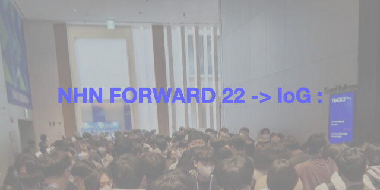

### FORWARD
```
앞으로 다짐을 해본다
어머닌 앞으로 행동을
하신다 다짐을 하셨다
이태원 유가족 어머님*
우리도 아닌건 아니다
말하고 살아야 하겠다
```

### HOT DOORAY! PACK
```
미소 가득 두레이 개발자 행복해 보인다.
두레이 탈인형 무빙이 발랄하다.
알고 보니 두레이 대표님이 탈인형 주인공이란다.

내가 써보고 추천해봐 알지만 두레이 참 좋다.
느그 서장 남천동 살제?! 어?! 내가 임마! 
느그 서장이랑 임마! 어저께도! Dooray! ㅎ

만드는 사람이 즐거운 Dooray 니까!
Dooray 로 협업하면 행복 할끄니까 ~

.　　　n Λ＿Λ
　　　(ﾖ(´･ω･｀) 따봉!!
　 　≡　y　 と丿
　 　 ≡（_ﾉ　ノ
　　　　≡(ノ´

```
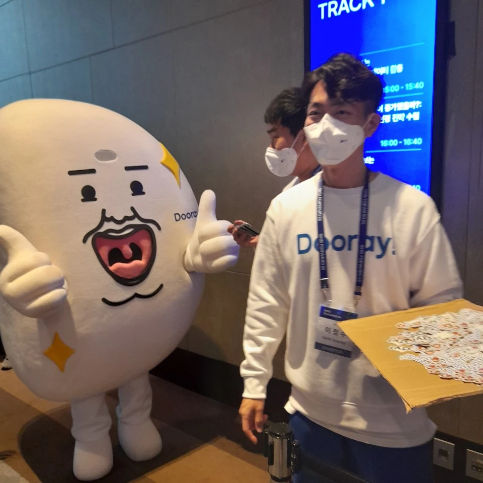

### banUH
- 세션 : [NHN Cloud Notification API + Microsoft 파워 플랫폼 = Awesome 로우코드/노코드 마케팅 도구](https://forward.nhn.com/2022/sessions/7)
- 오픈소스 : [github.com/devrel-kr](https://github.com/devrel-kr/nhn-toast-notification-service-custom-connector/issues) 아직도 열린 PR이 10개가 넘는다. C# 으로된 프로젝트로 오픈 소스 프로젝트의 과정을 한국어로 편하게 즐기고 참가해 보기 좋은 프로젝로 보인다.
```
개발할 땐 "어?" 금지
세 명 이상 같은 모니터 보는 것 금지
큰 웃음 몇번과 알찬 구성으로 40분 순삭
발표 영상과 자료가 공유되면 다시 보기를 권유
개발은 이제 더이상 개발자만의 것은 아니다
노 코드가 세상을 바꾼다

오픈소스와 커뮤니티에 초점을 맞춘 MS
최근 몇년간 행보는 MS 주식을 사고 싶도록 한다

위 링크의 해당 발표 대상 오픈소스에 참여해 보자

다른 세션
API 우선 접근 방식과 OpenAPI Specification
과 연결된 프로젝트다 이것도 다시보기 추천!
```

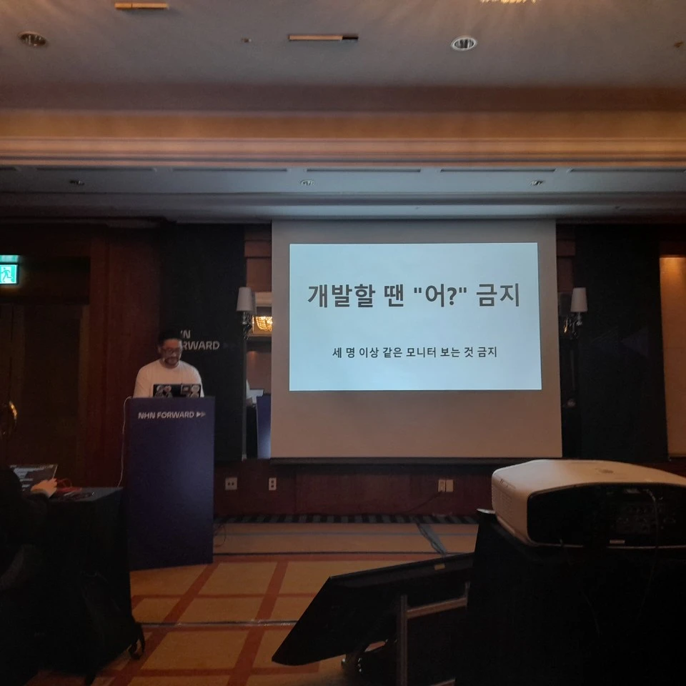

### Let's focus on FE development
- 세션 [밑바닥부터 만들어 보는 UI 프레임워크](https://forward.nhn.com/2022/sessions/37)
```
홍수처럼 쏟아져 나오는 JS 프레임워크!
유행에 휩쓸리지 않고 핵심 개념을 밑바닥부터

vue3 관련 동작 방식을 직접 라이브 코딩으로!
composition api 원리 이해에 유익

NHN 엔 괴수 개발자가 많다 @.@
```
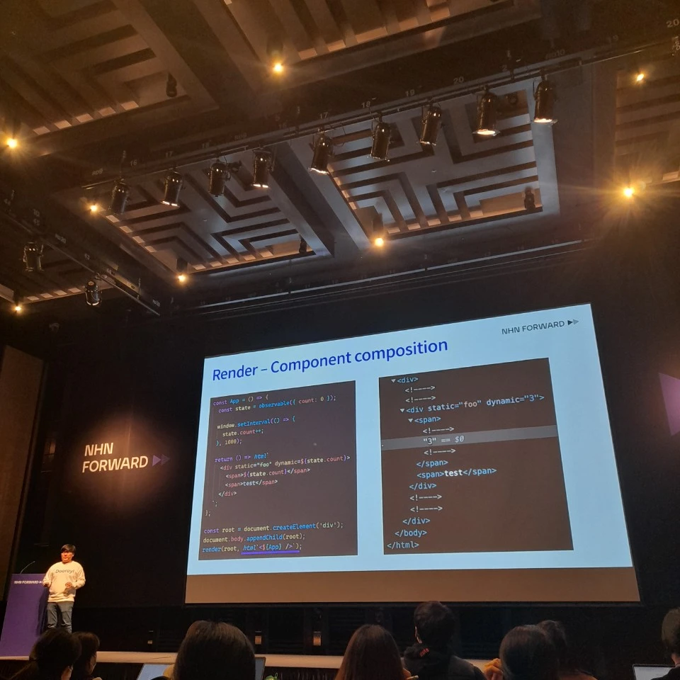

### OPENTELEMETRY
- 세션 : [OpenTelemetry를 활용한 모니터링](https://forward.nhn.com/2022/sessions/33)
- 큰 인사이트를 얻었다. 감사하다.
- 요즘 댐아닌 데이터 저수지 만들며 Traces 관리에 고민이 깊던 참에 바로 돌아와 팀원분들과 OPENTELEMETRAY 를 공부했다.
- OPENTELEMETRAY + DATA PIPELINE 주제로 블로그 작성해서 공유예정
```
Logs -시간 기반 텍스트
Metrics - 런타임 환경에서 측정된 값
Traces - 어떤 요청이 처리될 때 경로

기본 개념에서 시작하여
깊숙한 인사이트를 나누어 주셨다
```
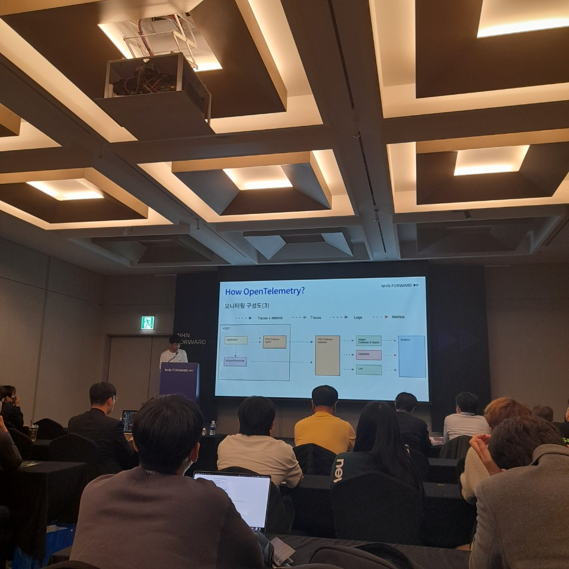

### COFFE TALK
```
기술 행사! 이지만 그래도 사람이 더 중하다
약속하지 않아도 만나고 싶은 사람을 만난다
호텔 식사는 앞만 보고 먹어야 한다
김밥이더라도 모여 앉아 먹는게 더 좋겠다
```
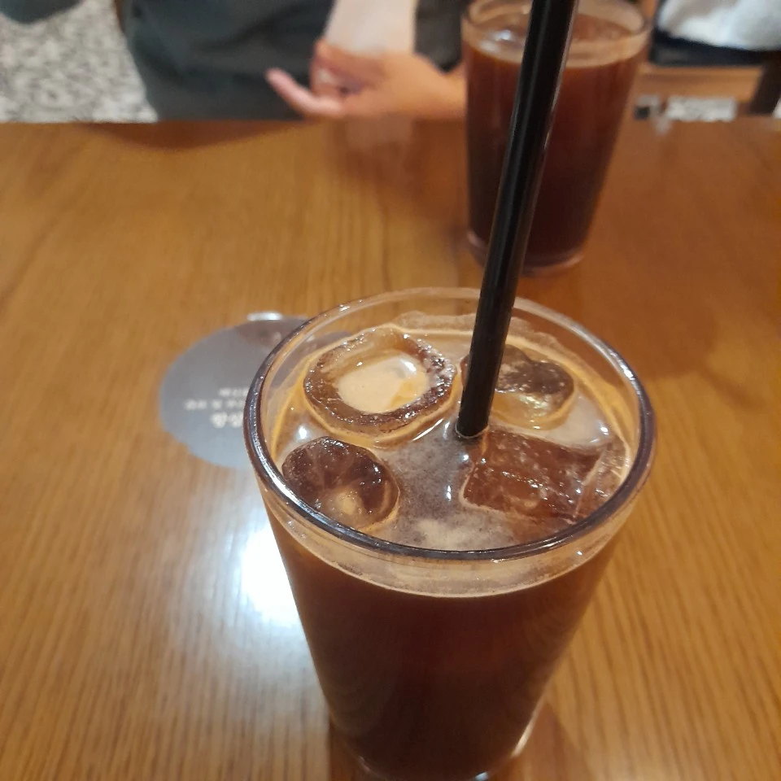

### LOUNGE TALK
```
그렇다. 효과적인 소통, 세일즈, 마케팅
팔려는 물건에만 집중하면 좀 그렇다

NHN 개발자를 챙겨주는 마음이 따뜻하다
소통과 배려가 충만했다.

신선한 시도와 주제로 건강과 스타일도 챙겼다

라운지라고 하여 트렉 1,2,3 앞에서 하는 줄
잘 보이지 않는 공간 / 문달린 공가은 아쉬움

내년에도 기대가 된다

여기서 파이콘의 향기가 묻어나는 건 외일까 ^^
```
- [3분 안에, 눈썹을 그리는 법](https://forward.nhn.com/2022/lounge-talks/12)

- [개발자의 직업병, 거북목? 이젠 '굿바이' 하세요!](https://forward.nhn.com/2022/lounge-talks/5)

- [메이크 오버 2: 다크모드는 이제 그만! 나답게 새로워지는 마법 '퍼스널 컬러'](https://forward.nhn.com/2022/lounge-talks/9)


### GOODS
- goods is GOOD!
```
차 없이 시골 내려감
어머니 바리바리 뭘 싸주심
그 맘을 알기에 들고 업고 집으로 ...

좀 심했다
그래서 좋았다
남은 핫팩 하나라도 끝까지 챙겨 주는 맘

페이코를 써야겠다
두레이를 틈나면 홍보해야겠다

기술발표 세션도 이런 맘에서
다들 청자를 염두하고 주셨다
그래서 기술보다 마음이 중요하다
그래서 기술보다 사람이 중요하다

기술로 더 나은 세상을 만들어 가는 
사람들과 함께하는 기술 콘퍼런스 OK!
```
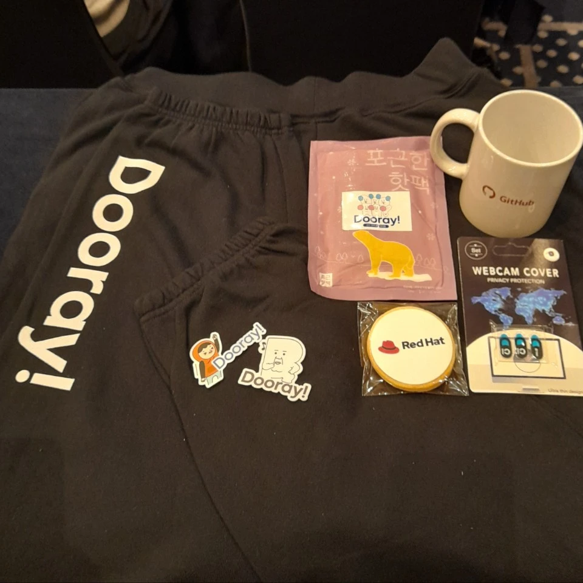
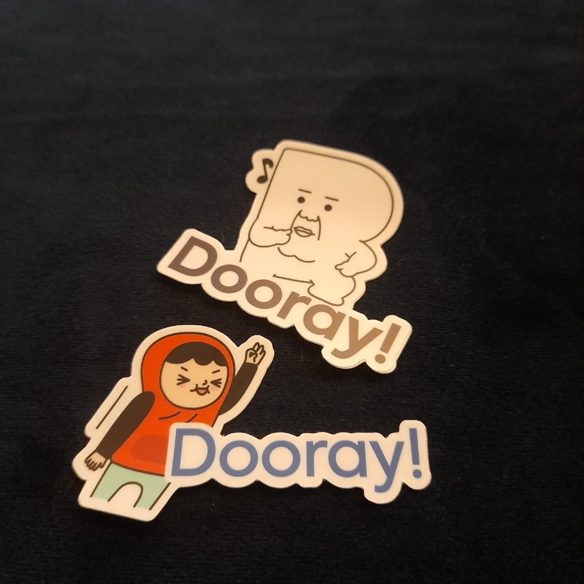
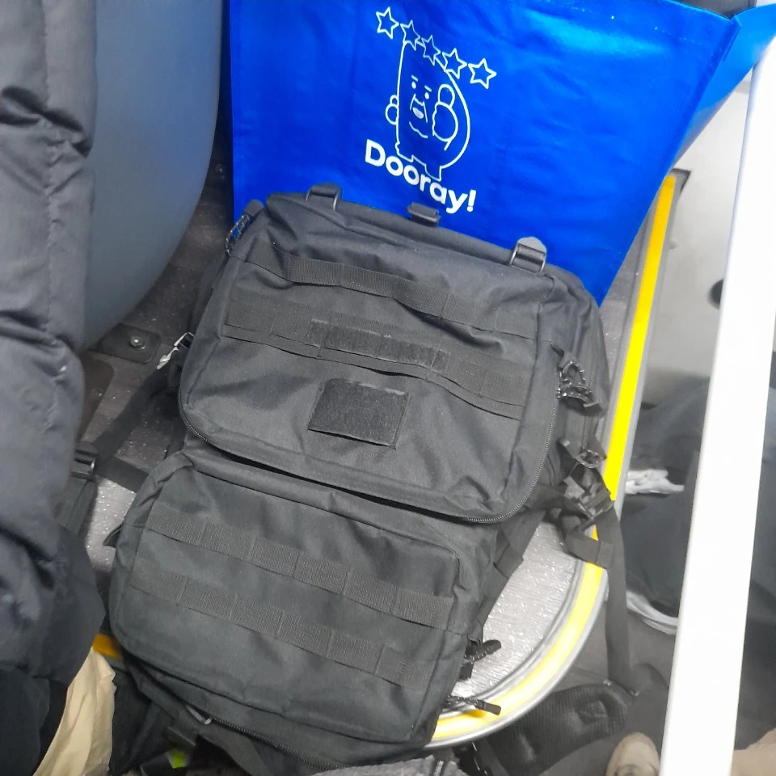

# 굿즈론
- 그것이 알고 싶다
- 행사 담당자의 큰 가방까지 준비해서 만원 버스를 타고 몇번을 쉬어가며 집에 오도록 의도했는지?
- 굿지와 개발자행사의 연관관계는 무엇인지?
- 마음과 마음은 어떻게 통하는지?
- [theory of goods](./theory-of-goods.md) 에서 다루어 보자!
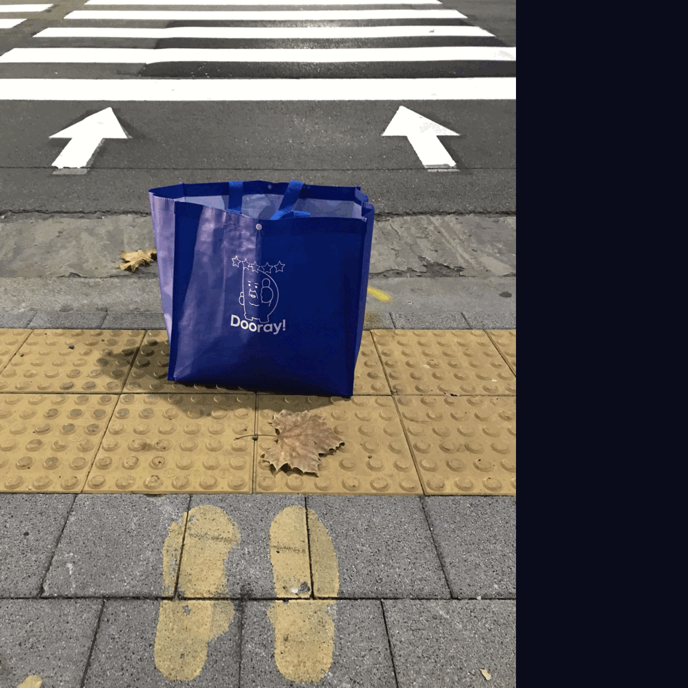

### Q&A
::: details
- 발표 자료와 영상 ? -> [NHN FORWARD 웹사이트](https://forward.nhn.com/2022) 공개 예정

- 이 블로는 무엇으로 만들어 졌나요? -> [vuepress2](https://v2.vuepress.vuejs.org/) 를 이용했습니다.

- 블로그 작성 이벤트가 있을까요? -> 아래 사항 확인!
::: details 블로그 이벤트 참가 방법 및 경품
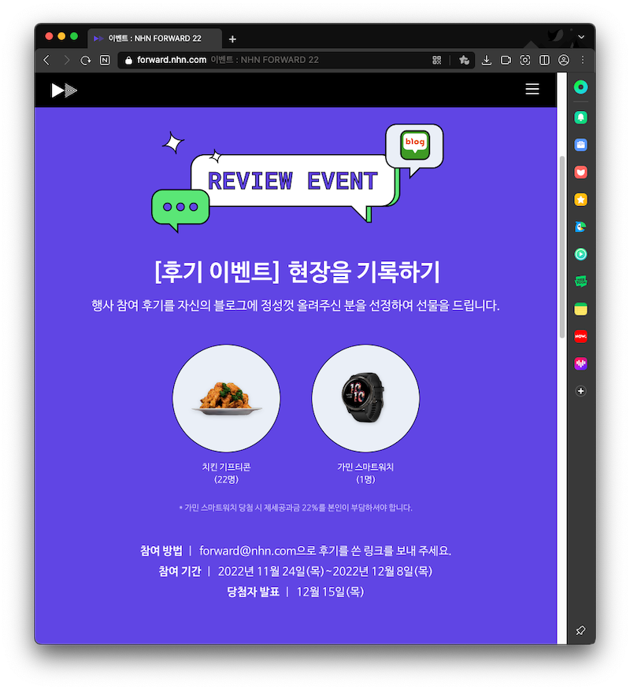
:::

### REFERENCE
- [이태원 참사 유가족 기자회견 풀영상](https://www.youtube.com/watch?v=GwZ7-POnVEA)

- [백창열 NHN두레이 대표 “업무에만 집중하는 문화 만들 것”](https://www.etnews.com/20211004000014)

- [NHN](https://www.nhn.com/ko/company/companyInfo.nhn) 회사소개

- [NHN FORWARD 22](https://forward.nhn.com/2022) - 2022.11.24.(목) 그랜드 인터컨티넨탈 서울 파르나스

- [@Justin](https://forward.nhn.com/2022/sessions/7) - "NHN Cloud Notification API + Microsoft 파워 플랫폼 = Awesome 로우코드/노코드 마케팅 도구" 발표자 및 Microsoft Korea Senior Cloud Advocate

- [데이터야놀자](https://2017.datayanolja.kr/) - 데이터를 다루는 모든 사람들의 축제

### Happy Hacking
```
⠀⠀⠀⠀⠀⠀⠀⠀⠀⠀⠀⠀⠀⠀⠀⠀⠀⠀⠀⠀⠀⠀⠀⠀⠀⠀⠀⠀⠀⠀⠀⠀⠀⠀⠀⠀⠀⠀⠀⠀⠀⢀⠀⠀⠀⠀⠀
⠀⠀⠀⠀⠀⠀⠀⠀⠀⠀⠀⠀⠀⠀⠀⠀⠀⠀⠀⠀⠀⠀⠀⠀⠀⠀⠀⠀⠀⠀⠀⠀⠀⠀⠀⢀⣀⣤⡴⠒⠚⣻⠇⠀⠀⠀⠀
⠀⠀⠀⠀⠀⠀⠀⠀⠀⠀⠀⠀⠀⠀⠀⠀⠀⠀⠀⠀⠀⠀⠀⠀⠀⢸⠓⠒⠒⠒⠒⢤⣤⠴⠚⠉⠀⡸⠁⣠⠞⠁⠀⠀⠀⠀⠀
⠀⠀⠀⠀⠀⠀⠀⠀⠀⠀⠀⠀⠀⠀⠀⠀⠀⠀⠀⠀⠀⠀⠀⠀⠀⠘⡆⠀⠀⣠⠖⠋⠀⠀⠀⠀⢀⡧⠞⠣⠤⣀⡀⠀⠀⠀⠀
⢀⣤⠔⠒⠚⣏⠉⠉⠉⠉⠉⠉⠉⠒⠒⠲⠤⠒⠋⠉⠉⠉⠉⠉⠒⠒⠻⢴⠋⠀⠀⠀⠀⠀⣠⠔⠋⠀⠀⠀⠀⠀⠉⠑⠲⢤⡀
⠈⠙⠒⠤⢄⣘⣦⡀⠀⠀⠀⠀⠀⠀⡔⠀⠀⠀⠀⠀⠀⠀⠀⠀⠀⠀⠀⠀⠀⠀⣤⠤⠖⠋⠀⠀⠀⠀⠀⠀⠀⠀⠀⠀⠀⠀⡼
⠀⠀⠀⠀⠀⠀⠈⢉⣿⣗⡒⠒⠒⡾⠁⣠⣶⠒⡆⠀⠀⠀⠀⠀⠀⠀⣀⣄⡀⠀⢳⠀⠀⠀⠀⠀⠀⠀⠀⠀⠀⠀⠀⠀⢀⠞⠀
⠀⠀⠀⠀⠀⠀⢠⡎⠀⠀⠙⢦⣀⠇⠀⠻⣼⡿⠁⠀⠀⢠⡄⠀⠀⠸⣷⣼⣷⠀⢸⣆⡀⠀⠀⠀⠀⠀⠀⠀⠀⠀⠀⣰⠋⠀⠀
⠀⠀⠀⠀⠀⠀⠈⣏⠀⠀⠀⠀⡿⠖⠲⣄⠀⠀⣤⡀⢀⣤⣀⠀⠀⢀⠈⠋⠁⠀⢸⣿⡉⠓⠦⣀⡀⠀⠀⠀⠀⢀⡴⠁⠀⠀⠀
⠀⠀⠀⠀⠀⠀⠀⢹⡀⠀⠀⠀⡇⠀⠀⣸⠀⠀⢸⣯⠟⠛⠛⢿⣿⠋⠀⢰⠟⠉⠹⡇⢷⠀⠀⠀⠉⠓⠦⣄⣠⠎⠀⠀⠀⠀⠀
⠀⠀⠀⠀⠀⠀⠀⠀⣇⠀⠀⠀⠹⡦⠴⠋⠀⠀⠀⢹⡄⠀⢀⡼⠁⠀⠀⣇⠀⠀⢠⡇⣀⣧⠀⠀⠀⠀⠀⠀⠁⠀⠀⠀⠀⠀⠀
⠀⠀⠀⠀⠀⠀⠀⠀⠸⡄⠀⠀⠀⠙⢆⠀⠀⠀⠀⠀⠹⠤⠋⠀⠀⠀⠀⠈⠓⡶⠋⠙⠳⠤⣀⠀⠀⠀⠀⠀⠀⠀⠀⠀⠀⠀⠀
⠀⠀⠀⠀⠀⠀⠀⠀⠀⠹⡄⠀⠀⠀⠀⠑⠶⠀⠀⠀⠀⠀⠀⠀⠀⠀⣤⠖⠋⠀⠀⠀⠀⠀⠀⠉⠲⢤⡀⠀⠀⠀⠀⠀⠀⠀⠀
⠀⠀⠀⠀⠀⠀⠀⠀⠀⠀⠙⣶⠆⠀⠀⠀⠀⠀⠀⠀⠀⠀⠀⠀⠀⠀⠀⠀⠀⢠⡀⠀⠀⠀⠀⠀⠀⢀⣷⠀⠀⠀⠀⠀⠀⠀⠀
⠀⠀⠀⠀⠀⠀⠀⠀⠀⠀⠀⣸⠀⠀⠀⠀⠀⠀⠀⠀⠀⠀⠀⠀⠀⠀⠀⠀⠀⠀⣧⠤⣤⠤⠴⠒⠒⠚⠁⠀⠀⠀⠀⠀⠀⠀⠀
⠀⠀⠀⠀⠀⠀⠀⠀⠀⠀⠀⡇⠀⠀⠀⠀⠀⠀⠀⠀⠀⠀⠀⠀⠀⠀⠀⠀⠀⠀⢧⡰⠋⠀⠀⠀⠀⠀⠀⠀⠀⠀⠀⠀⠀⠀⠀
⠀⠀⠀⠀⠀⠀⠀⠀⠀⠀⢸⠁⠀⠀⠀⠀⠀⠀⠀⠀⠀⠀⠀⠀⠀⠀⠀⠀⠀⠀⠸⡁⠀⠀⠀⠀⠀⠀⠀⠀⠀⠀⠀⠀⠀⠀⠀
⠀⠀⠀⠀⠀⠀⠀⠀⠀⠀⡞⠀⠀⠀⠀⠀⠀⠀⠀⠀⠀⠀⠀⠀⠀⠀⠀⠀⠀⠀⠀⣇⠀⠀⠀⠀⠀⠀⠀⠀⠀⠀⠀⠀⠀⠀⠀
⠀⠀⠀⠀⠀⠀⠀⠀⠀⢰⡇⠀⠀⠀⠀⠀⠀⠀⠀⠀⠀⠀⠀⠀⠀⠀⠀⠀⠀⠀⠀⢹⠀⠀⠀⠀⠀⠀⠀⠀⠀⠀⠀⠀⠀⠀⠀
⠀⠀⠀⠀⠀⠀⠀⠀⠀⢸⡇⠀⠀⠀⠀⠀⠀⠀⠀⠀⠀⠀⠀⠀⠀⠀⠀⠀⠀⠀⠀⠈⡇⠀⠀⠀⠀⠀⠀⠀⠀⠀⠀⠀⠀⠀⠀
⠀⠀⠀⠀⠀⠀⠀⠀⠀⠈⢧⡀⠀⠀⠀⠀⠀⠀⠀⠀⠀⠀⠀⠀⠀⠀⠀⠀⠀⠀⠀⡸⠁⠀⠀⠀⠀⠀⠀⠀⠀⠀⠀⠀⠀⠀⠀
⠀⠀⠀⠀⠀⠀⠀⠀⠀⠀⣠⣿⡆⢀⣠⠤⠒⠒⠒⠂⠀⠀⠐⠒⠒⠒⠒⠲⢦⡀⠀⠳⣄⠀⠀⠀⠀⠀⠀⠀⠀⠀⠀⠀⠀⠀⠀
⠀⠀⠀⠀⠀⠀⠀⠀⠀⠐⣿⡟⠋⠉⠀⠀⠀⠀⠀⠀⠀⠀⠀⠀⠀⠀⠀⠀⠀⠈⠑⠒⠾⠀⠀⠀⠀⠀⠀⠀⠀⠀⠀⠀⠀⠀⠀
```
``` python
def isHappy(msg: str) -> bool:
    return msg !='양말' 
              + '슬리퍼' 
              + '추리링'

>>> isHappy('NHN FORWARD 23 에서 만나요 ~')
True
```
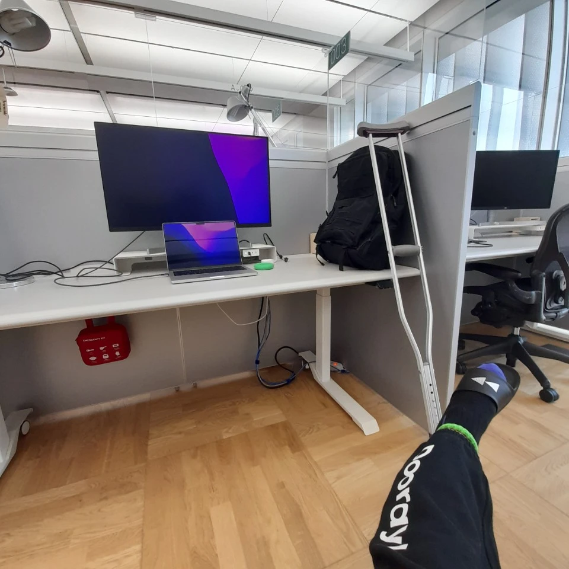