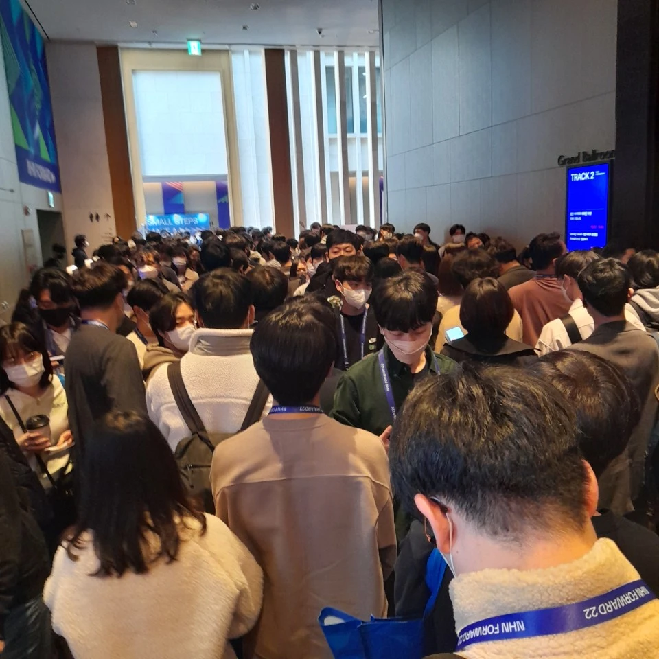

# NHN FORWARD

::: tip introduction
- 기술로 더 나은 세상을 만들어 가는 사람들과 함께하는 기술 콘퍼런스 NHN FORWARD 22* 참관기 입니다.

- Microsoft Korea Senior Cloud Advocate @Justin* 님이 발표자 초대 티켓을 나눔하여 주셔서 엄청난 경쟁을 비켜 다행이 참가하였습니다. 감사한 마음과 못가신 분들위해 후기를 남겨 봅니다.

- 데이터를 다루는 모든 사람들의 축제! 데이터야놀자에서 대한민국 최초로 평일 낮시간 발표중에 맥주를 나누어 마시며 "놀자"를 외쳐 보았습니다. 이 글도 이러한 다소 무리적 시각이 담겨 있습니다.
:::

### FORWARD
```
이태원 참사 유가족들이 모였다. 기자회견*이 있었다.
아닌 것은 아니라고 말해야 한다고
아들을 가르쳐 왔다는 어머니는 아들을 잃엇다. 

옆에는 그녀의 따님이
뒤에는 남편이
어머니가 말을 이어가는 내내 함께 오열 하고 있었다.

어머님은 장례를 위해 오스트리아로 돌아가지만
아들에게 가르친것과 같이 아닌것을 아니라고 말하겠다고 한다.

앞으로 우리도 그렇게 하자!
그래야 앞으로 나갈수 있다!
```
### NHN

::: details NHN 과 NAVER 가 아직도 같은 회사 라고 생각하신다면 클릭!
- NHN*은 게임, 결제, 엔터테인먼트, IT, 광고 등 IT 기반의 다양한 사업분야에 진출, 성장해 나가고 있는 글로벌 IT 기업입니다.

::: tip 회사 역사
- 2013년 8월 1일, 대한민국 최대 인터넷 기업인 NHN㈜에서 분할, ‘NHN엔터테인먼트’라는 사명으로 출범했으며,

- 2019년 4월 1일, 사명을 NHN으로 다시 바꾸며 한국 IT 기업의 상징인 ‘NHN’의 가치를 계승, 글로벌 IT기술 기업으로 재도약하고 있습니다.

- 2021년 8월 1일, NHN은 클라우드/커머스/콘텐츠/페이먼트 4대 핵심사업을 주축으로 2030년까지 글로벌 테크 컴퍼니로의 성장 비전을 선포했습니다.

::: warning 서비스
- NHN Dooray - 올인원 통합 협업 플랫폼
- NHN Cloud - 통합클라우드 솔루션
- 페이코 - 온·오프라인 겸용 간편결제
- 한게임 - 대한민국 NO.1 온라인 게임포털
- 프렌즈팜 - 1000만 다운로드에 빛나는 인기퍼즐
- 크루세이더 퀘스트 - 픽셀아트 감동 RPG
:::

### CROWDS AT CLOUD EVENTS
모두가 기다려온 기술행사! 기술로 더 나은 세상을 만들어 가는 사람들 :tada:
```
NHN FORWARD 구름 처럼 많은 인파가 모였다.
많은 사람들이 기다려왔고 잘 준비된 기술행사 였다.
장소에 비해 사람이 너무 많은점은 아쉬웠다.
반면 안전관리를 위한 충분한 요원들의 배치와 안내는 좋았다.
마지막으로 역시 이렇게 많은 사람이 모인 이유가 있었다. 
기술행사지만 사람이 중심에 있는 따뜻한 행사였다.
```


### HOT PACK DOORAY
```
얼굴에 웃음이 꽉찬 두레이 개발자들은 기분을 좋게 만들었다.
두레이 탈인형 쓰고 있는 사람이 무려 대표라신다.
대표분 굇수 개발자로 잘 알려지신 탈쓰고 경쾌한 무빙 나이가?
데이터야놀자/네이버노동조합 두레이 도입해봤다. 정말 좋다.
느그 서장 남천동 살제?! 어?! 내가 임마! 느그 서장이랑 임마! 어저께도! Dooray!
두레이 메일은 역시 마땅한 이유가 있어 강력하다. 
협업에는 무조건 두레이다. because 만드는 사람이 즐거운 Dooray 니까!
행사 끝까지 많은 분들께 "핫팩" 하나라도 더 챙겨 보내려 힘씀 두레이 개발자들 멋졌다.
```


### banUH
#### 개발할 땐 "어?" 금지


### REFERENCE
- [NHN](https://www.nhn.com/ko/company/companyInfo.nhn) 회사소개
- [NHN FORWARD 22](https://forward.nhn.com/2022) - 2022.11.24.(목) 그랜드 인터컨티넨탈 서울 파르나스
- [@Justin](https://forward.nhn.com/2022/sessions/7) - "NHN Cloud Notification API + Microsoft 파워 플랫폼 = Awesome 로우코드/노코드 마케팅 도구" 발표자
- [이태원 참사 가족 기자회견 풀영상](https://www.youtube.com/watch?v=GwZ7-POnVEA)