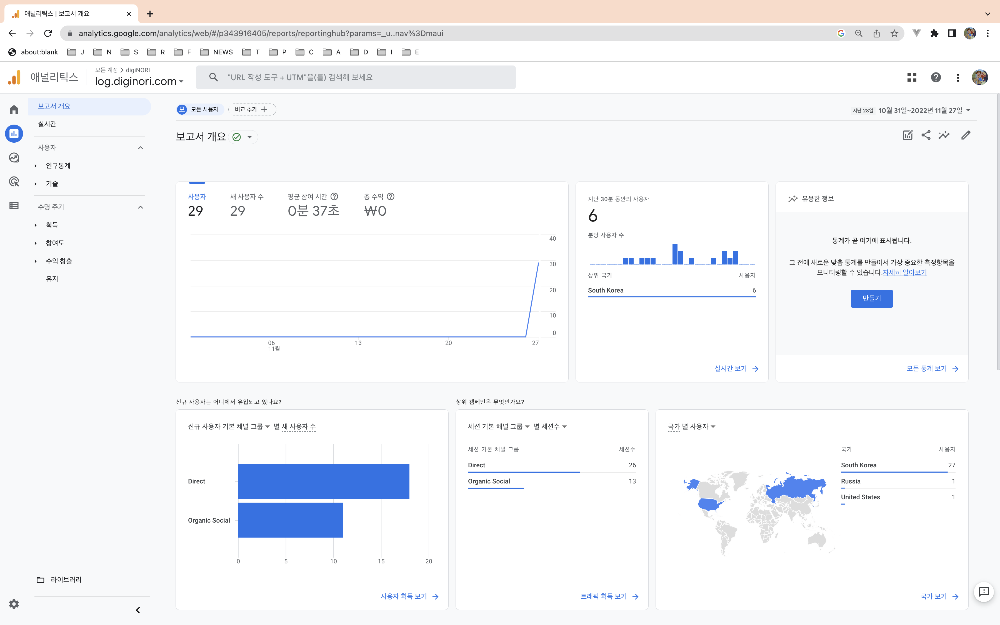

# SEO

### apply google analytics
- You can follow the guide on the site [https://analytics.google.com/](https://analytics.google.com/)
- You can see the following screen in an hour or two
- Path Navigation Analysis




# apply google analytics in vuepress
- https://v2.vuepress.vuejs.org/reference/plugin/google-analytics.html
``` js
import { googleAnalyticsPlugin } from '@vuepress/plugin-google-analytics'

googleAnalyticsPlugin({
    id: 'G-B5QYS2JYSW',
    debug: true,
}),
```

### Applied naver search Advisor


::: tip
- https://v2.vuepress.vuejs.org/reference/config.html#head
:::


