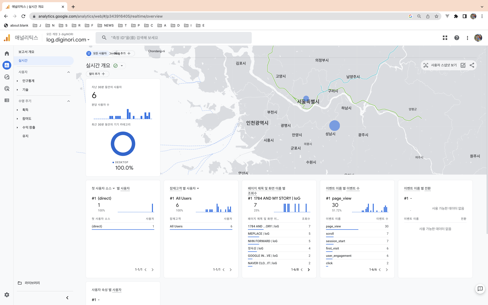

# SEO

### apply google analytics
- You can follow the guide on the site [https://analytics.google.com/](https://analytics.google.com/)
- You can see the following screen in an hour or two
- Path Navigation Analysis



# apply google analytics in vuepress
- https://v2.vuepress.vuejs.org/reference/plugin/google-analytics.html
``` js
import { googleAnalyticsPlugin } from '@vuepress/plugin-google-analytics'

googleAnalyticsPlugin({
    id: 'G-B12345678',
    debug: true,
}),
```

### Applied naver search Advisor


::: tip according to
    - https://v2.vuepress.vuejs.org/reference/config.html#head
:::


### Applied google search console
- https://search.google.com -> PageSpeed Insights -> https://pagespeed.web.dev


#### search console insights
- https://search.google.com/search-console/insights/u/0?utm_source=search_console&utm_medium=search_console&utm_campaign=association_report_sc&resource_id=https://log.diginori.com/&hl=ko&ga4_property_id=343916405&ga4_stream_id=4314547171 ( If you want to get permission ? To the discursions menu! )


### Reflect search ranking
- https://www.google.com/search?q=diginori+log&oq=diginori+log&aqs=chrome..69i57j69i65l2j69i60.2268j0j7&sourceid=chrome&ie=UTF-8


