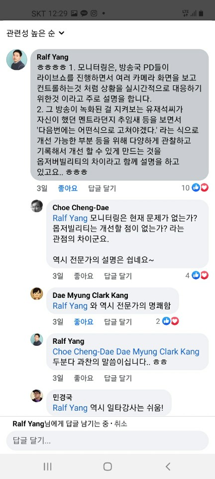

# SRE 
### monitoring vs observability
::: tip observability와 monitoring는 어떤 차이가 있을까?
1. 모니터링은, 방송국 PD들이 라이브쇼를 진행하면서 여러 카메라 화면을 보고 컨트롤하는것 처럼 상황을 실시간적으로 대응하기 위한것 이라고 주로 설명을 합니다.
2. 그 방송이 녹화된 걸 지켜보는 유재석씨가 자신이 했던 멘트라던지 추임새 등을 보면서 '다음번에는 어떤식으로 고쳐야겠다.' 라는 식으로 개선 가능한 부분 등을 위해 다양하게 관찰하고 기록해서 개선 할 수 있게 만드는 것을 옵저버빌리티의 차이라고 함께 설명을 하고 있고요.. ㅎㅎㅎ
:::
-  [If I have seen a little further it is by standing in the shoulders of Giants. - issack newton -](https://dayofblog.pe.kr/758)


### class SRE implements DevOps
- [클라우드 시대에 맞는 사이트 신뢰성 엔지니어, Outsider/당근마켓 SRE](https://docs.google.com/presentation/d/1-kA1N_7kCwJTwBizE3KJ6AhHghGqI8WZfMkBr0WuqWo/edit#slide=id.g13fe81ef2f1_18_42)
::: tip “사이트 신뢰성 엔지니어링" 책 중
끊임없이 엔지니어링을 추구하지 않으면

업무 부담이 증가하여 그 부담을 나누기 위해
더 많은 인력이 필요하게 되고

결국에는 서비스의 크기에 따라
전통적인 운영 업무를 담당하는 인력이 기하급수적으로 늘어나게 된다.
:::
```
아웃사이더님 발표 장표중 가장 인상 깊음

업무 부담이 증가 - 내가 지금 격고 있던 문제
여기서 인력충원까지 없으면?
그러니까 지금 나의 문제!

답은 "끊임없이 엔지니어링을 추구"
```
